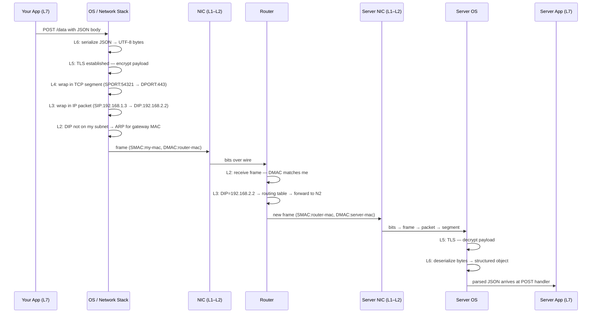

# Lecture 01 — Fundamentals of Networking
### From client-server origins to OSI layers to host-to-host communication

---

> [!NOTE]
> Lecture 01 introduced what networks are and why they exist — this lecture explains **how** they work: the architecture that distributes computation, the model that standardizes communication, and the addressing system that lets any two machines on Earth find each other.

---

# Part 1 — Client-Server Architecture

## 1. The Core Idea

> **Analogy:** A restaurant kitchen is expensive to build and run, so one kitchen serves many tables — customers (clients) order from a menu, the kitchen (server) does all the heavy cooking.

The core innovation of client-server architecture was the ability to separate server and client components into different physical locations, allowing different pieces of code to execute remotely rather than on a single machine. This departed from the era of large, expensive mainframes — workloads could now be distributed between cheap commodity hardware on the client side and more powerful servers handling computationally intensive operations.

The fundamental problem this solved: machines were expensive and applications were growing increasingly complex. By decomposing a single monolithic application into multiple components that communicate across a network, the architecture enabled more efficient resource allocation.

This concept of breaking down monolithic systems into smaller, communicating components resurfaced in modern **microservices** architectures. Where monolithic services once ran entirely on single machines, microservices decompose them into multiple smaller services that call one another — the same principle at a different scale.

The division of labor is based on **computational expense**. Expensive operations — those consuming significant RAM, CPU cycles, or disk I/O — are offloaded to servers equipped with robust resources. The client remains lightweight, functioning as a thin interface that delegates heavy lifting to the server.

This model gave rise to **Remote Procedure Call (RPC)**, a concept dating back to the 1960s and 1970s. Early remote communication lacked standardization — as long as data could somehow reach the server across the wire, the implementation details were left to individual developers. Over time, standards emerged to formalize these interactions. Modern RPC frameworks like gRPC have built upon these foundational concepts, providing a universal communication protocol between distributed components.

**Backend relevance:** Every backend service you write *is* the server half of this model. When you add a database, you're adding a second server tier — the three-tier architecture (presentation → application → data) is just client-server applied twice in a chain.

---

## 2. Benefits of Client-Server Architecture

> **Analogy:** A bank's central vault — many branches (clients) access the same secure resources without each needing their own vault.

**Scalability:** By centralizing expensive operations on powerful servers while distributing lightweight clients across commodity hardware, multiple clients can connect to a single server and efficiently share computational resources. Clients benefit from faster startup times and smaller binary sizes because they no longer carry the full application logic and dependencies.

**Edge flexibility and local computation:** Clients retain the ability to perform lightweight local tasks. This principle has experienced renewed interest with **edge computing** — even IoT devices, traditionally viewed as simple sensors transmitting data remotely, can now execute local computation. The flexibility to place logic on either the client or server side lets architects optimize for different performance and resource constraints.

**Dependency management:** In a monolithic application, every dependency — database drivers, system libraries, external interfaces — must be installed alongside the application. In a client-server architecture, the server assumes responsibility for these dependencies. If the server needs to communicate with a database, it alone requires the appropriate database driver. The client simply makes remote calls without needing to understand the underlying implementation details.

| Benefit | What it means in practice |
|---|---|
| Scalability | Many clients share one powerful server |
| Smaller clients | No local dependencies (DB drivers, heavy libs) |
| Dependency isolation | Server owns the DB driver; client just calls an API |
| Edge flexibility | Logic can shift client-side (IoT, edge computing) when needed |
| Three-tier architecture | A specialized form: presentation → application logic → data storage, with the server tier further decomposed |

**Backend relevance:** The three-tier architecture — which explicitly separates presentation, application logic, and data storage — is a specialized form of client-server, with the server tier further decomposed into application and database components. This is the architecture of virtually every web application you will ever build.

---

## 3. Remote Procedure Call (RPC)

> **Analogy:** Calling a function that runs on someone else's computer, but writing it as if it were a local function call.

RPC dates back to the 1960s–70s. Early implementations were ad-hoc — as long as bits reached the server across the wire, the implementation details were left to individual developers. Over time, standards emerged to formalize these interactions. Modern RPC frameworks like **gRPC** have built upon these foundational concepts, providing a universal communication protocol between distributed components.

```bash
# Example: curl as a manual RPC — you're calling a remote procedure (endpoint)
curl -X POST https://api.example.com/users \
  -H "Content-Type: application/json" \
  -d '{"name": "Nouri"}'   # payload = arguments to the remote procedure
```

**Backend relevance:** REST, gRPC, and GraphQL are all variations of RPC — different ways to call code that lives on another machine. The difference is in protocol, serialization format, and transport — not in the fundamental concept.

---

## 4. Why Standardization Is Non-Negotiable

> **Analogy:** Electrical outlets — without a standard shape and voltage, every device would need its own custom wall socket.

Despite its advantages, client-server architecture introduces a critical requirement: a well-defined communication model. Without standardization, distributed systems devolve into incompatible implementations where each client-server pair uses proprietary protocols. While developers could theoretically transmit data using any medium — radio waves, electrical signals, or custom wire protocols — the absence of common standards makes interoperability impossible.

For client-server architecture to realize its full potential, the industry needed universal communication standards that all systems could adopt, ensuring that clients and servers could understand one another regardless of their specific implementations.

Standards solve this by creating **abstraction layers**: your `fetch()` call is identical whether the bits travel as radio waves, electrical pulses, or light through glass fiber.

> [!IMPORTANT]
> The OSI model is the industry's answer to this standardization problem — it defines exactly what each layer is responsible for so that layers above don't need to know anything about layers below.

---

# Part 2 — The OSI Model

## 4. Why Do Communication Models Exist?

Three problems that would make networked software impossible to build without standards:

---

### Problem 1 — Your app would need to know about every physical medium

> **Analogy:** Imagine writing a different version of WhatsApp for Wi-Fi, another for LTE, another for fiber, another for satellite. That's what a world without standards looks like.

Without a model, every application would have to handle the physical transmission medium itself. Your Node.js app sends an HTTP request — it doesn't know or care whether that request travels as radio waves, electrical pulses through copper, or light pulses through fiber. It works identically on all of them.

That's not magic. Engineers built abstraction layers specifically so you never have to think about signal propagation. The OSI model is that contract.

**Backend relevance:** This is why your `fetch()` call works on localhost, on a cloud server, over a VPN, and via satellite internet — identical code, totally different physical paths underneath.

---

### Problem 2 — Network hardware from different vendors couldn't talk to each other

> **Analogy:** If every car manufacturer used a different type of road, cities would be impossible to build.

Without common standards, a Cisco router and a Juniper router couldn't exchange packets. ISPs couldn't interconnect. The internet — which is literally just thousands of independently operated networks agreeing to speak the same protocols — couldn't exist.

The OSI model decouples the physical medium from higher-level protocols. When faster physical layer technology emerges (fiber replacing copper, 5G replacing 4G), you swap out L1 without redesigning IP routing at L3 or TCP at L4.

---

### Problem 3 — You couldn't improve one part without breaking everything else

> **Analogy:** A good API lets you rewrite the backend without changing the frontend. Layers work the same way.

Because each layer has a well-defined interface to the layer above and below, teams can innovate independently. HTTP/2 replaced HTTP/1.1 at L7 without touching TCP at L4. TCP itself was added without changing IP at L3. Wi-Fi replaced Ethernet in many places without anyone rewriting their applications.

> [!WARNING]
> This independence has a hard limit called **protocol ossification**. Once a protocol is deployed at massive scale, intermediary devices (firewalls, NATs, load balancers) start parsing its packets in specific ways. Changing the packet format then breaks those devices. This is why QUIC was built on top of UDP instead of modifying TCP — too many middleboxes would have broken. It's also why IPv6 took 20+ years to reach majority adoption despite being clearly superior.

---

## 5. The Seven Layers

| Layer | Name | Data Unit | Key Protocol(s) | Device |
|---|---|---|---|---|
| 7 | Application | Data | HTTP, gRPC, FTP | — |
| 6 | Presentation | Data | TLS (encoding), JSON | — |
| 5 | Session | Data | TLS (handshake) | — |
| 4 | Transport | Segment / Datagram | TCP, UDP, QUIC | Firewall |
| 3 | Network | Packet | IP, ICMP | Router |
| 2 | Data Link | Frame | Ethernet, Wi-Fi 802.11 | Switch |
| 1 | Physical | Bits | — | Hub, NIC |

**Quick plain-English breakdown of each layer:**

**L7 — Application:** The protocol your actual app speaks. HTTP, gRPC, FTP. This is the data your code produces and consumes.

**L6 — Presentation:** Converts your in-memory object (a JS object, a Python dict) into raw bytes that can travel over a wire, and back again on the other side. JSON serialization, UTF-8 encoding, encryption of the payload — all happen here.

**L5 — Session:** Manages the *connection* between two machines before any app data flows. This needs unpacking:

- **What is a connection?** Two machines agreeing "we're talking now" and keeping track of that conversation. Without a session, every message would arrive with no context — the server wouldn't know if it's a new request or a continuation.
- **Stateful vs stateless:** A *stateful* protocol remembers the connection. TCP is stateful — both sides track sequence numbers, whether the connection is open, how much data can still be sent. If the connection breaks, it must be re-established. A *stateless* protocol doesn't remember anything between messages — UDP just fires packets, no connection, no tracking.
- **What is an endpoint?** Just the two sides of a connection. Your laptop is one endpoint, `api.github.com` is the other. The word "endpoint" in APIs (like `POST /users`) borrows this term — it means a specific destination you're connecting to.
- **What is a proxy?** A middleman machine that sits between two endpoints and manages connections on their behalf. Instead of your machine talking directly to the server, it talks to the proxy, and the proxy talks to the server. The proxy can pool, cache, inspect, or redirect connections. This is L5 work — it's about managing connections, not about what's inside them.
- **TLS handshake:** Before encrypted data can flow, client and server must agree on encryption keys. This negotiation (the handshake) happens at L5 — it's connection setup, not data transfer. Only after the handshake is complete does L6/L7 data start flowing through the encrypted tunnel.

**L4 — Transport:** Adds port numbers so the OS knows which app gets the incoming data. Also handles reliability (TCP retransmits lost data) and ordering (TCP reassembles segments in the right sequence).

**L3 — Network:** Adds IP addresses for routing across networks. Routers live here.

**L2 — Data Link:** Adds MAC addresses for delivery *within* a single local network. Switches live here. More on this below.

**L1 — Physical:** The actual wire, radio wave, or light pulse. Converts bits into signals.

> [!NOTE]
> MAC addresses appear at **L2 only** — they are stripped and rewritten at every router hop and never travel beyond the local network segment. IP addresses (L3) are the ones that survive the full end-to-end journey. This distinction is critical and is covered in depth in Part 3.

**Backend relevance:** As a backend engineer you live primarily in **layers 4 and 7**. You bind to a port (L4), speak HTTP (L7), and deal with TLS handshakes (L5) on every HTTPS connection. Understanding where each layer sits tells you what data a proxy, firewall, or load balancer can *see*.

---

## 6. Data Flow — Sending an HTTPS POST Request

> **Analogy:** Mailing a confidential document — you write it, seal it in a tamper-evident envelope, put that inside a shipping box with addresses, and hand it to a courier network that passes it hop-to-hop until it arrives.

Each layer wraps the layer above's data in a new header — like Russian matryoshka dolls. The diagram below shows the data units produced at each layer:


Each layer also adds specific **addressing fields**. These are the "doors" data enters and exits through:


```
SPORT  — source port          (Layer 4)
DPORT  — destination port     (Layer 4)
SIP    — source IP address    (Layer 3)
DIP    — destination IP address (Layer 3)
SMAC   — source MAC address   (Layer 2)
DMAC   — destination MAC address (Layer 2)
```

> [!NOTE]
> Decapsulation on the receiver is the exact reverse — bits → frame → packet → segment → session check → deserialize → application handler. Each unwrapping costs nanoseconds; at high traffic volumes these nanoseconds accumulate.

---

## 7. Intermediary Devices and Which Layer They Reach

> **Analogy:** Airport security checks your boarding pass (L4 firewall), but customs opens your bag and reads your documents (L7 proxy).

A packet rarely travels directly from client to server — it passes through switches, routers, firewalls, and load balancers, each processing only as deep as it needs to:


For more complex deployments with L4 firewalls and L7 load balancers/CDNs in the path:


| Device | Highest Layer Read | What it sees | What it's blind to |
|---|---|---|---|
| Hub | L1 | Raw bits | Everything |
| Switch | L2 | MAC addresses | IP, ports, payload |
| Router | L3 | IP addresses | Ports, payload |
| Firewall | L4 | IP + ports | Encrypted payload |
| L7 Load Balancer / CDN | L7 | Full HTTP (after TLS termination) | Nothing — it's the endpoint |

> [!IMPORTANT]
> Layers 3 and 4 headers (IP addresses and ports) are **always visible in plaintext** — they are never encrypted because routers need them to deliver packets. This is why a VPN works: it wraps your original IP packet inside another IP packet, hiding your real destination from the ISP.

**Backend relevance:** When you configure nginx to route `/api` to one backend and `/static` to another, you're building an L7 device. It must decrypt TLS, read the URL path, then re-encrypt to the backend — which is why L7 proxies are slower than L4 ones.

---

## 8. OSI vs. TCP/IP Model

> **Analogy:** OSI is the academic textbook; TCP/IP is the engineer's field guide.

```
OSI Model          TCP/IP Model
─────────────      ─────────────────
Layer 7  ┐
Layer 6  ├──────►  Application
Layer 5  ┘
Layer 4  ─────────► Transport
Layer 3  ─────────► Internet
Layer 2  ┐
Layer 1  ├──────►  Link
         ┘
```

TCP/IP collapses the top three OSI layers into one "Application" layer — more pragmatic, but loses the granularity useful for understanding proxies (L5), serialization (L6), and session management.

> [!WARNING]
> When someone says "layer 5" without specifying the model, ask which model they mean. In OSI it's Session; in TCP/IP it doesn't exist as a separate concept.

---

# Part 3 — Host-to-Host Communication

## 9. MAC Addresses — Layer 2 Addressing

> **Analogy:** Your apartment unit number inside one building — unique within the building, meaningless for mail coming from another city.

Every network interface card (NIC) — the hardware inside your laptop, server, or phone that connects to a network — has a hardcoded **MAC address** (48 bits, written as `AA:BB:CC:DD:EE:FF`). It's assigned by the manufacturer and is globally unique.

**Where MAC addresses live in the OSI model:**

```
L7  Application  ]
L6  Presentation ]  ← MAC address does NOT exist here
L5  Session      ]
L4  Transport    ]
L3  Network      ]  ← IP address lives here
L2  Data Link    ← ★ MAC address lives HERE, in the frame header
L1  Physical     ]  ← MAC becomes raw bits on the wire
```

MAC addresses are added at L2 when a frame is built, and stripped off when the frame is received. They **never travel beyond the local network segment** — at every router hop, the old frame (with its MACs) is discarded and a brand new frame (with new MACs) is built for the next segment. IP addresses (L3) are the ones that survive the full end-to-end journey.

In a mesh network where all devices are directly connected, when host A sends a frame **every device on the segment receives it** — each checks whether the destination MAC matches theirs, and discards if not:


**The critical flaw:** MAC addresses have no hierarchical structure. To route globally using only MACs, a device would have to scan every address on Earth — like a full table scan with no index.

> [!WARNING]
> Public Wi-Fi is a mesh at layer 2 — all frames are broadcast to all connected devices. Historically, password sniffers exploited this by accepting frames not addressed to them. This is why unencrypted HTTP on public Wi-Fi was dangerous.

**Backend relevance:** You'll rarely touch MACs directly, but they matter when debugging ARP issues (`arp -a`) or configuring network interfaces on servers.

---

## 10. IP Addresses — Layer 3 Hierarchical Addressing

> **Analogy:** A full postal address with country, city, street, and house number — routers use the country+city part to narrow down the route, then the street+house part for final delivery.

An IPv4 address is 32 bits, split into two logical parts:

```
192  .  168  .   1   .  10   /24
└──────────────────┘   └──┘
    Network portion    Host portion
    (first 24 bits)    (last 8 bits)
```

The `/24` subnet mask tells every router: "only look at the first 24 bits to decide if this packet is for my network."

Two networks connected by a router, with hosts labeled abstractly:


The same topology with real IP addresses:


**How a host decides where to send:**
1. Apply subnet mask to destination IP
2. If network portion **matches** → destination is **local**, use ARP to get MAC and send directly
3. If network portion **differs** → destination is **remote**, forward to the **default gateway** (router)

> [!NOTE]
> Modern networking uses **CIDR** (Classless Inter-Domain Routing) with flexible prefix lengths (`/8`, `/16`, `/24`, `/30`...) instead of the old rigid Class A/B/C system, which wasted huge blocks of addresses.

**Backend relevance:** When you deploy to a VPC on AWS/GCP, you choose a CIDR block (e.g., `10.0.0.0/16`). Subnets get smaller blocks like `10.0.1.0/24` — 254 usable host addresses. Knowing this prevents "why can't my new EC2 instance get an IP" surprises.

---

## 11. Port Numbers — Layer 4 Multiplexing

> **Analogy:** IP is the building address; the port is the apartment number. The postal carrier (OS) delivers the package to the right tenant (process).

A single host runs many services simultaneously. Ports allow the OS to **demultiplex** incoming segments to the right process:

```
Incoming TCP segment
      │
      ▼
  Destination IP: 192.168.1.10  ──► correct machine   (L3)
  Destination Port: 443          ──► HTTPS process     (L4)
  Source Port: 54321             ──► tells server where to reply
```

**Well-known ports:**

| Port | Protocol | Common use |
|---|---|---|
| 22 | TCP | SSH |
| 53 | UDP/TCP | DNS |
| 80 | TCP | HTTP |
| 443 | TCP | HTTPS |
| 5432 | TCP | PostgreSQL |
| 6379 | TCP | Redis |
| 27017 | TCP | MongoDB |

**Ephemeral ports** (typically `49152–65535`) are assigned by the OS for outgoing connections. The server uses the source port to send responses back to the right client process.

```bash
# See what ports your machine is listening on
ss -tlnp   # Linux — shows TCP listening sockets with process names

# See active connections including ephemeral source ports
ss -tnp    # Linux — shows established TCP connections
```

**Backend relevance:** When your Express app listens on port `3000`, it binds a well-known (to your app) port. Every outbound request it makes gets a fresh ephemeral port. Under extreme load, if you exhaust the ephemeral port range, new outbound connections fail — this is called **port exhaustion**.

---

## 12. The Three Addressing Layers Working Together

> **Analogy:** Sending international mail — MAC is the street-level handoff between neighbors, IP is the international routing system, and the port is the department number inside the destination building.

```
┌─────────────────────────────────────────────────────────┐
│  Port 443          ◄── "which app on this host?"  (L4)  │
├─────────────────────────────────────────────────────────┤
│  IP  203.0.113.5   ◄── "which host globally?"     (L3)  │
├─────────────────────────────────────────────────────────┤
│  MAC AA:BB:CC:..   ◄── "which NIC right now?"     (L2)  │
└─────────────────────────────────────────────────────────┘
```

Each layer solves the problem the layer below cannot:
- MACs are unique but unroutable globally → IP adds hierarchy
- IPs identify hosts but not processes → ports add multiplexing

> [!NOTE]
> `127.0.0.1` (IPv4) / `::1` (IPv6) is the **loopback address**. Traffic sent here never leaves the machine. Services bound to `localhost` are invisible to the outside world — intentional for dev databases, dangerous if you think a service is exposed when it isn't.

---

# Part 4 — Code Examples

> All examples are in [`code.js`](./code.js). No dependencies — Node.js built-ins only.

---

## Example 1 — Socket Binding: `0.0.0.0` vs `127.0.0.1`

**The backend decision you make on day 1 of every deployment.**

When you start a server you choose *which network interface* it listens on. This is a Layer 4 decision — you're telling the OS which incoming TCP connections to accept:

| Bind address | Who can reach it | When to use |
|---|---|---|
| `0.0.0.0` | Anyone on any interface (LAN, public IP, loopback) | Your API in production |
| `127.0.0.1` | Only processes on the same machine | Local dev DB, internal services |

> [!WARNING]
> A Redis or PostgreSQL instance accidentally bound to `0.0.0.0` on a public server with no firewall is one of the most common causes of real-world data breaches. Always check what your services are binding to.

```bash
# Run with 0.0.0.0 — then test from another machine on your network
node code.js bind 0.0.0.0

# Run with 127.0.0.1 — curl below works, but another machine cannot reach it
node code.js bind 127.0.0.1

# Test from the same machine (always works either way)
curl http://localhost:3000

# Test from another machine (only works with 0.0.0.0)
curl http://<your-ip>:3000
```

The program also prints the **client's ephemeral port** on every connection so you can see the OS-assigned random source port in real time.

---

## Example 2 — Raw TCP Client & Server

**Seeing Layer 4 directly — before any HTTP, before any framework.**

Every `fetch()`, `axios`, `pg.connect()`, and `redis.createClient()` call you make creates a TCP socket under the hood. This example strips away all layer-7 abstraction so you see the actual lifecycle:

```
SYN  ──────────────────►  (client initiates)
     ◄──────────────────  SYN-ACK
ACK  ──────────────────►  (connection established)
data ◄─────────────────►  (bidirectional byte stream)
FIN  ──────────────────►  (client done writing)
     ◄──────────────────  FIN-ACK
```

We also implement a minimal message protocol ourselves (JSON + `\n` delimiter) — which is exactly what Redis's RESP protocol and PostgreSQL's wire protocol do at their core.

```bash
# Terminal 1 — start the server
node code.js server

# Terminal 2 — connect a client
node code.js client
```

**What to observe:**
- The client's ephemeral source port printed on both sides
- TCP stream behavior: three client sends may arrive in fewer `data` events on the server (Nagle's algorithm merging small segments)
- The FIN handshake logged explicitly when the client calls `socket.end()`
- `ECONNREFUSED` if you run the client before the server — this is a Layer 4 error, not HTTP

> [!NOTE]
> Connection pooling (used by every production DB client) is just keeping these TCP sockets open and reusing them instead of paying the 3-way handshake cost on every query. Now that you've seen what a socket is, connection pool sizing makes intuitive sense.

---

# Full Flow — Tracing an HTTPS POST Across Two Networks

**Scenario:** Your backend (192.168.1.3) sends a POST request to an API server (192.168.2.2) through a router.



> [!IMPORTANT]
> **MAC addresses change at every router hop** — the router rewrites SMAC and DMAC for each new link. **IP addresses stay the same** end-to-end. This is the fundamental difference between L2 and L3 addressing.

---

# Checklist — What You Should Know After This

- [ ] Why did client-server architecture replace monolithic mainframe computing?
- [ ] What problem does RPC solve, and how do gRPC and REST relate to it?
- [ ] Why is a standardized communication model necessary for networked applications?
- [ ] What are the seven OSI layers and the data unit name at each layer?
- [ ] What happens at each layer when a client sends an HTTPS POST request?
- [ ] What is encapsulation, and what is the matryoshka-doll analogy for it?
- [ ] Up to which layer does a switch, router, firewall, and L7 load balancer each process traffic?
- [ ] Why are IP addresses and ports always visible to intermediary devices, but HTTP payloads are not?
- [ ] Why is a MAC address insufficient for global routing?
- [ ] What are the two logical parts of an IPv4 address, and what does `/24` in CIDR notation mean?
- [ ] How does a host decide whether to send a packet directly or via the default gateway?
- [ ] What is port multiplexing, and what is the difference between a well-known port and an ephemeral port?
- [ ] What is the loopback address, and why does binding to `localhost` vs `0.0.0.0` matter?
- [ ] Why do MAC addresses change at every router hop while IP addresses stay the same?
- [ ] Can you trace a real-world scenario end-to-end using everything from this lecture?

---

← [Back to main README](../README.md)