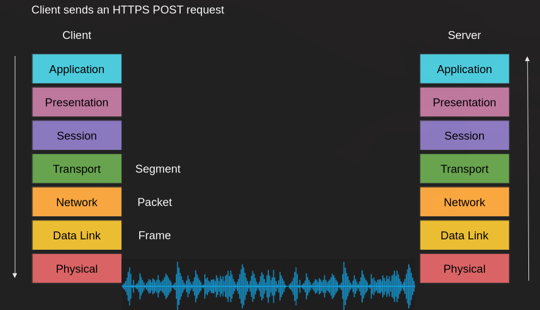
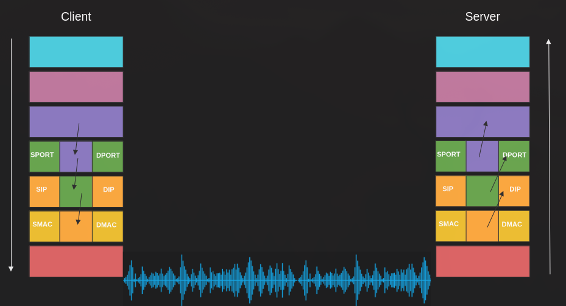
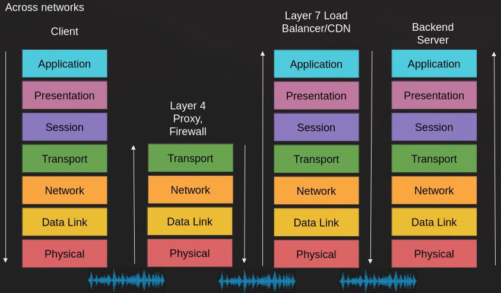
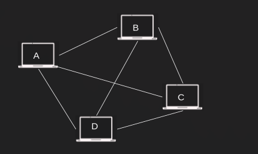
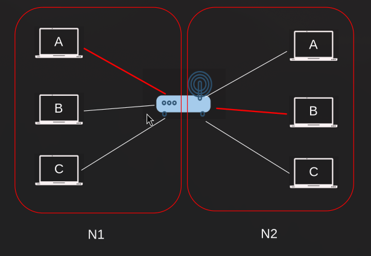
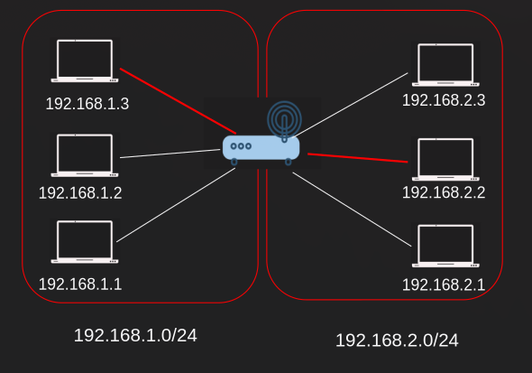
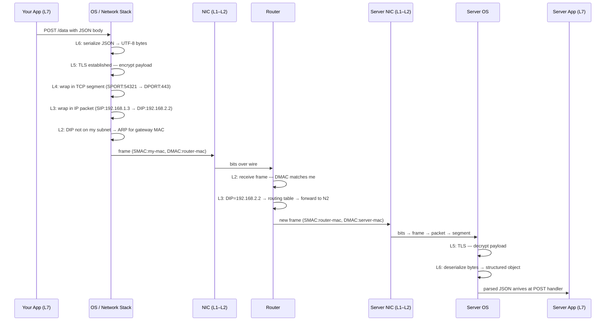

# Lecture 01 — Fundamentals of Networking
### From client-server origins to OSI layers to host-to-host communication

---

> [!NOTE]
> Lecture 01 introduced what networks are and why they exist — this lecture explains **how** they work: the architecture that distributes computation, the model that standardizes communication, and the addressing system that lets any two machines on Earth find each other.

---

## Table of Contents

- [Part 1 — Client-Server Architecture](#part-1--client-server-architecture)
  - [1. Who Is the Client, Who Is the Server?](#1-who-is-the-client-who-is-the-server)
  - [2. The Old Approach — One Big Machine](#2-the-old-approach--one-big-machine)
  - [3. How We Separate Them](#3-how-we-separate-them)
  - [4. Benefits of Separating Them](#4-benefits-of-separating-them)
- [Part 2 — The OSI Model](#part-2--the-osi-model)
  - [4b. Why Do Communication Models Exist?](#4b-why-do-communication-models-exist)
  - [5. The Seven Layers — Overview First](#5-the-seven-layers--overview-first)
  - [6. Walking the Layers — Sending an HTTPS POST](#6-walking-the-layers--sending-an-https-post)
  - [7. Walking the Layers — Receiving the Request](#7-walking-the-layers--receiving-the-request)
  - [8. The Diagrams — Data Units and Addressing](#8-the-diagrams--data-units-and-addressing)
  - [9. Switch vs Router — Who Does What](#9-switch-vs-router--who-does-what)
  - [10. Proxy, Firewall, Load Balancer, CDN — Who's Who](#10-proxy-firewall-load-balancer-cdn--whos-who)
  - [11. OSI vs. TCP/IP Model](#11-osi-vs-tcpip-model)
- [Part 3 — Host-to-Host Communication](#part-3--host-to-host-communication)
  - [12. MAC Addresses — Layer 2 Addressing](#12-mac-addresses--layer-2-addressing)
  - [13. IP Addresses — Layer 3 Hierarchical Addressing](#13-ip-addresses--layer-3-hierarchical-addressing)
  - [14. Port Numbers — Layer 4 Multiplexing](#14-port-numbers--layer-4-multiplexing)
  - [15. The Three Addressing Layers Working Together](#15-the-three-addressing-layers-working-together)
- [Part 4 — Code Examples](#part-4--code-examples)
  - [Example 1 — Socket Binding](#example-1--socket-binding-0000-vs-127001)
  - [Example 2 — Raw TCP Client & Server](#example-2--raw-tcp-client--server)
- [Full Flow — Tracing an HTTPS POST Across Two Networks](#full-flow--tracing-an-https-post-across-two-networks)
- [Checklist](#checklist--what-you-should-know-after-this)

---

# Part 1 — Client-Server Architecture

## 1. Who Is the Client, Who Is the Server?

> **Analogy:** A restaurant — the tables (clients) place orders, the kitchen (server) does the actual cooking. One kitchen, many tables.

- **Client** — the lightweight side. It's whatever makes the request: a browser, a mobile app, your frontend code. It runs on cheap, commodity hardware.
- **Server** — the heavy side. It's whatever does the actual work: a backend service, a database. It runs on beefier hardware built to handle load.

The key part isn't just that they're two different *roles* — it's that they can live on two different **physical machines**, connected over a network. That physical separation is the entire point of this architecture.

**Backend relevance:** Every backend service you write *is* the server half of this model.

---

## 2. The Old Approach — One Big Machine

> **Analogy:** One giant kitchen that also seats the customers, prints the menus, and washes its own dishes — everything happens in the same room because it has to.

Before client-server, applications ran as a single **monolith** on a single, expensive mainframe — UI, business logic, and data access all crammed onto one machine. There was no physical separation because there was no way to split the work across a network yet.

The problem: machines were expensive, and applications were getting more complex. Doing everything on one box didn't scale.

---

## 3. How We Separate Them

> **Analogy:** Instead of one chef doing everything, you split the job — a waiter takes the order (client), a chef cooks it (server), and they communicate by passing a ticket back and forth.

The fix: break the one monolithic application into components that talk to each other **over a network** instead of calling each other in memory. The client sends a request; the server does the expensive work (heavy RAM/CPU/disk usage) and sends back a result.

This "calling code that lives on another machine" pattern is a **Remote Procedure Call (RPC)** — an idea from the 1960s–70s. Early RPC had no standard; as long as bits reached the server, implementation was up to you. Over time this got standardized, and today's REST, gRPC, and GraphQL are all just different flavors of the same idea.

```bash
# curl as a manual RPC — you're calling a remote procedure (an endpoint)
curl -X POST https://api.example.com/users \
  -H "Content-Type: application/json" \
  -d '{"name": "Nouri"}'   # payload = arguments to the remote procedure
```

**Microservices are the same concept, just applied more granularly** — instead of splitting into one client + one server, you split a monolith into many small services that call each other the same way.

**Backend relevance:** Adding a database to your backend is adding a second server tier — the three-tier architecture (presentation → application → data) is just client-server applied twice in a chain.

---

## 4. Benefits of Separating Them

> **Analogy:** A bank's central vault — many branches (clients) access the same secure resources without each needing their own vault.

| Benefit | What it means in practice |
|---|---|
| Scalability | Many clients share one powerful server |
| Smaller clients | No local dependencies (DB drivers, heavy libs) — clients start faster, smaller binaries |
| Dependency isolation | Server owns the DB driver; client just calls an API |
| Edge flexibility | Logic can still shift client-side when useful (IoT, edge computing) |
| Three-tier architecture | Presentation → application logic → data storage — a specialized form of client-server |

However — none of this works without a shared rulebook both sides agree to speak. That's what the OSI model gives us, covered next.

---

# Part 2 — The OSI Model

## 4b. Why Do Communication Models Exist?

Three problems that would make networked software impossible to build without standards:

---

### Problem 1 — Your app would need to know about every physical medium

> **Analogy:** Imagine writing a different version of WhatsApp for Wi-Fi, another for LTE, another for fiber, another for satellite. That's what a world without standards looks like.

Without a model, every application would have to handle the physical transmission medium itself. Your Node.js app sends an HTTP request — it doesn't know or care whether that request travels as radio waves, electrical pulses through copper, or light pulses through fiber. It works identically on all of them.

That's not magic. Engineers built abstraction layers specifically so you never have to think about signal propagation. The OSI model is that contract.

**Backend relevance:** This is why your `fetch()` call works on localhost, on a cloud server, over a VPN, and via satellite internet — identical code, totally different physical paths underneath.

---

### Problem 2 — Network hardware from different vendors couldn't talk to each other

> **Analogy:** If every car manufacturer used a different type of road, cities would be impossible to build.

Without common standards, a Cisco router and a Juniper router couldn't exchange packets. ISPs couldn't interconnect. The internet — which is literally just thousands of independently operated networks agreeing to speak the same protocols — couldn't exist.

The OSI model decouples the physical medium from higher-level protocols. When faster physical layer technology emerges (fiber replacing copper, 5G replacing 4G), you swap out L1 without redesigning IP routing at L3 or TCP at L4.

---

### Problem 3 — You couldn't improve one part without breaking everything else

> **Analogy:** A good API lets you rewrite the backend without changing the frontend. Layers work the same way.

Because each layer has a well-defined interface to the layer above and below, teams can innovate independently. HTTP/2 replaced HTTP/1.1 at L7 without touching TCP at L4. TCP itself was added without changing IP at L3. Wi-Fi replaced Ethernet in many places without anyone rewriting their applications.

> [!WARNING]
> This independence has a hard limit called **protocol ossification**. Once a protocol is deployed at massive scale, intermediary devices (firewalls, NATs, load balancers) start parsing its packets in specific ways. Changing the packet format then breaks those devices. This is why QUIC was built on top of UDP instead of modifying TCP — too many middleboxes would have broken. It's also why IPv6 took 20+ years to reach majority adoption despite being clearly superior.

---

## 5. The Seven Layers — Overview First

> **Analogy:** Think of it like a company org chart before you learn what each department actually does day-to-day — get the seven boxes in your head first, details come after.

| Layer | Name | Data Unit | Key Protocol(s) | Device |
|---|---|---|---|---|
| 7 | Application | Data | HTTP, gRPC, FTP | — |
| 6 | Presentation | Data | TLS (encoding), JSON | — |
| 5 | Session | Data | TLS (handshake) | — |
| 4 | Transport | Segment / Datagram | TCP, UDP, QUIC | Firewall |
| 3 | Network | Packet | IP, ICMP | Router |
| 2 | Data Link | Frame | Ethernet, Wi-Fi 802.11 | Switch |
| 1 | Physical | Bits | — | Hub, NIC |

One line per layer, nothing more for now:

- **L7 Application** — the protocol your app speaks (HTTP, gRPC, FTP)
- **L6 Presentation** — encoding/serialization (turns your object into bytes)
- **L5 Session** — connection establishment, TLS handshake
- **L4 Transport** — TCP or UDP, adds ports
- **L3 Network** — IP, adds routing
- **L2 Data Link** — frames, adds MAC addresses
- **L1 Physical** — electric signal, radio, or light

**Backend relevance:** As a backend engineer you live primarily in **layers 4 and 7** — binding to a port (L4) and speaking HTTP (L7). Knowing where each layer sits tells you what a proxy, firewall, or load balancer can actually *see*. The rest of this section walks through what each layer means in practice.

<details>
<summary>Layer details (open when you need the deeper explanation)</summary>

**L7 — Application:** The protocol your actual app speaks. HTTP, gRPC, FTP. This is the data your code produces and consumes.

**L6 — Presentation:** Converts your in-memory object (a JS object, a Python dict) into raw bytes that can travel over a wire, and back again on the other side. JSON serialization, UTF-8 encoding, encryption of the payload — all happen here.

**L5 — Session:** Manages the *connection* between two machines before any app data flows.

- **What is a connection?** Two machines agreeing "we're talking now" and keeping track of that conversation. Without a session, every message would arrive with no context — the server wouldn't know if it's a new request or a continuation.
- **Stateful vs stateless:** A *stateful* protocol remembers the connection. TCP is stateful — both sides track sequence numbers, whether the connection is open, how much data can still be sent. If the connection breaks, it must be re-established. A *stateless* protocol doesn't remember anything between messages — UDP just fires packets, no connection, no tracking.
- **What is an endpoint?** Just the two sides of a connection. Your laptop is one endpoint, `api.github.com` is the other. The word "endpoint" in APIs (like `POST /users`) borrows this term.
- **TLS handshake:** Before encrypted data can flow, client and server must agree on encryption keys. This negotiation happens at L5 — it's connection setup, not data transfer. Only after the handshake completes does L6/L7 data start flowing through the encrypted tunnel.

**L4 — Transport:** Adds port numbers so the OS knows which app gets the incoming data. Also handles reliability (TCP retransmits lost data) and ordering (TCP reassembles segments in the right sequence).

**L3 — Network:** Adds IP addresses for routing across networks. Routers live here.

**L2 — Data Link:** Adds MAC addresses for delivery *within* a single local network. Switches live here.

**L1 — Physical:** The actual wire, radio wave, or light pulse. Converts bits into signals.

</details>

> [!NOTE]
> MAC addresses appear at **L2 only** — they are stripped and rewritten at every router hop and never travel beyond the local network segment. IP addresses (L3) are the ones that survive the full end-to-end journey. Covered in depth in Part 3.

---

## 6. Walking the Layers — Sending an HTTPS POST

> **Analogy:** Mailing a confidential document — you write it, seal it in a tamper-evident envelope, put that inside a shipping box with addresses, and hand it to a courier network that passes it hop-to-hop until it arrives.

**Scenario:** your app sends a POST request with a JSON body to an HTTPS server. Top to bottom:

1. **L7 Application** — your code builds the POST request with the JSON body
2. **L6 Presentation** — the JSON object is serialized into a flat byte string
3. **L5 Session** — a request to establish the TCP connection / TLS session
4. **L4 Transport** — a SYN segment is sent targeting port `443`
5. **L3 Network** — the SYN is placed into an IP packet with source/destination IPs added
6. **L2 Data Link** — the packet goes into a frame with source/destination MAC addresses added
7. **L1 Physical** — the frame becomes a string of bits, converted into radio (Wi-Fi), electric signal (Ethernet), or light (fiber)

Take this with a grain of salt — it's not always this cleanly cut. For example, the SYN above doesn't carry your JSON yet; that's paused at L5 until the connection is actually established.

---

## 7. Walking the Layers — Receiving the Request

The receiver does the exact same thing in reverse:

1. **L1 Physical** — radio/electric/light is received and converted into digital bits
2. **L2 Data Link** — bits are assembled into a frame
3. **L3 Network** — the frame's contents are assembled into an IP packet
4. **L4 Transport** — the IP packet's contents are assembled into a TCP segment (this is where congestion control, flow control, and retransmission happen). If the segment is a SYN, we stop here — there's no point going further up, since we're still just processing the connection request.
5. **L5 Session** — once the handshake completes, the session is established. We only arrive here when a connection actually exists.
6. **L6 Presentation** — the byte string is deserialized back into a JSON object
7. **L7 Application** — your app understands the JSON POST request, and your framework's request handler (e.g. Express's route handler) fires

> [!NOTE]
> 📸 Both walkthroughs correspond to the diagram below — client and server each run the full stack, and a request travels down one side and up the other.

---

## 8. The Diagrams — Data Units and Addressing

Each layer wraps the layer above's data in a new header — like Russian matryoshka dolls, one doll inside another:



- Layer 4 wraps the data into a **Segment**
- Layer 3 wraps that into a **Packet**
- Layer 2 wraps that into a **Frame**
- Layer 1 turns the frame into raw bits/signal

Each layer also adds specific **addressing fields** — the "doors" data enters and exits through:



```
SPORT  — source port          (Layer 4)
DPORT  — destination port     (Layer 4)
SIP    — source IP address    (Layer 3)
DIP    — destination IP address (Layer 3)
SMAC   — source MAC address   (Layer 2)
DMAC   — destination MAC address (Layer 2)
```

> [!NOTE]
> Unwrapping (decapsulation) on the receiver costs a finite amount of time at each layer — nanoseconds per hop. At high traffic volumes, these nanoseconds accumulate.

---

## 9. Switch vs Router — Who Does What

> **Analogy:** A switch is the mailroom inside one office building — it knows which desk is which. A router is the postal service between buildings — it needs the full address to figure out which building to send to.

A packet rarely travels directly from client to server — it hits a switch, then a router, then possibly more switches/routers, before reaching the server:


| | Switch | Router |
|---|---|---|
| **Layer** | L2 (Data Link) | L3 (Network) |
| **Looks at** | MAC addresses only | IP addresses |
| **Job** | Connects devices *within* the same local network/subnet — forwards a frame only out the port the destination MAC is known to be on | Connects *different* networks/subnets together — decides which network a packet needs to go to next |
| **Doesn't need** | IP addresses at all | — |
| **Analogy** | Mailroom clerk who knows every desk in the building | Postal service routing between cities |

Why this distinction matters: a switch's whole job is a MAC address lookup — that's it. A router has to go one layer deeper, to L3, because IP is what tells it whether a packet is meant for this network or needs to be forwarded onward. That's why a router is called a Layer 3 device and a switch a Layer 2 device — and why a router will sometimes behave like a switch too, when the destination happens to be on the same subnet.

**Backend relevance:** You'll rarely configure switches/routers directly, but this is exactly the layer distinction that shows up when you set up VPCs, subnets, and routing tables in AWS/GCP.

---

## 10. Proxy, Firewall, Load Balancer, CDN — Who's Who

> **Analogy:** Airport security checks your boarding pass and ID (L4 firewall) — quick, surface-level. Customs opens your bag and reads what's inside (L7 proxy) — slower, but it actually sees the contents.

Once you add security and traffic-management devices into the path, each one only goes as deep into the stack as its job requires:



| Device | Layer | What it does | What it can see | What it's blind to |
|---|---|---|---|---|
| **Firewall** | L4 | Blocks/allows traffic based on rules | IP addresses + ports | The encrypted payload — it doesn't decrypt anything |
| **L4 / Transparent Proxy** | L4 | Passes traffic through unchanged, can only block by IP/port | IP + ports | Payload — it's "transparent" because it doesn't alter the content, just decides whether to let it through |
| **L7 Load Balancer** | L7 | Decrypts TLS, reads the actual HTTP request, routes based on rules (e.g. path, header) | Full HTTP request | Nothing — it's a real endpoint in the conversation |
| **CDN** (e.g. Fastly, Cloudflare) | L7 | Same as an L7 load balancer, just also caches content close to the client | Full HTTP request | Nothing — same as above |

**Firewalls and transparent proxies** only need IP addresses and ports — both are always sent in plaintext, since routers need to read them to deliver anything at all. That's exactly why they *can't* see your payload: TLS encrypts everything from L5 upward, but L3/L4 headers stay visible. This is also how an ISP or government can block a *site* (they can see the destination IP) without being able to read *what* you sent.

**L7 devices (load balancer, CDN, reverse proxy) are a different category entirely** — to make routing decisions based on the URL path or headers, they have to fully decrypt TLS, terminate the connection, read the HTTP request, then open a **brand-new connection** to the actual backend and re-encrypt. This is why:
- They're meaningfully slower than L4 devices (decrypt → inspect → re-encrypt costs time)
- They're called **reverse proxies** — the client thinks it's talking to its final destination, but the true backend is hidden behind it. (A regular *proxy* is the opposite: the client knows the final destination, and the proxy just forwards the request on the client's behalf.)

> [!IMPORTANT]
> Layer 3/4 headers (IP + ports) are **always plaintext** — never encrypted, because routers need them to deliver packets. This is also why VPNs work: they wrap your original IP packet inside another IP packet, hiding your real destination from anything downstream of the VPN.

**Backend relevance:** When you configure nginx to route `/api` to one backend and `/static` to another, you're building an L7 reverse proxy. It must decrypt TLS, read the path, then re-encrypt to the backend — the exact tradeoff described above.

---

## 11. OSI vs. TCP/IP Model

> **Analogy:** OSI is the academic textbook; TCP/IP is the engineer's field guide.

```
OSI Model          TCP/IP Model
─────────────      ─────────────────
Layer 7  ┐
Layer 6  ├──────►  Application
Layer 5  ┘
Layer 4  ─────────► Transport
Layer 3  ─────────► Internet
Layer 2  ┐
Layer 1  ├──────►  Link
         ┘
```

TCP/IP collapses the top three OSI layers into one "Application" layer — more pragmatic, but loses the granularity useful for understanding proxies (L5), serialization (L6), and session management.

> [!WARNING]
> When someone says "layer 5" without specifying the model, ask which model they mean. In OSI it's Session; in TCP/IP it doesn't exist as a separate concept.

---

# Part 3 — Host-to-Host Communication

## 12. MAC Addresses — Layer 2 Addressing

> **Analogy:** Your apartment unit number inside one building — unique within the building, meaningless for mail coming from another city.

Every network interface card (NIC) — the hardware inside your laptop, server, or phone that connects to a network — has a hardcoded **MAC address** (48 bits, written as `AA:BB:CC:DD:EE:FF`). It's assigned by the manufacturer and is globally unique.

**Where MAC addresses live in the OSI model:**

```
L7  Application  ]
L6  Presentation ]  ← MAC address does NOT exist here
L5  Session      ]
L4  Transport    ]
L3  Network      ]  ← IP address lives here
L2  Data Link    ← ★ MAC address lives HERE, in the frame header
L1  Physical     ]  ← MAC becomes raw bits on the wire
```

MAC addresses are added at L2 when a frame is built, and stripped off when the frame is received. They **never travel beyond the local network segment** — at every router hop, the old frame (with its MACs) is discarded and a brand new frame (with new MACs) is built for the next segment. IP addresses (L3) are the ones that survive the full end-to-end journey.

In a mesh network where all devices are directly connected, when host A sends a frame **every device on the segment receives it** — each checks whether the destination MAC matches theirs, and discards if not:



**The critical flaw:** MAC addresses have no hierarchical structure. To route globally using only MACs, a device would have to scan every address on Earth — like a full table scan with no index.

> [!WARNING]
> Public Wi-Fi is a mesh at layer 2 — all frames are broadcast to all connected devices. Historically, password sniffers exploited this by accepting frames not addressed to them. This is why unencrypted HTTP on public Wi-Fi was dangerous.

**Backend relevance:** You'll rarely touch MACs directly, but they matter when debugging ARP issues (`arp -a`) or configuring network interfaces on servers.

---

## 13. IP Addresses — Layer 3 Hierarchical Addressing

> **Analogy:** A full postal address with country, city, street, and house number — routers use the country+city part to narrow down the route, then the street+house part for final delivery.

An IPv4 address is 32 bits, split into two logical parts:

```
192  .  168  .   1   .  10   /24
└──────────────────┘   └──┘
    Network portion    Host portion
    (first 24 bits)    (last 8 bits)
```

The `/24` subnet mask tells every router: "only look at the first 24 bits to decide if this packet is for my network."

Two networks connected by a router, with hosts labeled abstractly:



The same topology with real IP addresses:



**How a host decides where to send:**
1. Apply subnet mask to destination IP
2. If network portion **matches** → destination is **local**, use ARP to get MAC and send directly
3. If network portion **differs** → destination is **remote**, forward to the **default gateway** (router)

> [!NOTE]
> Modern networking uses **CIDR** (Classless Inter-Domain Routing) with flexible prefix lengths (`/8`, `/16`, `/24`, `/30`...) instead of the old rigid Class A/B/C system, which wasted huge blocks of addresses.

**Backend relevance:** When you deploy to a VPC on AWS/GCP, you choose a CIDR block (e.g., `10.0.0.0/16`). Subnets get smaller blocks like `10.0.1.0/24` — 254 usable host addresses. Knowing this prevents "why can't my new EC2 instance get an IP" surprises.

---

## 14. Port Numbers — Layer 4 Multiplexing

> **Analogy:** IP is the building address; the port is the apartment number. The postal carrier (OS) delivers the package to the right tenant (process).

A single host runs many services simultaneously. Ports allow the OS to **demultiplex** incoming segments to the right process:

```
Incoming TCP segment
      │
      ▼
  Destination IP: 192.168.1.10  ──► correct machine   (L3)
  Destination Port: 443          ──► HTTPS process     (L4)
  Source Port: 54321             ──► tells server where to reply
```

**Well-known ports:**

| Port | Protocol | Common use |
|---|---|---|
| 22 | TCP | SSH |
| 53 | UDP/TCP | DNS |
| 80 | TCP | HTTP |
| 443 | TCP | HTTPS |
| 5432 | TCP | PostgreSQL |
| 6379 | TCP | Redis |
| 27017 | TCP | MongoDB |

**Ephemeral ports** (typically `49152–65535`) are assigned by the OS for outgoing connections. The server uses the source port to send responses back to the right client process.

```bash
# See what ports your machine is listening on
ss -tlnp   # Linux — shows TCP listening sockets with process names

# See active connections including ephemeral source ports
ss -tnp    # Linux — shows established TCP connections
```

**Backend relevance:** When your Express app listens on port `3000`, it binds a well-known (to your app) port. Every outbound request it makes gets a fresh ephemeral port. Under extreme load, if you exhaust the ephemeral port range, new outbound connections fail — this is called **port exhaustion**.

---

## 15. The Three Addressing Layers Working Together

> **Analogy:** Sending international mail — MAC is the street-level handoff between neighbors, IP is the international routing system, and the port is the department number inside the destination building.

```
┌─────────────────────────────────────────────────────────┐
│  Port 443          ◄── "which app on this host?"  (L4)  │
├─────────────────────────────────────────────────────────┤
│  IP  203.0.113.5   ◄── "which host globally?"     (L3)  │
├─────────────────────────────────────────────────────────┤
│  MAC AA:BB:CC:..   ◄── "which NIC right now?"     (L2)  │
└─────────────────────────────────────────────────────────┘
```

Each layer solves the problem the layer below cannot:
- MACs are unique but unroutable globally → IP adds hierarchy
- IPs identify hosts but not processes → ports add multiplexing

> [!NOTE]
> `127.0.0.1` (IPv4) / `::1` (IPv6) is the **loopback address**. Traffic sent here never leaves the machine. Services bound to `localhost` are invisible to the outside world — intentional for dev databases, dangerous if you think a service is exposed when it isn't.

---

# Part 4 — Code Examples

> All examples are in [`code.js`](./code.js). No dependencies — Node.js built-ins only.

---

## Example 1 — Socket Binding: `0.0.0.0` vs `127.0.0.1`

**The backend decision you make on day 1 of every deployment.**

When you start a server you choose *which network interface* it listens on. This is a Layer 4 decision — you're telling the OS which incoming TCP connections to accept:

| Bind address | Who can reach it | When to use |
|---|---|---|
| `0.0.0.0` | Anyone on any interface (LAN, public IP, loopback) | Your API in production |
| `127.0.0.1` | Only processes on the same machine | Local dev DB, internal services |

> [!WARNING]
> A Redis or PostgreSQL instance accidentally bound to `0.0.0.0` on a public server with no firewall is one of the most common causes of real-world data breaches. Always check what your services are binding to.

```bash
# Run with 0.0.0.0 — then test from another machine on your network
node code.js bind 0.0.0.0

# Run with 127.0.0.1 — curl below works, but another machine cannot reach it
node code.js bind 127.0.0.1

# Test from the same machine (always works either way)
curl http://localhost:3000

# Test from another machine (only works with 0.0.0.0)
curl http://<your-ip>:3000
```

The program also prints the **client's ephemeral port** on every connection so you can see the OS-assigned random source port in real time.

---

## Example 2 — Raw TCP Client & Server

**Seeing Layer 4 directly — before any HTTP, before any framework.**

Every `fetch()`, `axios`, `pg.connect()`, and `redis.createClient()` call you make creates a TCP socket under the hood. This example strips away all layer-7 abstraction so you see the actual lifecycle:

```
SYN  ──────────────────►  (client initiates)
     ◄──────────────────  SYN-ACK
ACK  ──────────────────►  (connection established)
data ◄─────────────────►  (bidirectional byte stream)
FIN  ──────────────────►  (client done writing)
     ◄──────────────────  FIN-ACK
```

We also implement a minimal message protocol ourselves (JSON + `\n` delimiter) — which is exactly what Redis's RESP protocol and PostgreSQL's wire protocol do at their core.

```bash
# Terminal 1 — start the server
node code.js server

# Terminal 2 — connect a client
node code.js client
```

**What to observe:**
- The client's ephemeral source port printed on both sides
- TCP stream behavior: three client sends may arrive in fewer `data` events on the server (Nagle's algorithm merging small segments)
- The FIN handshake logged explicitly when the client calls `socket.end()`
- `ECONNREFUSED` if you run the client before the server — this is a Layer 4 error, not HTTP

> [!NOTE]
> Connection pooling (used by every production DB client) is just keeping these TCP sockets open and reusing them instead of paying the 3-way handshake cost on every query. Now that you've seen what a socket is, connection pool sizing makes intuitive sense.

---

# Full Flow — Tracing an HTTPS POST Across Two Networks

**Scenario:** Your backend (192.168.1.3) sends a POST request to an API server (192.168.2.2) through a router.



> [!IMPORTANT]
> **MAC addresses change at every router hop** — the router rewrites SMAC and DMAC for each new link. **IP addresses stay the same** end-to-end. This is the fundamental difference between L2 and L3 addressing.

---

# Checklist — What You Should Know After This

- [ ] Who is the client, who is the server, and where do they physically live?
- [ ] What did the old monolithic (mainframe) approach look like, and why did it stop scaling?
- [ ] How do we separate a monolith into client and server components, and what role does RPC play?
- [ ] What are the main benefits of client-server separation?
- [ ] Why is a standardized communication model necessary for networked applications?
- [ ] What are the seven OSI layers and the data unit name at each layer?
- [ ] What happens at each layer when a client sends an HTTPS POST request?
- [ ] What is encapsulation, and what is the matryoshka-doll analogy for it?
- [ ] Up to which layer does a switch, router, firewall, and L7 load balancer each process traffic?
- [ ] Why are IP addresses and ports always visible to intermediary devices, but HTTP payloads are not?
- [ ] Why is a MAC address insufficient for global routing?
- [ ] What are the two logical parts of an IPv4 address, and what does `/24` in CIDR notation mean?
- [ ] How does a host decide whether to send a packet directly or via the default gateway?
- [ ] What is port multiplexing, and what is the difference between a well-known port and an ephemeral port?
- [ ] What is the loopback address, and why does binding to `localhost` vs `0.0.0.0` matter?
- [ ] Why do MAC addresses change at every router hop while IP addresses stay the same?
- [ ] Can you trace a real-world scenario end-to-end using everything from this lecture?

---

← [Back to main README](../README.md)