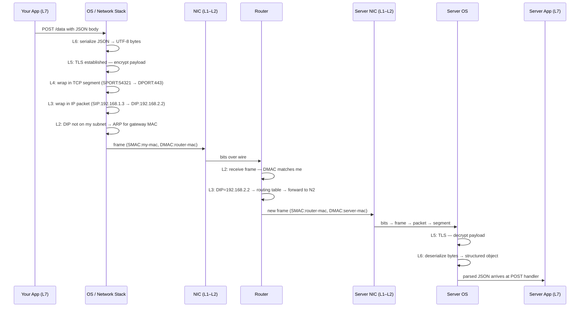

# Lecture 01 — Fundamentals of Networking
### From client-server origins to OSI layers to host-to-host communication

---

> [!NOTE]
> Lecture 01 introduced what networks are and why they exist — this lecture explains **how** they work: the architecture that distributes computation, the model that standardizes communication, and the addressing system that lets any two machines on Earth find each other.

---

# Part 1 — Client-Server Architecture

## 1. The Core Idea

> **Analogy:** A restaurant kitchen is expensive to build and run, so one kitchen serves many tables — customers (clients) order from a menu, the kitchen (server) does all the heavy cooking.

Before client-server, everything ran on one large, expensive mainframe. The revolution was simple: **split the application** so the expensive parts (RAM, CPU, disk I/O) run on a powerful server, while clients stay lightweight and cheap.

This decomposition of monolithic systems into communicating components is the same principle behind **microservices** today — just applied at a different scale. Where a monolith once ran on one machine, microservices are many small services calling each other over a network.

**Benefits at a glance:**

| Benefit | What it means in practice |
|---|---|
| Scalability | Many clients share one powerful server |
| Smaller clients | No local dependencies (DB drivers, heavy libs) |
| Dependency isolation | Server owns the DB driver; client just calls an API |
| Edge flexibility | Logic can shift client-side (IoT, edge computing) when needed |

**Backend relevance:** Every backend service you write *is* the server half of this model. When you add a database, you're adding a second server tier — the three-tier architecture (presentation → application → data) is just client-server applied twice in a chain.

---

## 2. Remote Procedure Call (RPC)

> **Analogy:** Calling a function that runs on someone else's computer, but writing it as if it were a local function call.

RPC dates back to the 1960s–70s. Early implementations were ad-hoc — as long as bits reached the server, the format was up to the developer. Over time, standards emerged. Today **gRPC** (Google's RPC framework) formalizes this with Protocol Buffers over HTTP/2.

```bash
# Example: curl as a manual RPC — you're calling a remote procedure (endpoint)
curl -X POST https://api.example.com/users \
  -H "Content-Type: application/json" \
  -d '{"name": "Nouri"}'   # payload = arguments to the remote procedure
```

**Backend relevance:** REST, gRPC, and GraphQL are all variations of RPC — different ways to call code that lives on another machine.

---

## 3. Why Standardization Is Non-Negotiable

> **Analogy:** Electrical outlets — without a standard shape and voltage, every device would need its own custom wall socket.

Without agreed-upon standards, a Node.js server and a Python client couldn't talk. Worse, every app would need separate versions for Wi-Fi, Ethernet, LTE, and fiber — each handling the physical medium differently.

Standards solve this by creating **abstraction layers**: your `fetch()` call is identical whether the bits travel as radio waves, electrical pulses, or light through glass fiber.

> [!IMPORTANT]
> The OSI model is the industry's answer to this standardization problem — it defines exactly what each layer is responsible for so that layers above don't need to know anything about layers below.

---

# Part 2 — The OSI Model

## 4. Why Seven Layers?

> **Analogy:** A postal system — you write a letter (application), put it in an envelope (presentation), seal it (session), hand it to a courier (transport), who uses road signs (network) to reach the right street (data link), then drops it in a physical mailbox (physical).

Each layer solves one problem and **exposes a clean interface** to the layer above. This means:
- Physical layer improvements (faster fiber) don't change IP routing
- New application protocols don't require new physical hardware
- Independent teams can innovate at each layer simultaneously

> [!WARNING]
> "Protocol ossification" is the exception: if too many intermediary devices depend on a specific packet format, changing that format breaks the internet. This is why IPv6 adoption took decades.

---

## 5. The Seven Layers

| Layer | Name | Data Unit | Key Protocol(s) | Device |
|---|---|---|---|---|
| 7 | Application | Data | HTTP, gRPC, FTP | — |
| 6 | Presentation | Data | TLS (encoding), JSON | — |
| 5 | Session | Data | TLS (handshake) | — |
| 4 | Transport | Segment / Datagram | TCP, UDP, QUIC | Firewall |
| 3 | Network | Packet | IP, ICMP | Router |
| 2 | Data Link | Frame | Ethernet, Wi-Fi 802.11 | Switch |
| 1 | Physical | Bits | — | Hub, NIC |

**Backend relevance:** As a backend engineer you live primarily in **layers 4 and 7**. You bind to a port (L4), speak HTTP (L7), and occasionally care about TLS (L5/L6). Understanding where each layer sits tells you what data a proxy, firewall, or load balancer can *see*.

---

## 6. Data Flow — Sending an HTTPS POST Request

> **Analogy:** Mailing a confidential document — you write it, seal it in a tamper-evident envelope, put that inside a shipping box with addresses, and hand it to a courier network that passes it hop-to-hop until it arrives.

Each layer wraps the layer above's data in a new header — like Russian matryoshka dolls. The diagram below shows the data units produced at each layer:


Each layer also adds specific **addressing fields**. These are the "doors" data enters and exits through:


```
SPORT  — source port          (Layer 4)
DPORT  — destination port     (Layer 4)
SIP    — source IP address    (Layer 3)
DIP    — destination IP address (Layer 3)
SMAC   — source MAC address   (Layer 2)
DMAC   — destination MAC address (Layer 2)
```

> [!NOTE]
> Decapsulation on the receiver is the exact reverse — bits → frame → packet → segment → session check → deserialize → application handler. Each unwrapping costs nanoseconds; at high traffic volumes these nanoseconds accumulate.

---

## 7. Intermediary Devices and Which Layer They Reach

> **Analogy:** Airport security checks your boarding pass (L4 firewall), but customs opens your bag and reads your documents (L7 proxy).

A packet rarely travels directly from client to server — it passes through switches, routers, firewalls, and load balancers, each processing only as deep as it needs to:


For more complex deployments with L4 firewalls and L7 load balancers/CDNs in the path:


| Device | Highest Layer Read | What it sees | What it's blind to |
|---|---|---|---|
| Hub | L1 | Raw bits | Everything |
| Switch | L2 | MAC addresses | IP, ports, payload |
| Router | L3 | IP addresses | Ports, payload |
| Firewall | L4 | IP + ports | Encrypted payload |
| L7 Load Balancer / CDN | L7 | Full HTTP (after TLS termination) | Nothing — it's the endpoint |

> [!IMPORTANT]
> Layers 3 and 4 headers (IP addresses and ports) are **always visible in plaintext** — they are never encrypted because routers need them to deliver packets. This is why a VPN works: it wraps your original IP packet inside another IP packet, hiding your real destination from the ISP.

**Backend relevance:** When you configure nginx to route `/api` to one backend and `/static` to another, you're building an L7 device. It must decrypt TLS, read the URL path, then re-encrypt to the backend — which is why L7 proxies are slower than L4 ones.

---

## 8. OSI vs. TCP/IP Model

> **Analogy:** OSI is the academic textbook; TCP/IP is the engineer's field guide.

```
OSI Model          TCP/IP Model
─────────────      ─────────────────
Layer 7  ┐
Layer 6  ├──────►  Application
Layer 5  ┘
Layer 4  ─────────► Transport
Layer 3  ─────────► Internet
Layer 2  ┐
Layer 1  ├──────►  Link
         ┘
```

TCP/IP collapses the top three OSI layers into one "Application" layer — more pragmatic, but loses the granularity useful for understanding proxies (L5), serialization (L6), and session management.

> [!WARNING]
> When someone says "layer 5" without specifying the model, ask which model they mean. In OSI it's Session; in TCP/IP it doesn't exist as a separate concept.

---

# Part 3 — Host-to-Host Communication

## 9. MAC Addresses — Layer 2 Addressing

> **Analogy:** Your apartment unit number inside one building — unique within the building, meaningless for mail coming from another city.

Every network interface card has a globally unique **MAC address** (48 bits, e.g., `AA:BB:CC:DD:EE:FF`). In a mesh network where all devices are directly connected, when host A sends a frame **every device receives it** — each checks whether the destination MAC matches theirs, and discards if not:


**The critical flaw:** MAC addresses have no hierarchical structure. To route globally using only MACs, a device would have to scan every address on Earth — like a full table scan with no index.

> [!WARNING]
> Public Wi-Fi is a mesh at layer 2 — all frames are broadcast to all connected devices. Historically, password sniffers exploited this by accepting frames not addressed to them. This is why unencrypted HTTP on public Wi-Fi was dangerous.

**Backend relevance:** You'll rarely touch MACs directly, but they matter when debugging ARP issues (`arp -a`) or configuring network interfaces on servers.

---

## 10. IP Addresses — Layer 3 Hierarchical Addressing

> **Analogy:** A full postal address with country, city, street, and house number — routers use the country+city part to narrow down the route, then the street+house part for final delivery.

An IPv4 address is 32 bits, split into two logical parts:

```
192  .  168  .   1   .  10   /24
└──────────────────┘   └──┘
    Network portion    Host portion
    (first 24 bits)    (last 8 bits)
```

The `/24` subnet mask tells every router: "only look at the first 24 bits to decide if this packet is for my network."

Two networks connected by a router, with hosts labeled abstractly:


The same topology with real IP addresses:


**How a host decides where to send:**
1. Apply subnet mask to destination IP
2. If network portion **matches** → destination is **local**, use ARP to get MAC and send directly
3. If network portion **differs** → destination is **remote**, forward to the **default gateway** (router)

> [!NOTE]
> Modern networking uses **CIDR** (Classless Inter-Domain Routing) with flexible prefix lengths (`/8`, `/16`, `/24`, `/30`...) instead of the old rigid Class A/B/C system, which wasted huge blocks of addresses.

**Backend relevance:** When you deploy to a VPC on AWS/GCP, you choose a CIDR block (e.g., `10.0.0.0/16`). Subnets get smaller blocks like `10.0.1.0/24` — 254 usable host addresses. Knowing this prevents "why can't my new EC2 instance get an IP" surprises.

---

## 11. Port Numbers — Layer 4 Multiplexing

> **Analogy:** IP is the building address; the port is the apartment number. The postal carrier (OS) delivers the package to the right tenant (process).

A single host runs many services simultaneously. Ports allow the OS to **demultiplex** incoming segments to the right process:

```
Incoming TCP segment
      │
      ▼
  Destination IP: 192.168.1.10  ──► correct machine   (L3)
  Destination Port: 443          ──► HTTPS process     (L4)
  Source Port: 54321             ──► tells server where to reply
```

**Well-known ports:**

| Port | Protocol | Common use |
|---|---|---|
| 22 | TCP | SSH |
| 53 | UDP/TCP | DNS |
| 80 | TCP | HTTP |
| 443 | TCP | HTTPS |
| 5432 | TCP | PostgreSQL |
| 6379 | TCP | Redis |
| 27017 | TCP | MongoDB |

**Ephemeral ports** (typically `49152–65535`) are assigned by the OS for outgoing connections. The server uses the source port to send responses back to the right client process.

```bash
# See what ports your machine is listening on
ss -tlnp   # Linux — shows TCP listening sockets with process names

# See active connections including ephemeral source ports
ss -tnp    # Linux — shows established TCP connections
```

**Backend relevance:** When your Express app listens on port `3000`, it binds a well-known (to your app) port. Every outbound request it makes gets a fresh ephemeral port. Under extreme load, if you exhaust the ephemeral port range, new outbound connections fail — this is called **port exhaustion**.

---

## 12. The Three Addressing Layers Working Together

> **Analogy:** Sending international mail — MAC is the street-level handoff between neighbors, IP is the international routing system, and the port is the department number inside the destination building.

```
┌─────────────────────────────────────────────────────────┐
│  Port 443          ◄── "which app on this host?"  (L4)  │
├─────────────────────────────────────────────────────────┤
│  IP  203.0.113.5   ◄── "which host globally?"     (L3)  │
├─────────────────────────────────────────────────────────┤
│  MAC AA:BB:CC:..   ◄── "which NIC right now?"     (L2)  │
└─────────────────────────────────────────────────────────┘
```

Each layer solves the problem the layer below cannot:
- MACs are unique but unroutable globally → IP adds hierarchy
- IPs identify hosts but not processes → ports add multiplexing

> [!NOTE]
> `127.0.0.1` (IPv4) / `::1` (IPv6) is the **loopback address**. Traffic sent here never leaves the machine. Services bound to `localhost` are invisible to the outside world — intentional for dev databases, dangerous if you think a service is exposed when it isn't.

---

# Full Flow — Tracing an HTTPS POST Across Two Networks

**Scenario:** Your backend (192.168.1.3) sends a POST request to an API server (192.168.2.2) through a router.



> [!IMPORTANT]
> **MAC addresses change at every router hop** — the router rewrites SMAC and DMAC for each new link. **IP addresses stay the same** end-to-end. This is the fundamental difference between L2 and L3 addressing.

---

# Checklist — What You Should Know After This

- [ ] Why did client-server architecture replace monolithic mainframe computing?
- [ ] What problem does RPC solve, and how do gRPC and REST relate to it?
- [ ] Why is a standardized communication model necessary for networked applications?
- [ ] What are the seven OSI layers and the data unit name at each layer?
- [ ] What happens at each layer when a client sends an HTTPS POST request?
- [ ] What is encapsulation, and what is the matryoshka-doll analogy for it?
- [ ] Up to which layer does a switch, router, firewall, and L7 load balancer each process traffic?
- [ ] Why are IP addresses and ports always visible to intermediary devices, but HTTP payloads are not?
- [ ] Why is a MAC address insufficient for global routing?
- [ ] What are the two logical parts of an IPv4 address, and what does `/24` in CIDR notation mean?
- [ ] How does a host decide whether to send a packet directly or via the default gateway?
- [ ] What is port multiplexing, and what is the difference between a well-known port and an ephemeral port?
- [ ] What is the loopback address, and why does binding to `localhost` vs `0.0.0.0` matter?
- [ ] Why do MAC addresses change at every router hop while IP addresses stay the same?
- [ ] Can you trace a real-world scenario end-to-end using everything from this lecture?

---

← [Back to main README](../README.md)