# Lecture 02 — IP Addressing, Packets, ICMP, ARP & Routing
### How a piece of data actually finds its way from your laptop to a server on the other side of the world

---

> [!NOTE]
> This lecture builds directly on Lecture 01. Once you know the basic layers of a network, this lecture answers the next question: *how does a device actually decide where to send a packet, and how does it find the right physical neighbor to hand it to?*

---

## Table of Contents

- [Part 1 — IP Addressing & Subnets](#part-1--ip-addressing--subnets)
  - [1. The Big Picture](#1-the-big-picture)
  - [2. What Is an IP Address?](#2-what-is-an-ip-address)
  - [3. Network vs Host](#3-network-vs-host)
  - [4. Subnet & Subnet Mask](#4-subnet--subnet-mask)
  - [5. Default Gateway](#5-default-gateway)
  - [6. Private IP Ranges](#6-private-ip-ranges)
- [Part 2 — The IP Packet, ICMP, Ping & Traceroute](#part-2--the-ip-packet-icmp-ping--traceroute)
  - [7. The IP Packet](#7-the-ip-packet)
  - [8. TTL — Time To Live](#8-ttl--time-to-live)
  - [9. ICMP](#9-icmp)
  - [10. Ping](#10-ping)
  - [11. Traceroute](#11-traceroute)
  - [12. Watching Packets with tcpdump](#12-watching-packets-with-tcpdump)
- [Part 3 — ARP: Finding the Physical Address](#part-3--arp-finding-the-physical-address)
  - [13. Why We Need ARP](#13-why-we-need-arp)
  - [14. The ARP Flow](#14-the-arp-flow)
  - [15. Same Subnet vs Different Subnet](#15-same-subnet-vs-different-subnet)
  - [16. ARP Poisoning](#16-arp-poisoning)
- [Full Flow — A Complete Routing Example](#full-flow--a-complete-routing-example)
- [Checklist — What You Should Know After This](#checklist--what-you-should-know-after-this)

---

# Part 1 — IP Addressing & Subnets

## 1. The Big Picture

> **Analogy:** Sending data over a network is like mailing a letter inside a box, inside a delivery van. Each layer only cares about its own job.

When your computer sends data, it gets wrapped in layers, from the inside out:

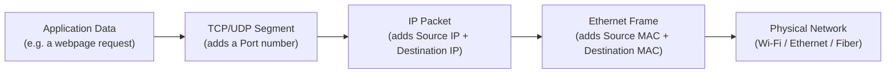

Each address answers a different question:

| Layer       | Question it answers                                                  |
| ----------- | ---------------------------------------------------------------------|
| MAC address | Which physical device on this local network should get this right now? |
| IP address  | Which host should eventually receive this, anywhere in the world?    |
| Port        | Which specific app/process on that host should handle it?            |

Here is what a real frame looks like once everything is filled in — two laptops, each with an IP, a MAC address, and (for the sender) a port:

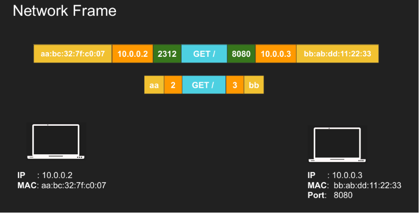

> [!NOTE]
> 📸 *`arp1.png` — a full Ethernet frame with the source MAC, source IP, source port, the actual request ("GET /"), destination port, destination IP, and destination MAC all laid out side by side. It's the clearest single picture of "everything a packet carries."*

**Backend relevance:** every request that hits your API server has already passed through this exact wrapping/unwrapping process — this is why "the network" is a real part of your system's behavior, not an abstraction you can ignore.

---

## 2. What Is an IP Address?

> **Analogy:** An IP address is like a home address — it identifies *which house* (host) on the map should receive the delivery.

An IPv4 address is 4 bytes (32 bits), written as four numbers separated by dots:

```txt
192 . 168 . 1 . 3
 8     8    8   8  bits per section
```

It can be assigned in two ways:

| Type      | Meaning                        |
| --------- | ------------------------------- |
| Static    | You (or an admin) set it manually |
| Automatic | DHCP hands your device an IP automatically |

**Backend relevance:** the question that actually matters day to day isn't "who assigned this IP" — it's *"is the machine I'm talking to on my own local network, or somewhere else?"* Everything in this lecture builds toward answering that one question.

---

## 3. Network vs Host

> **Analogy:** Think of an IP address like a street address: `Network = Street`, `Host = House number`. Everyone on the same street shares the street name; only the house number is unique to you.

Every IP address is split into two parts:

```txt
192.168.254.15/24
<--- network ---> host
     24 bits       8 bits
```

The `/24` tells your computer: *"the first 24 bits are the network part, the rest is the host part."*

So for `192.168.254.15/24`:

```txt
Network = 192.168.254.0/24
Host    = 15
```

Devices that share the same network part are on the **same network** and can talk directly:

```txt
192.168.1.3
192.168.1.10
192.168.1.55
```

All three above are on `192.168.1.0/24`. But `192.168.2.10` is on a *different* network (`192.168.2.0/24`), even though it looks similar.

**Backend relevance:** this is exactly what determines whether two servers can reach each other over a local/private network segment (fast, no router hop) versus needing to go through a gateway (extra hop, more latency).

---

## 4. Subnet & Subnet Mask

> **Analogy:** The subnet mask is a stencil. Lay it over an IP address and it tells you which part is the "street" (network) and which part is the "house number" (host).

A **subnet** is simply a network range, e.g. `192.168.254.0/24`, and its **subnet mask** is `255.255.255.0`.

Your device applies the mask to both its own IP and the destination IP to decide if they land in the same network.

### Same subnet example

```txt
Your host:    192.168.1.3/24
Destination:  192.168.1.2

Apply mask:
192.168.1.3  → 192.168.1.0
192.168.1.2  → 192.168.1.0
```

Same result → same subnet → **no router needed**, send straight to the destination's MAC address.

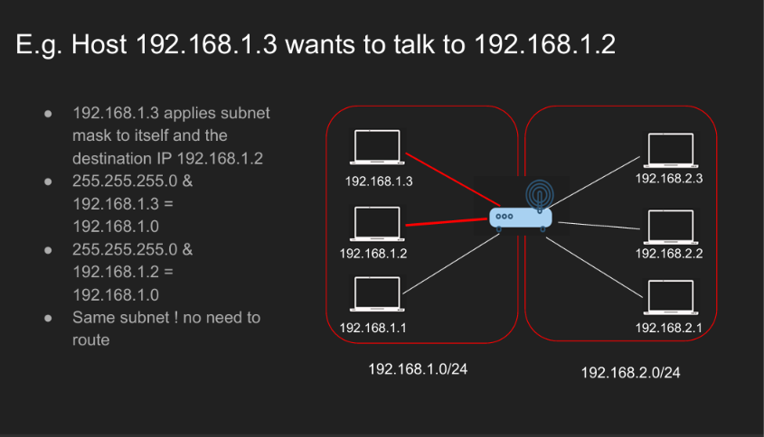

> [!NOTE]
> 📸 *It shows `192.168.1.3` talking to `192.168.1.2`: applying the mask to both gives `192.168.1.0`, so no routing is needed.*

### Different subnet example

```txt
Your host:    192.168.1.3/24
Destination:  192.168.2.2

Apply mask:
192.168.1.3  → 192.168.1.0
192.168.2.2  → 192.168.2.0
```

Different result → different subnet → the packet must be sent to the **Default Gateway** instead.

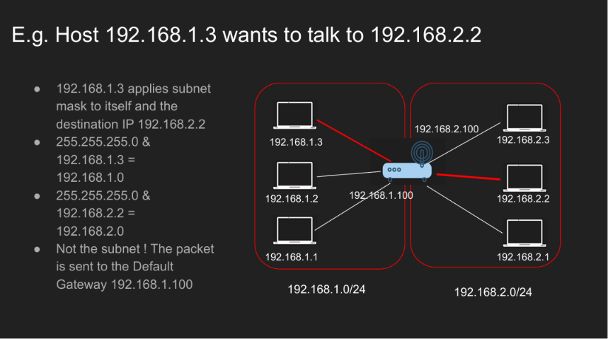

> [!NOTE]
> 📸 *It shows `192.168.1.3` talking to `192.168.2.2`: the mask gives two different networks, so the packet is sent to the Default Gateway `192.168.1.100` instead of directly to the destination.*

**Backend relevance:** this "apply the mask, compare the result" check is exactly what your OS does before every outgoing connection — it's why two VMs "in the same VPC subnet" talk faster than two VMs in different subnets that must hop through a router/NAT gateway.

---

## 5. Default Gateway

> **Analogy:** The Default Gateway is your local post office. If the letter's destination isn't on your street, you don't try to deliver it yourself — you hand it to the post office, which knows how to get it further.

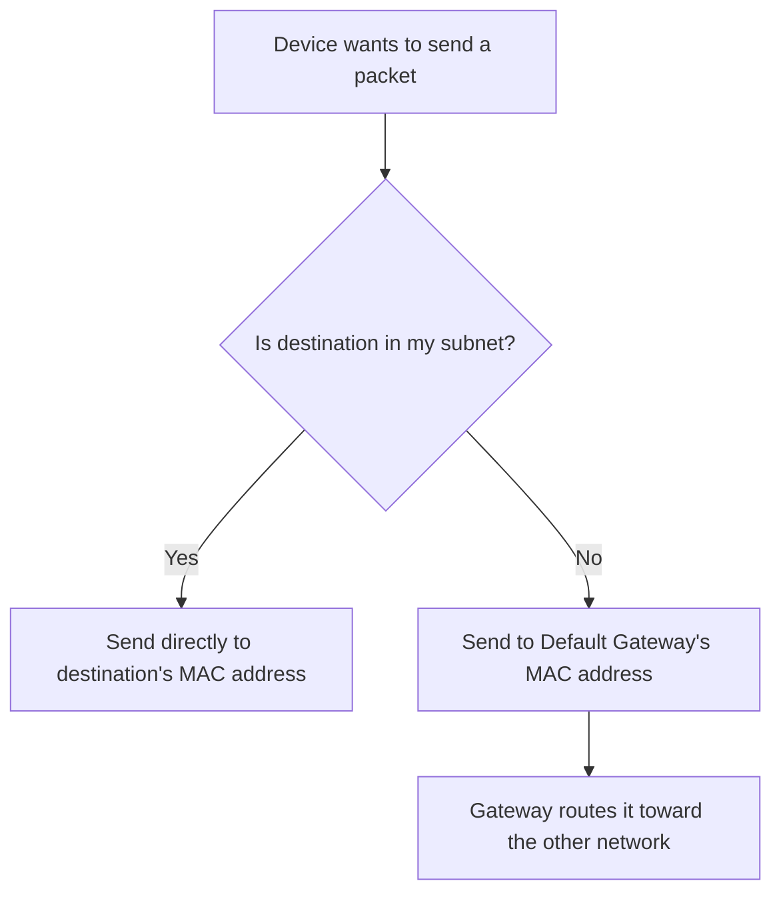

> [!IMPORTANT]
> The **IP address never changes** along the way — it always points to the true final destination. Only the **MAC address** changes at each hop, since MAC only ever points to *the next physical neighbor*.

Example:

```txt
Your IP:          192.168.1.3
Default Gateway:  192.168.1.100
Destination:      192.168.2.2   (outside your subnet)
```

The packet still says `Destination IP = 192.168.2.2`, but the Ethernet frame says `Destination MAC = Gateway's MAC`.

**Backend relevance:** whenever a request "leaves the building" (leaves its subnet/VPC), it is always handed off to a gateway first — this is a key piece of intuition for debugging connectivity/firewall/security-group issues in cloud environments.

---

## 6. Private IP Ranges

> **Analogy:** Private IPs are like internal extension numbers inside a company — they mean something inside the building, but nobody outside can dial them directly.

Some ranges are reserved for private/local networks and are never routed on the public internet:

```txt
10.0.0.0/8
172.16.0.0/12
192.168.0.0/16
```

Home Wi-Fi, office networks, Docker networks, and cloud VPCs commonly use these.

> [!NOTE]
> A mask like `255.255.254.0` is a `/23`, giving `2^9 = 512` total addresses (a few of which are reserved, so the usable host count is slightly lower).

**Backend relevance:** if you've ever wondered why your laptop's IP (e.g. `192.168.1.10`) is invisible to the internet, this is why — it's a private address, and it only becomes reachable externally after NAT rewrites it (more on NAT in a later lecture).

---

# Part 2 — The IP Packet, ICMP, Ping & Traceroute

## 7. The IP Packet

> **Analogy:** Picture a shipping box. The outside label (header) says who it's from and where it's going and how it should be handled; the inside (data) is the actual thing being shipped.

To a backend engineer, the simplest mental model of a packet is just three fields:

```txt
[ Source IP ][ Data ][ Destination IP ]
```

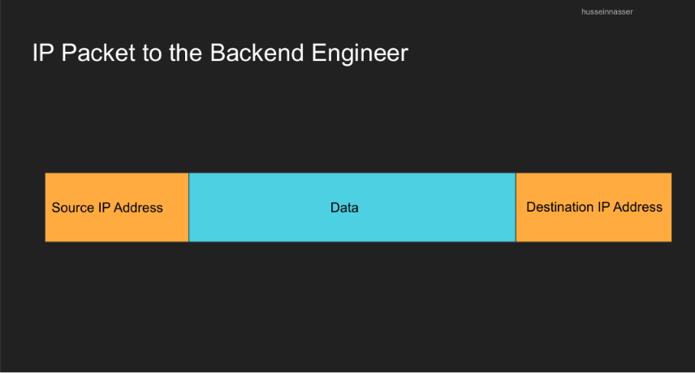

> [!NOTE]
> 📸 *the simplified "backend engineer's view" of an IP packet: just Source IP, Data, and Destination IP.*

The real packet header carries a lot more metadata:

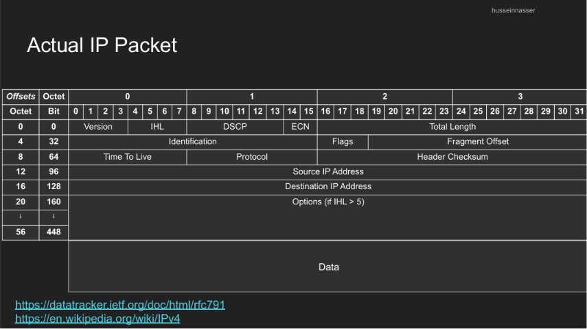

> [!NOTE]
> 📸 *the actual IPv4 header layout (Version, IHL, Total Length, TTL, Protocol, Source/Destination IP, and more), byte by byte.*

| Section | Meaning                          |
| ------- | --------------------------------- |
| Header  | Metadata used to deliver the packet |
| Data    | The actual payload being carried  |

The header is normally **20 bytes**, but can grow to **60 bytes** if optional fields are used. The data section can theoretically be up to ~65,535 bytes, though in practice packets are kept much smaller (limited by MTU).

Key fields worth knowing right now:

| Field          | Why it matters                            |
| -------------- | ------------------------------------------ |
| Source IP      | Where the packet came from                 |
| Destination IP | Where the packet is going                  |
| TTL            | Stops packets from looping forever         |
| Protocol       | Says what's inside the data (ICMP/TCP/UDP) |
| Total Length   | Size of header + data                      |

**Backend relevance:** the `Protocol` field is why a firewall can tell TCP traffic (your API calls) apart from ICMP traffic (pings) apart from UDP — it's the very first filter applied before your app ever sees a byte.

### A closer look at a few more header fields

The fields above are the ones you'll use daily, but a few more fields in the real header are worth actually understanding rather than skipping past.

#### Version

> **Analogy:** Version is just the label on the envelope telling the post office "this is a Type-4 form, not a Type-6 form" — it tells every router which set of rules to use to read the rest of the header.

A 4-bit field, always the very first thing read. It's either `4` (IPv4, what this lecture covers) or `6` (IPv6). Since IPv4 and IPv6 headers are laid out completely differently, a router has to know this before it can make sense of a single other field.

#### IHL — Internet Header Length

> **Analogy:** IHL is like a note at the top of a form saying "this form has 5 sections" — it tells the reader exactly where the header ends and the actual content (Data) begins.

A 4-bit field that states the header's length, measured in **32-bit (4-byte) words**. The minimum legal value is `5`, meaning `5 × 4 = 20 bytes` — a plain header with no extra options. If optional fields are attached, IHL goes up accordingly (up to a max of `15 × 4 = 60 bytes`). Without this field, a device wouldn't know where the header stops and the payload starts.

#### Congestion — and what ECN does about it

> **Analogy:** Congestion is a traffic jam. Every router has a limited amount of "road" (bandwidth and buffer space) it can push packets through per second. When more packets show up than it can forward, they start to queue up — and if the queue fills completely, new packets simply get dropped, like cars that can't fit onto a full highway.

**Congestion** is what happens when a network link or router receives more traffic than it can currently handle. The two normal symptoms are:

- **Delay** — packets sit in a queue longer before being forwarded.
- **Packet loss** — once the queue is full, arriving packets are dropped outright.

**ECN (Explicit Congestion Notification)** is a 2-bit field that gives routers a way to warn endpoints about this *before* it gets bad enough to start dropping packets. Instead of silently discarding a packet once congestion becomes severe, a router experiencing early congestion can mark the ECN bits on a packet as it passes through — a small flag that says "traffic is getting heavy along this path." The receiving end sees this mark and can signal the sender to slow down, easing the congestion before real packet loss happens. If ECN is never used, the field simply stays at `0`, and routers fall back to dropping packets as the only way to signal congestion.

#### Fragmentation — and the three fields that support it

> **Analogy:** Imagine mailing a large piece of furniture that's too big to fit through a normal doorway. You saw it into smaller pieces, ship each piece separately, and label every piece clearly — "part 2 of 4, box #57" — so whoever receives them can reassemble the original object correctly, in the right order.

**Fragmentation** is exactly this, but for packets. Every physical network link has a maximum packet size it can carry in one piece, called the **MTU (Maximum Transmission Unit)** — commonly 1500 bytes on Ethernet. If an IP packet is larger than the MTU of a link it needs to cross, it has to be **split into smaller fragments**, each with its own copy of the IP header, sent separately, and reassembled by the receiving host once every fragment has arrived.

Three header fields exist specifically to make this splitting and reassembly work:

| Field | What it does |
| ----- | ------------- |
| **Identification** | A number the sender attaches to every fragment of the *same* original packet. All fragments belonging to one packet share this same value, so the receiver knows which fragments belong together (like the "box #57" label in the analogy above). |
| **Flags** | A small set of control bits. One of them, "Don't Fragment," tells routers *not* to split this packet even if it's too big (instead, the router drops it and reports back that fragmentation would have been needed). Another, "More Fragments," is set on every fragment except the last one, so the receiver knows when reassembly is complete. |
| **Fragment Offset** | Tells the receiver exactly *where* this particular fragment fits within the original, unfragmented packet — like a page number, so the pieces can be reassembled in the correct order even if they arrive out of sequence. |

Together, these three fields let a single oversized packet be broken apart at any point along its path and correctly rebuilt at the destination, regardless of the order the pieces actually arrive in.

---

## 8. TTL — Time To Live

> **Analogy:** TTL is like giving someone a countdown timer to deliver a message: "if you haven't reached the destination in N hops, give up and turn back."

```txt
Initial TTL = 64

Router 1 → TTL 63
Router 2 → TTL 62
Router 3 → TTL 61
```

Every router that forwards the packet subtracts 1 from TTL. If it hits 0, the router **drops the packet** and sends back an `ICMP Time Exceeded` message.

**Backend relevance:** this single mechanism is what prevents a misconfigured network from letting packets circulate forever — and it's also the trick that `traceroute` uses on purpose (see below).

---

## 9. ICMP

> **Analogy:** ICMP is the network's internal notification system — not a message *for* an application, but a message *about* the network itself ("I couldn't deliver this," "this took too long," etc.).

ICMP = **Internet Control Message Protocol**. It's used by operating systems and routers, not directly by your application code.

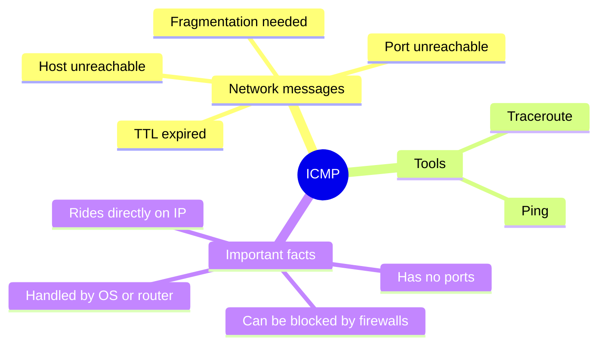

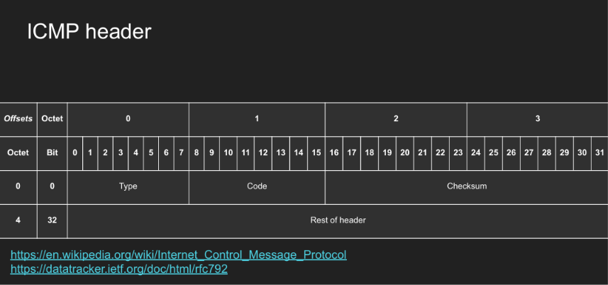

> [!NOTE]
> 📸 *the ICMP header layout: Type, Code, Checksum, and the rest of the header.*

| Field    | Meaning                    |
| -------- | --------------------------- |
| Type     | What kind of ICMP message   |
| Code     | A more specific sub-reason  |
| Checksum | Detects data corruption     |

Common ICMP messages:

| Message                  | Meaning                                 |
| ------------------------- | ---------------------------------------- |
| Echo Request              | "Are you alive?"                        |
| Echo Reply                | "Yes, I'm alive."                       |
| Time Exceeded             | TTL hit 0 along the way                 |
| Destination Unreachable   | The target couldn't be reached          |
| Fragmentation Needed      | Packet is too big and can't be split    |

> [!WARNING]
> ICMP has no ports and no application logic — it's easy for a firewall to block entirely. If `ping` fails, that does **not** automatically mean the server is down; it might just mean ICMP is being filtered.

**Backend relevance:** this is exactly why "the server didn't respond to ping" is not proof of an outage — you should always check the actual service port (e.g. `curl` on port 443) before assuming downtime.

---

## 10. Ping

> **Analogy:** Ping is like shouting "are you there?" across a room and listening for someone to shout back "yes!"

`ping` uses ICMP to answer one question: *can I reach this host at all?*

```bash
ping google.com
```

Your OS sends an `ICMP Echo Request`; if the destination allows ICMP, it replies with an `ICMP Echo Reply`.

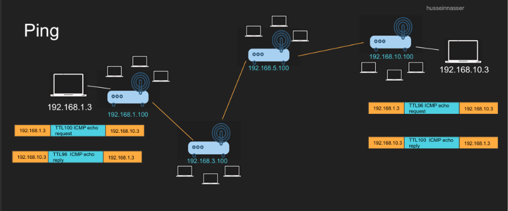

> [!NOTE]
> 📸 *shows the Echo Request/Reply bouncing across multiple routers between `192.168.1.3` and `192.168.10.3`, with the TTL decreasing at each hop.*

**Backend relevance:** ping works against *any* host that allows ICMP — it's not a Google-specific trick, and it's usually the very first sanity check in debugging "is anything even reachable?"

---

## 11. Traceroute

> **Analogy:** If ping asks "can I reach you," traceroute asks "which street corners did I pass on the way there?"

`traceroute` reuses the TTL trick from earlier, on purpose:

```txt
Packet 1: TTL = 1 → dies at router 1, which replies
Packet 2: TTL = 2 → dies at router 2, which replies
Packet 3: TTL = 3 → dies at router 3, which replies
...
```

Each router that drops a packet due to expired TTL sends back an ICMP message identifying itself — so, hop by hop, traceroute reconstructs the entire path.

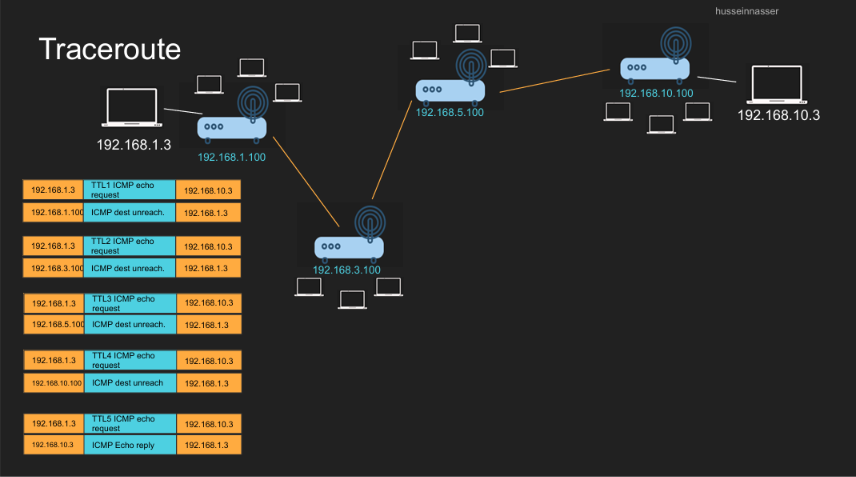

> [!NOTE]
> 📸 *shows the TTL being incremented (1, 2, 3, 4, 5) across a chain of routers, with each router replying "ICMP dest unreachable" until the final hop replies with the real "ICMP Echo reply."*

> [!WARNING]
> Traceroute isn't always 100% accurate — routes can change mid-trip, and ICMP can be blocked at any hop along the way, creating gaps ("stars") in the output.

**Backend relevance:** when a service is slow or unreachable from a specific region, traceroute is the tool that tells you *where* along the path the problem sits, rather than just *that* there is a problem.

---

## 12. Watching Packets with tcpdump

`tcpdump` lets you watch real packets moving on your machine's network interface.

This command shows only ARP traffic on interface `en0`:

```bash
tcpdump -n -i en0 arp
# tcpdump = the packet capture tool
# -n      = show raw numbers (IPs/ports), don't resolve them to hostnames
# -i en0  = listen on network interface "en0"
# arp     = filter: only show ARP packets
```

A few more useful filters:

```bash
# Show only ICMP packets — pair this with a ping in another terminal
tcpdump -n -i en0 icmp

# Verbose mode: print more IP header detail per packet
tcpdump -n -i en0 -v icmp
# -v = "verbose", prints extra header fields like TTL

# Show only traffic coming FROM a specific source IP
tcpdump -n -i en0 src 93.184.216.34
# src <ip> = filter: source address must match

# Show only traffic going TO a specific destination IP
tcpdump -n -i en0 dst 93.184.216.34
# dst <ip> = filter: destination address must match

# Show traffic in either direction for that IP
tcpdump -n -i en0 "src 93.184.216.34 or dst 93.184.216.34"
# quotes needed because "or" would otherwise be parsed by the shell
```

Try it yourself: run `tcpdump -n -i en0 icmp` in one terminal, then `ping example.com` in another, and watch the Echo Request/Reply pairs appear live.

**Backend relevance:** `tcpdump` is the tool you reach for when logs aren't enough — e.g. confirming whether a request ever actually left the box, or whether a firewall silently dropped it.

---

# Part 3 — ARP: Finding the Physical Address

## 13. Why We Need ARP

> **Analogy:** Knowing someone's house address (IP) doesn't tell the delivery driver which specific person to hand the package to at the door (MAC). ARP is how you find out "which physical device answers to this address."

**ARP** = **Address Resolution Protocol**. It answers exactly one question:

> *I know the IP address — what is the matching MAC address?*

This matters because Ethernet frames are delivered using MAC addresses, not IP addresses:

```txt
IP address  → used at Layer 3 (routing, "which host, eventually")
MAC address → used at Layer 2 (delivery, "which device, right now")
```

If your computer wants to reach `10.0.0.5` but doesn't yet know its MAC address, it sends an ARP request as a **broadcast**: *"Who has 10.0.0.5?"*

> **Analogy:** Broadcast is like standing in a room and shouting a question to everyone at once — only the person being asked about answers back.

The special broadcast MAC address is `FF:FF:FF:FF:FF:FF`; the switch forwards it to every port, but only the device with the matching IP replies.

---

## 14. The ARP Flow

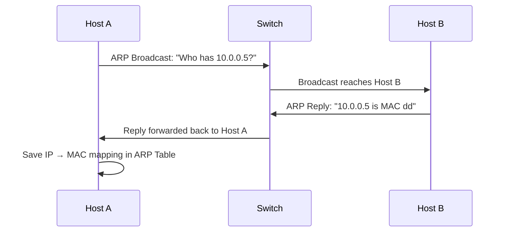

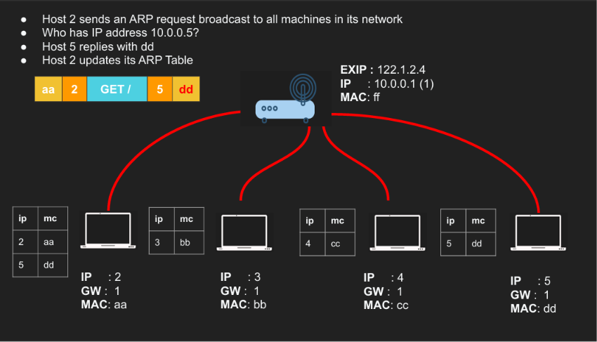

> [!NOTE]
> 📸 *shows Host 2 broadcasting "Who has 10.0.0.5?", Host 5 replying "dd", and Host 2 saving that mapping into its ARP table.*

After this exchange, Host A can send normal frames straight to Host B's MAC address, without repeating the ARP request every time — because it now caches the result in its **ARP table**:

```txt
IP Address  → MAC Address
10.0.0.5    → dd
10.0.0.1    → ff
```

**Backend relevance:** ARP tables are why the *first* connection to a new local peer has a tiny extra delay compared to later ones — the mapping only needs to be resolved once, then it's cached.

---

## 15. Same Subnet vs Different Subnet

### Same subnet

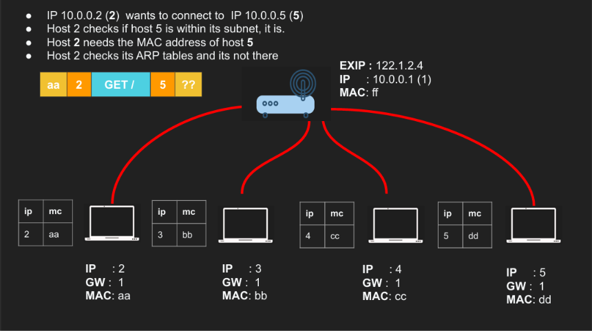

> [!NOTE]
> 📸 *Host 2 (`10.0.0.2`) wants to reach Host 5 (`10.0.0.5`); since they're in the same subnet, Host 2 needs Host 5's actual MAC address and ARPs for it directly.*

If the destination is on your own subnet, ARP resolves the **destination's own MAC address**.

### Different subnet

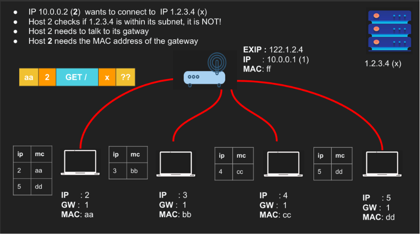

> [!NOTE]
> 📸 *Host 2 (`10.0.0.2`) wants to reach `1.2.3.4`, which is outside its subnet, so it only needs the MAC address of the Gateway, not of the far-away server.*

If the destination is outside your subnet, your device doesn't need (and can't get) the far server's MAC address at all — it only needs the **gateway's** MAC, because the gateway is the next physical hop:

```txt
Destination IP  = 1.2.3.4        (the real, final target)
Destination MAC = Gateway's MAC  (the next hop only)
```

> [!IMPORTANT]
> This is one of the most important ideas in this whole lecture: **for anything outside your subnet, ARP resolves the gateway's MAC address — never the final server's.**

---

## 16. ARP Poisoning

> **Analogy:** ARP is like a note-passing system where nobody checks ID — if someone shouts "I'm the gateway!" convincingly enough, your device will believe them.

ARP's core weakness: **it trusts replies without verifying them.**

Normal exchange:

```txt
Who has 10.0.0.1?
Gateway: "I do. My MAC is ff."
```

An attack:

```txt
Attacker: "I am 10.0.0.1. My MAC is cc."
```

If the victim believes this, its ARP table gets **poisoned**:

```txt
Gateway IP → Attacker's MAC   (instead of the real gateway MAC)
```

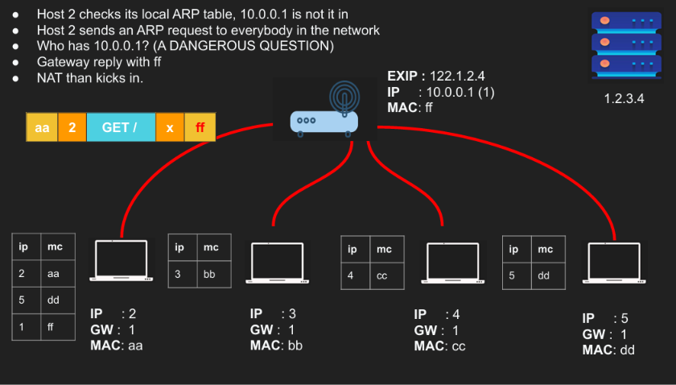

> [!NOTE]
> 📸 *It shows Host 2 asking "Who has 10.0.0.1? (A DANGEROUS QUESTION)" — the point being that whichever device replies first is simply trusted, which is exactly the weakness an attacker exploits.*

From that point on, all of the victim's outbound traffic flows through the attacker first:

```txt
Victim → Attacker → Gateway
```

This is a classic **Man-in-the-Middle (MITM)** attack.

> [!WARNING]
> ARP has no built-in authentication. Defenses against this (like static ARP entries, port security, or Dynamic ARP Inspection) live at the switch/network-admin level, not inside your application.

**Backend relevance:** this is why traffic *within* a data center or cloud VPC isn't automatically trustworthy just because it's "internal" — encryption in transit (TLS) still matters even on private networks.

---

# Full Flow — A Complete Routing Example

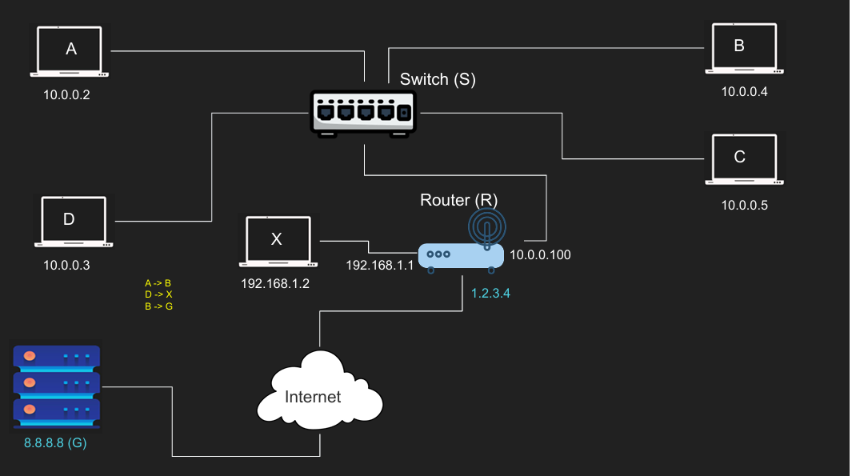

> [!NOTE]
> 📸 *the full picture used for all three cases below: hosts A, B, C, D on `10.0.0.0/24`, host X on `192.168.1.0/24`, a router bridging both, and server `8.8.8.8` reachable through the internet.*

## Case 1 — A → B, same network

Both `A` and `B` are on `10.0.0.0/24`.

```txt
A checks the subnet mask → B is local
A uses ARP to get B's MAC address
A sends the frame directly to B's MAC
The switch forwards it only to B's port
```

No router is involved at all.

## Case 2 — D → X, different local network

`D` is `10.0.0.3`; `X` is `192.168.1.2` — different subnets.

```txt
D checks the subnet mask → X is NOT local
D sends the packet toward its gateway (10.0.0.100)
D uses ARP to get the gateway's MAC address
The router receives the packet and forwards it into 192.168.1.0/24
```

```txt
IP destination  = X
MAC destination = the Router (not X!)
```

## Case 3 — B → G, out to the internet

`B` wants to reach `8.8.8.8`, which is out on the public internet.

```txt
B sends the packet to its gateway
The gateway performs NAT
B's private source IP is rewritten to the router's public IP
The packet is forwarded out to the internet
```

> [!NOTE]
> NAT (Network Address Translation) is what makes private IPs like `10.0.0.3` reachable on the public internet at all — we'll cover it in full in a later lecture.

---

# Checklist — What You Should Know After This

- [ ] Can you explain, in one sentence each, what an IP address, a MAC address, and a port are each responsible for?
- [ ] Can you apply a subnet mask to two IPs and determine whether they're on the same network?
- [ ] Do you know when a Default Gateway gets involved, and why the destination MAC changes but the destination IP never does?
- [ ] Can you name three fields in an IP packet header and explain why each one matters?
- [ ] Can you explain what TTL is for and what happens when it reaches zero?
- [ ] Do you know the difference between what `ping` tells you and what `traceroute` tells you?
- [ ] Can you explain why a failed `ping` doesn't necessarily mean a server is down?
- [ ] Can you write a basic `tcpdump` filter to capture ICMP or ARP traffic?
- [ ] Can you explain, step by step, what happens when a device sends an ARP request?
- [ ] Do you know whether ARP resolves the final server's MAC or the gateway's MAC when the destination is outside your subnet?
- [ ] Can you explain what ARP poisoning is and why ARP is vulnerable to it?
- [ ] Do you know what private IP ranges are, and why they're not directly reachable from the internet?
- [ ] Can you trace a real-world scenario end-to-end using everything from this lecture?

---

← [Back to main README](../README.md)