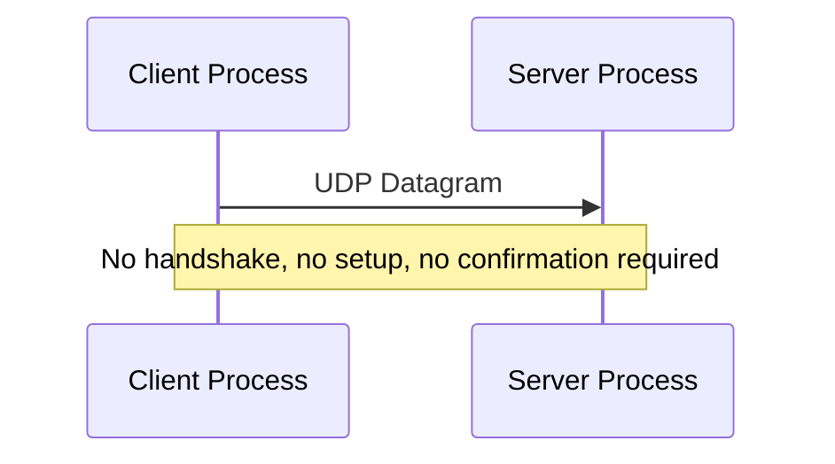
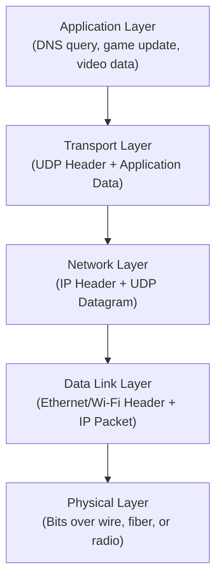
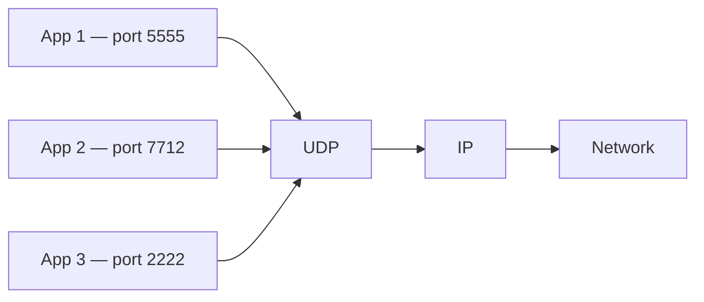
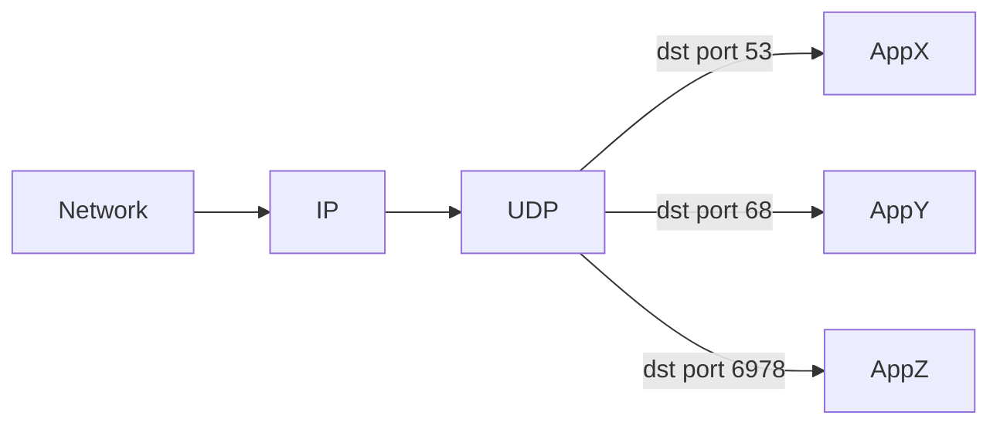
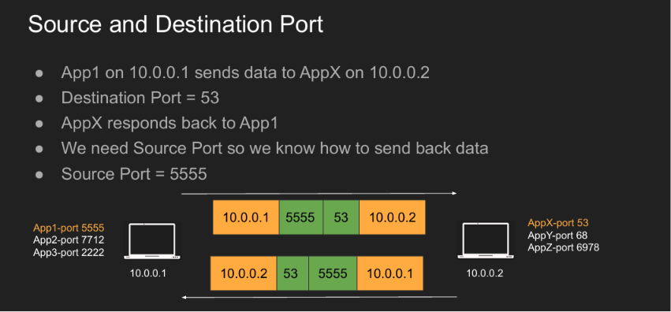
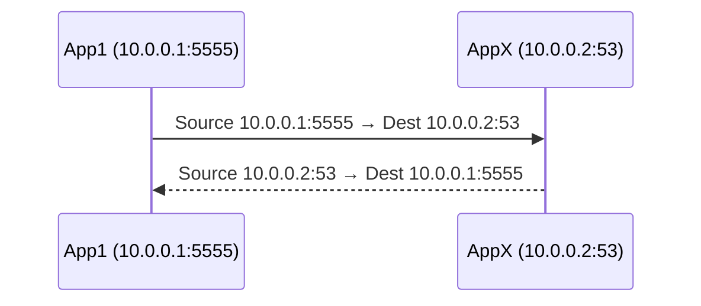
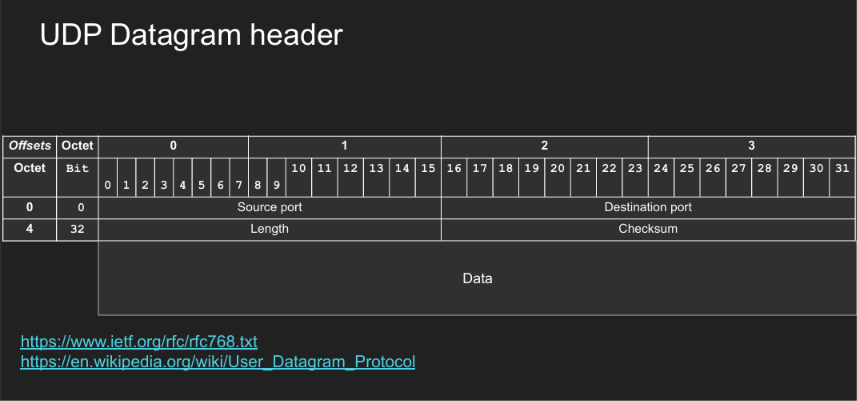
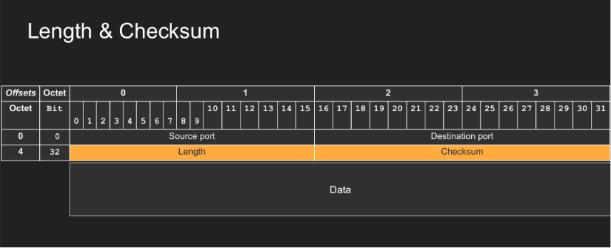
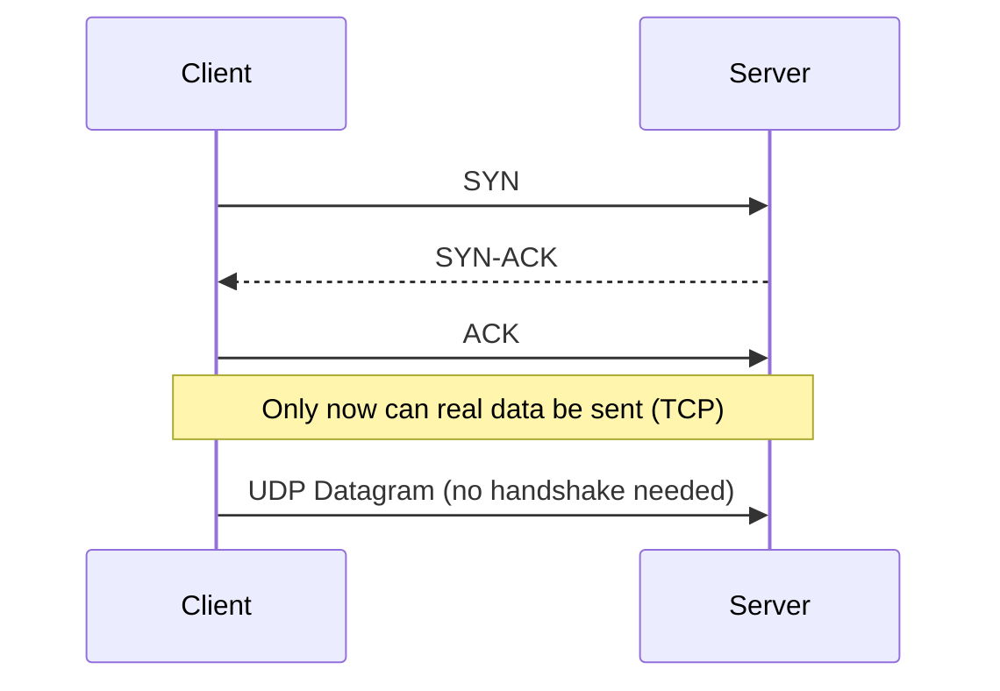
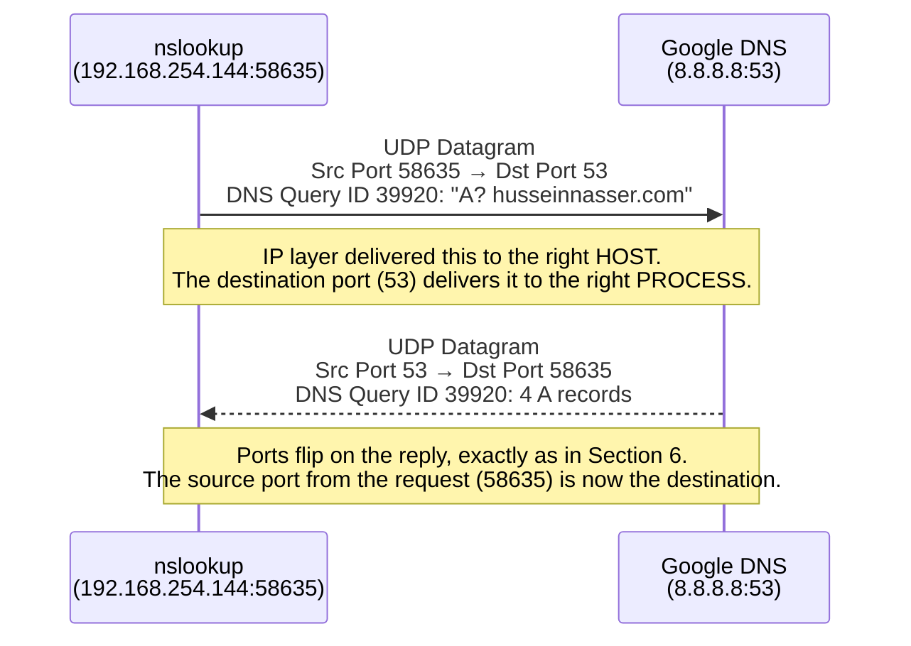

# Lecture 03 — UDP: User Datagram Protocol
### How a packet finds the right *process*, not just the right machine

---

> [!NOTE]
> Lecture 02 got a packet from one **host** to another host, using IP, ARP, and routing. This lecture answers the next question: once a packet lands on the right machine, how does it know which *process* on that machine should actually receive it? That's the job of UDP.

---

## References

> Links and resources for this lecture:
>
> - RFC 768 — User Datagram Protocol
> - [Wikipedia — User Datagram Protocol](https://en.wikipedia.org/wiki/User_Datagram_Protocol)
> - `man tcpdump`
> - `man nc`
> - `man socket`
> - `man recvfrom`

---

## Table of Contents

- [Part 1 — Why UDP Exists](#part-1--why-udp-exists)
  - [1. The Big Picture](#1-the-big-picture)
  - [2. Where UDP Sits in the Layers](#2-where-udp-sits-in-the-layers)
  - [3. What Problem UDP Actually Solves](#3-what-problem-udp-actually-solves)
- [Part 2 — Ports & Addressing Processes](#part-2--ports--addressing-processes)
  - [4. What Is a Port?](#4-what-is-a-port)
  - [5. Multiplexing & Demultiplexing](#5-multiplexing--demultiplexing)
  - [6. Source Port vs Destination Port](#6-source-port-vs-destination-port)
- [Part 3 — The UDP Datagram](#part-3--the-udp-datagram)
  - [7. UDP Datagram Anatomy](#7-udp-datagram-anatomy)
  - [8. UDP Pros](#8-udp-pros)
  - [9. UDP Cons](#9-udp-cons)
  - [10. Common UDP Use Cases](#10-common-udp-use-cases)
- [Part 4 — UDP in Practice](#part-4--udp-in-practice)
  - [11. A UDP Server in Node.js](#11-a-udp-server-in-nodejs)
  - [12. A UDP Server in C](#12-a-udp-server-in-c)
  - [13. Capturing UDP with tcpdump](#13-capturing-udp-with-tcpdump)
- [Full Flow — A Real DNS Query Over UDP](#full-flow--a-real-dns-query-over-udp)
- [Checklist — What You Should Know After This](#checklist--what-you-should-know-after-this)

---

# Part 1 — Why UDP Exists

## 1. The Big Picture

> **Analogy:** UDP is like dropping a postcard in a mailbox. You don't call ahead, you don't get a confirmation it arrived, and you don't get to say "wait, resend that" if it gets lost. You just write it and drop it.

**UDP** stands for **User Datagram Protocol**. It's a **Layer 4 (transport)** protocol, and its entire job can be summed up in one sentence:

> Send data from one process on one host to another process on another host, using ports.

UDP does **not** set up a connection first — it just sends a self-contained unit of data called a **datagram**, and moves on.



UDP is fast, simple, and lightweight — but it makes no promises about reliability.

---

## 2. Where UDP Sits in the Layers

> **Analogy:** Think of shipping a package inside a box, inside a delivery truck. Each layer only adds its own wrapper around whatever the layer above it already built.

Every layer wraps the data handed down from the layer above it:



> [!IMPORTANT]
> A UDP datagram becomes the **Data** section inside an IP packet. Nesting looks like this:
> ```txt
> Ethernet/Wi-Fi Frame
> └── IP Packet
>     └── UDP Datagram
>         └── Application Data
> ```

**Backend relevance:** this is why a packet capture tool like `tcpdump` shows you nested layers at once — one single line of output is really an Ethernet frame, wrapping an IP packet, wrapping a UDP datagram, wrapping your actual application bytes.

---

## 3. What Problem UDP Actually Solves

> **Analogy:** An IP address is like a building's street address — it gets mail *to the building*. It says nothing about *which office inside the building* should open the envelope.

IP can deliver data to a **host**, e.g. `10.0.0.2` — but a single host runs many processes at once:

```txt
Host 10.0.0.2
├── DNS server
├── Web server
├── Game server
├── Video app
└── Database process
```

IP alone cannot answer: *"which process inside this host should receive this data?"* UDP solves exactly that, using **ports**:

```txt
IP address → identifies the host
Port       → identifies the process/service inside the host
```

**Backend relevance:** this split is why you can run a web server on port 3000 and a database on port 5432 on the very same machine without them ever colliding — the OS uses the port number to hand each incoming datagram to the correct listening process.

---

# Part 2 — Ports & Addressing Processes

## 4. What Is a Port?

> **Analogy:** If the IP address is the building, the port is the apartment number — it's how the mail gets from the front door to the exact process waiting for it.

A port is a **16-bit number**, so it ranges from `0` to `65535`.

| Port | Commonly used for |
| ---- | ------------------ |
| 53 | DNS |
| 67 / 68 | DHCP |
| 443 | HTTPS — usually TCP, but also used by QUIC over UDP |
| 5500 | A custom local UDP server (example used later in this lecture) |

> [!NOTE]
> A port is **not** the process itself — it's just a number the OS uses to deliver incoming data to the correct socket, which is in turn attached to a specific process.

```txt
10.0.0.2:53
   |     |
   |     └── port: DNS process
   └──────── IP: host
```

**Backend relevance:** when you write `server.listen(3000)` in your code, you're telling the OS "any datagram/segment that arrives addressed to port 3000 belongs to me" — the port number is the entire mechanism that makes that promise work.

---

## 5. Multiplexing & Demultiplexing

> **Analogy:** Multiplexing is several people funneling their letters into one shared outgoing mailbag. Demultiplexing is the mail room on the other end sorting that one incoming bag back out to the correct individual desks.

This is one of the most important Layer 4 ideas.

### Multiplexing — many processes, one network stack



The sender machine has many apps, but only one IP address (`10.0.0.1`). UDP attaches source and destination ports to every datagram so all of these apps can safely share the same host and network connection.

### Demultiplexing — one stream, sorted back out by port



The receiving host checks each datagram's **destination port** and hands it to the matching process.

**Backend relevance:** this is exactly how a single server can run multiple independent services (a DNS resolver, a game server, a metrics collector) at once, on one network interface, without any of them stepping on each other's traffic.

---

## 6. Source Port vs Destination Port

> **Analogy:** Sending mail without a return address means the recipient has no way to reply — the source port is UDP's version of a return address.



> [!NOTE]
> 📸 The slide above shows `App1` on `10.0.0.1` (using port 5555) sending data to `AppX` on `10.0.0.2` (port 53). The destination port tells the network which process to deliver to; the source port exists so `AppX` knows exactly where to send its reply back to.

Walking through the exchange:



Notice that on the reply, the ports simply **flip** — the server's port becomes the source, and the client's original port becomes the destination.

> [!IMPORTANT]
> Without a source port, a server could reply to the correct *host* IP, but the OS on that host would have no way of knowing *which local process* should receive the response. The source port is what makes a reply possible at all.

**Backend relevance:** this is also why client-side "ephemeral" ports (like `5555` here, or `58635` later in this lecture) are usually chosen randomly by the OS for outgoing requests — your app rarely picks its own outgoing port on purpose.

---

# Part 3 — The UDP Datagram

## 7. UDP Datagram Anatomy

> **Analogy:** If a TCP segment is a tracked, signed-for parcel, a UDP datagram is a plain envelope: an address on the front, a return address, a note about how big it is, and a way to tell if it got smudged in transit.

The full UDP header is only **8 bytes** — remarkably small.



> [!NOTE]
> 📸 The header layout above shows the UDP datagram's four fields: **Source Port** and **Destination Port** occupy the first 4 bytes (2 bytes each), and **Length** and **Checksum** occupy the next 4 bytes (2 bytes each) — followed immediately by the application **Data**.

```txt
0                   15 16                  31
+---------------------+---------------------+
|     Source Port     |  Destination Port   |
+---------------------+---------------------+
|        Length        |       Checksum      |
+---------------------+---------------------+
|                                             |
|              Application Data               |
|                                             |
+---------------------------------------------+
```

#### Source Port

The sending process's port — often a random, temporary ("ephemeral") port chosen by the OS. Example: `58635`.

#### Destination Port

The receiving service's port. Example: `53` for DNS.

#### Length & Checksum



> [!NOTE]
> 📸 The slide above highlights the same header, with **Length** and **Checksum** called out specifically — these are the two fields most people gloss over, so they're worth a closer look.

**Length** is the total size of the UDP datagram — header plus data:

```txt
UDP header = 8 bytes
Data       = 35 bytes
Length     = 43 bytes
```

**Checksum** is used to detect corruption. If bits flip during transmission, the checksum lets the receiver notice the datagram is damaged.

> [!WARNING]
> UDP can only *detect* corruption — it cannot fix it. A damaged datagram is simply discarded; there is no retransmission mechanism built in.

**Backend relevance:** the tiny 8-byte header is exactly why UDP has less overhead than TCP (whose header is at least 20 bytes) — more of every packet is your actual data, which matters at scale for things like real-time video or high-frequency telemetry.

---

## 8. UDP Pros

| Strength | Why it helps |
| -------- | -------------- |
| **Simple** | No connection management, ordering, retransmission, or flow control to worry about |
| **Small header** | Only 8 bytes, so more of the packet carries real data |
| **Stateless** | The server doesn't have to remember anything between datagrams: receive → process → forget |
| **Low latency** | No handshake — data goes out immediately |

Compare that to TCP, which needs a three-way handshake before sending a single byte of real data:



**Backend relevance:** this is precisely why UDP is favored anywhere the cost of "wait, then send" is worse than the cost of occasionally losing a datagram — real-time systems care more about speed than about guaranteed delivery.

---

## 9. UDP Cons

UDP's weaknesses are simply the mirror image of its strengths — everything it skips, it skips completely:

| Weakness | What it means in practice |
| -------- | --------------------------- |
| No acknowledgement | The sender never learns whether a datagram actually arrived |
| No guaranteed delivery | A datagram can be silently lost, and UDP will not retransmit it |
| No ordering | Datagrams sent as `1, 2, 3` may arrive as `2, 3, 1` — UDP won't reorder them |
| No flow control | UDP never asks "can the receiver keep up?" — sending too fast can simply overwhelm it |
| No congestion control | Unlike TCP, UDP doesn't automatically slow down when the network is congested |
| Easier to spoof/abuse | Being connectionless, UDP lets an attacker send datagrams with no prior handshake, which is part of why it's common in amplification-style DDoS attacks |

**Backend relevance:** every one of these is a design trade-off, not a flaw — if your application actually needs ordering, retransmission, or congestion control, that's a strong signal you should be reaching for TCP instead of trying to rebuild these features yourself on top of UDP.

---

## 10. Common UDP Use Cases

> **Analogy:** UDP fits situations where a slightly-late or slightly-incomplete update is far more useful than a perfect one that arrives too late to matter.

| Use case | Why UDP fits |
| -------- | ------------- |
| **DNS** | Queries and responses are small and speed matters more than guaranteed delivery |
| **Video streaming** | A dropped frame is often better skipped than delayed by a retransmit-and-wait cycle |
| **Online games** | Only the *latest* player position matters — resending an old, stale position is pointless |
| **WebRTC** | Real-time voice/video calls prioritize low latency over perfect delivery |
| **VPN** | Some VPNs use UDP specifically to avoid TCP's extra handshake and retransmission overhead |

---

# Part 4 — UDP in Practice

## 11. A UDP Server in Node.js

This is a minimal UDP server that listens on a local port and prints whatever datagram it receives, along with who sent it.

```js
// index.mjs — the .mjs extension tells Node.js to treat this file
// as an ES Module, which is what lets us use `import` syntax below

import dgram from "node:dgram"; // Node's built-in UDP module

const socket = dgram.createSocket("udp4"); // create a UDP (IPv4) socket

socket.on("message", (message, info) => {
  // this callback fires every time a UDP datagram arrives
  console.log("Server got UDP datagram:");
  console.log("Data:", message.toString());       // the raw bytes, converted to text
  console.log("From:", `${info.address}:${info.port}`); // sender's IP and source port
  console.log("Size:", info.size, "bytes");        // total datagram size
});

socket.bind(5500, "127.0.0.1", () => {
  // start listening on 127.0.0.1, port 5500
  console.log("UDP server listening on 127.0.0.1:5500");
});
```

Run it:

```bash
node index.mjs
```

Then, in a second terminal, send it a test datagram using `netcat`:

```bash
nc -u 127.0.0.1 5500
# -u = tell netcat to use UDP instead of its default, TCP
```

Type `hi` and press Enter. The server prints:

```txt
# output:
Server got UDP datagram:
Data: hi
From: 127.0.0.1:random_port
Size: 3 bytes
```

> [!NOTE]
> Why 3 bytes for two characters? Because pressing Enter after `hi` sends `h`, `i`, and a newline (`\n`) — three bytes total, not two.

**Backend relevance:** notice everything Node.js hides from you here — no socket creation boilerplate, no manual buffer management. The C example below shows exactly what's happening underneath.

---

## 12. A UDP Server in C

The same server, but at a much lower level — every step Node.js hides is explicit here.

```c
// udp_server.c
#include <stdio.h>
#include <stdlib.h>
#include <string.h>
#include <unistd.h>
#include <arpa/inet.h>
#include <sys/socket.h>

#define PORT 5501          // the port this server listens on
#define BUFFER_SIZE 1024   // max bytes we'll read per datagram

int main(void) {
    int sockfd;
    char buffer[BUFFER_SIZE];

    struct sockaddr_in server_addr;  // holds our own address/port
    struct sockaddr_in client_addr;  // filled in with the sender's address/port
    socklen_t client_len = sizeof(client_addr);

    sockfd = socket(AF_INET, SOCK_DGRAM, 0);
    // AF_INET     = use IPv4
    // SOCK_DGRAM  = datagram socket, i.e. UDP (as opposed to SOCK_STREAM for TCP)
    if (sockfd < 0) {
        perror("socket failed");
        exit(EXIT_FAILURE);
    }

    memset(&server_addr, 0, sizeof(server_addr)); // zero out the struct first
    memset(&client_addr, 0, sizeof(client_addr));

    server_addr.sin_family = AF_INET;
    server_addr.sin_port = htons(PORT);          // htons = convert port to network byte order
    server_addr.sin_addr.s_addr = inet_addr("127.0.0.1"); // bind to localhost only

    if (bind(sockfd, (struct sockaddr *)&server_addr, sizeof(server_addr)) < 0) {
        // bind() attaches this socket to the IP + port above
        perror("bind failed");
        close(sockfd);
        exit(EXIT_FAILURE);
    }

    printf("UDP server listening on 127.0.0.1:%d\n", PORT);

    while (1) {
        memset(buffer, 0, BUFFER_SIZE); // clear the buffer before each read

        ssize_t n = recvfrom(
            sockfd,
            buffer,
            BUFFER_SIZE - 1,
            0,
            (struct sockaddr *)&client_addr, // filled in with sender's info
            &client_len
        );
        // recvfrom() blocks here until a datagram arrives

        if (n < 0) {
            perror("recvfrom failed");
            continue;
        }

        buffer[n] = '\0'; // null-terminate so we can print it as a string

        printf("Got datagram: %s", buffer);
        printf("From: %s:%d\n",
               inet_ntoa(client_addr.sin_addr),   // convert sender's IP to text
               ntohs(client_addr.sin_port));      // ntohs = convert port back to host byte order
    }

    close(sockfd);
    return 0;
}
```

Compile and run it:

```bash
gcc udp_server.c -o udp_server
# on macOS, clang works identically:
# clang udp_server.c -o udp_server

./udp_server
```

Test it the same way as before:

```bash
nc -u 127.0.0.1 5501
```

Then type `hello from netcat` and press Enter.

> [!NOTE]
> The C version makes the four core steps explicit: `socket()` creates the UDP socket, `bind()` attaches it to an IP + port, `recvfrom()` blocks and waits for a datagram, and the `buffer` is where the received bytes actually land in memory. Node.js performs all four steps too — it just hides them behind `dgram.createSocket()` and `socket.bind()`.

---

## 13. Capturing UDP with tcpdump

> **Analogy:** `tcpdump` is like standing next to the mail sorting machine and reading every envelope as it passes by, without opening it.

`tcpdump` captures packets straight from a network interface — despite the name, it captures far more than just TCP, including UDP, ICMP, and ARP.

This command watches all traffic to or from Google's public DNS server:

```bash
sudo tcpdump -n -v -i en0 'src 8.8.8.8 or dst 8.8.8.8'
# -n  = show numeric IPs/ports, don't resolve hostnames
# -v  = verbose output, shows more detail per packet
# -i  = choose the network interface, e.g. en0 on macOS Wi-Fi
# 'src 8.8.8.8 or dst 8.8.8.8' = only capture packets where 8.8.8.8 is sender or receiver
```

In a second terminal, generate some DNS traffic to capture:

```bash
nslookup husseinnasser.com 8.8.8.8
# asks Google's DNS server directly: what is the IPv4 address of husseinnasser.com?
```

The captured request looks like this:

```txt
# output:
IP 192.168.254.144.58635 > 8.8.8.8.53: 39920+ A? husseinnasser.com. (35)
```

Reading it field by field:

```txt
Source IP        = 192.168.254.144
Source Port      = 58635
Destination IP   = 8.8.8.8
Destination Port = 53
DNS Query ID      = 39920
DNS Question      = A? husseinnasser.com
```

> [!WARNING]
> `58635` is the **UDP port**. `39920` is the **DNS query ID**. They live in completely different protocols (UDP vs. DNS) and are easy to mix up at a glance — the port belongs to the transport layer, the query ID belongs to the application layer.

The captured response looks like this:

```txt
# output:
IP 8.8.8.8.53 > 192.168.254.144.58635: 39920 4/0/0 A 216.239.36.21, A 216.239.38.21, A 216.239.34.21, A 216.239.32.21 (99)
```

```txt
Source IP        = 8.8.8.8
Source Port      = 53
Destination IP   = 192.168.254.144
Destination Port = 58635
DNS Query ID      = 39920
DNS Answers       = 4 IPv4 addresses
```

Notice the source and destination ports flip between request and response — exactly the pattern from [Section 6](#6-source-port-vs-destination-port).

> [!NOTE]
> You may also see `proto UDP (17)` in a capture — this refers to the IP header's **Protocol** field from Lecture 02. `17` means UDP, `6` means TCP, `1` means ICMP. It's how the receiving host's IP stack knows to hand this packet's data up to the UDP layer in the first place.

---

# Full Flow — A Real DNS Query Over UDP

Tying every section together with the exact `nslookup` example above:



```txt
1. nslookup sends a datagram: my laptop:58635 → Google DNS:53
2. IP delivers the packet to 8.8.8.8 (the host)
3. UDP hands the datagram to whatever process is listening on port 53 (the DNS service)
4. The DNS service builds a reply and sends it back: 8.8.8.8:53 → my laptop:58635
5. IP delivers the reply packet back to 192.168.254.144 (the host)
6. UDP hands the datagram to whatever process opened port 58635 (nslookup itself)
```

No handshake happened anywhere in this exchange — the entire round trip is two independent, connectionless datagrams, tied together only by matching ports and a shared DNS query ID.

---

# Checklist — What You Should Know After This

- [ ] Can you explain, in one sentence, what problem UDP solves that IP alone cannot?
- [ ] Do you know why a port is not the same thing as the process itself?
- [ ] Can you explain multiplexing and demultiplexing in your own words?
- [ ] Do you know why UDP needs a source port even though the sender isn't expecting an immediate reply from the network layer?
- [ ] Can you draw the four fields of a UDP header from memory?
- [ ] Do you know the difference between what Length and Checksum each protect against?
- [ ] Can you name at least three things UDP deliberately does *not* guarantee?
- [ ] Can you explain why DNS, video streaming, and gaming all commonly choose UDP over TCP?
- [ ] Do you understand what each line of the minimal C UDP server actually does (`socket`, `bind`, `recvfrom`)?
- [ ] Can you read a `tcpdump` UDP line and correctly identify source/destination IP and port?
- [ ] Do you know the difference between a UDP port number and a DNS query ID?
- [ ] Can you explain what `proto UDP (17)` in a packet capture actually refers to?
- [ ] Can you trace a real-world scenario end-to-end using everything from this lecture?

---

← [Back to main README](../README.md)