# Lecture 04 — TCP (Transmission Control Protocol)
### From reliable byte streams to real backend servers

---

> [!NOTE]
> Lectures 01–03 covered client-server basics, the OSI model, IP addressing, ICMP, ARP, routing, and UDP. UDP gave us fast, connectionless, "fire and forget" delivery. TCP is the other major transport option — this lecture covers how it gets ordered, reliable, congestion-aware delivery, and how that shows up in real servers, routers, and packet captures.

---

## Table of Contents

**Part 1 — TCP Foundations**
1. [The Big Picture](#1-the-big-picture)
2. [What TCP Gives Us](#2-what-tcp-gives-us)
3. [Ports and Multiplexing](#3-ports-and-multiplexing)
4. [What Is a TCP Connection?](#4-what-is-a-tcp-connection)
5. [The Three-Way Handshake](#5-the-three-way-handshake)
6. [Sending Data Reliably](#6-sending-data-reliably)
7. [Acknowledgements and Retransmission](#7-acknowledgements-and-retransmission)
8. [Closing a TCP Connection](#8-closing-a-tcp-connection)
9. [The TCP Segment](#9-the-tcp-segment)
10. [Important TCP Flags](#10-important-tcp-flags)
11. [MTU, MSS, and Jumbo Frames](#11-mtu-mss-and-jumbo-frames)

**Part 2 — Flow Control and Congestion Control**
12. [The Core Problem](#12-the-core-problem)
13. [The Three Important Limits](#13-the-three-important-limits)
14. [Why Sending One Segment at a Time Is Slow](#14-why-sending-one-segment-at-a-time-is-slow)
15. [Flow Control](#15-flow-control)
16. [Receiver Buffer and Receive Window](#16-receiver-buffer-and-receive-window)
17. [The Sliding Window](#17-the-sliding-window)
18. [Window Scaling](#18-window-scaling)
19. [Congestion Control](#19-congestion-control)
20. [The Sender's Real Sending Limit](#20-the-senders-real-sending-limit)
21. [Slow Start](#21-slow-start)
22. [Congestion Avoidance](#22-congestion-avoidance)
23. [The Slow Start Threshold](#23-the-slow-start-threshold)
24. [How TCP Detects Congestion](#24-how-tcp-detects-congestion)
25. [ECN: Warning Before Packet Loss](#25-ecn-warning-before-packet-loss)
26. [The Complete Congestion-Control Cycle](#26-the-complete-congestion-control-cycle)

**Part 3 — TCP in Real Systems**
27. [NAT: Why Private Devices Can Reach the Internet](#27-nat-why-private-devices-can-reach-the-internet)
28. [The NAT Table](#28-the-nat-table)
29. [Port Forwarding](#29-port-forwarding)
30. [Layer 4 Load Balancing](#30-layer-4-load-balancing)
31. [TCP Connection States](#31-tcp-connection-states)
32. [Why TIME_WAIT Exists](#32-why-time_wait-exists)
33. [TCP Advantages and Drawbacks](#33-tcp-advantages-and-drawbacks)
34. [Head-of-Line Blocking](#34-head-of-line-blocking)
35. [The TCP-over-TCP Problem](#35-the-tcp-over-tcp-problem)
36. [NIC vs Socket](#36-nic-vs-socket)
37. [Listening Socket vs Connected Socket](#37-listening-socket-vs-connected-socket)
38. [The TCP Server Lifecycle](#38-the-tcp-server-lifecycle)
39. [SYN Queue, Accept Queue, and Backlog](#39-syn-queue-accept-queue-and-backlog)
40. [Testing a TCP Server with Netcat](#40-testing-a-tcp-server-with-netcat)
41. [Building a TCP Server in Node.js](#41-building-a-tcp-server-in-nodejs)
42. [Building a TCP Server in C](#42-building-a-tcp-server-in-c)
43. [Listing Active TCP Connections](#43-listing-active-tcp-connections)
44. [Watching TCP with tcpdump](#44-watching-tcp-with-tcpdump)

45. [Full Flow — A Browser Request, End to End](#45-full-flow--a-browser-request-end-to-end)
46. [Checklist — What You Should Know After This Lecture](#46-checklist--what-you-should-know-after-this-lecture)

---

# Part 1 — TCP Foundations

## 1. The Big Picture

> **Analogy:** UDP is like shouting a postcard into the world and hoping it arrives. TCP is like a phone call — you dial, both sides confirm they can hear each other, then you talk in order, and either side can say "wait, repeat that" if something got garbled.

TCP stands for **Transmission Control Protocol**. It is a **Layer 4 transport protocol** that moves data between applications running on different hosts.

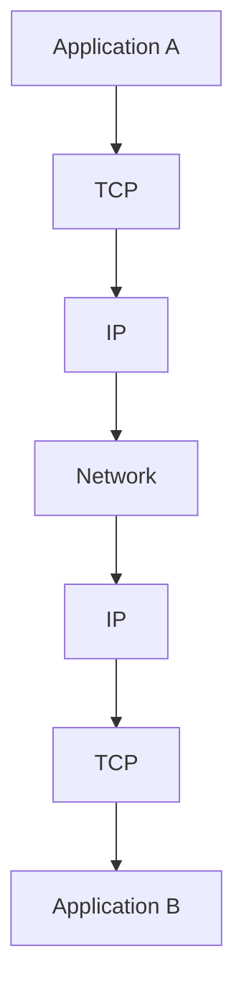
```mermaid
flowchart TB
    A[Application A] --> B[TCP]
    B --> C[IP]
    C --> D[Network]
    D --> E[IP]
    E --> F[TCP]
    F --> G[Application B]
```

TCP is used when the application needs data to arrive:

- reliably
- in the correct order
- without missing pieces
- as part of a maintained connection

Common examples: web communication, remote shells (SSH), database connections, and any bidirectional communication.

> 📸 *The slide below lists TCP's classic use cases — reliable communication, remote shell, databases, web traffic, and any two-way conversation between hosts.*

<p align="center">
  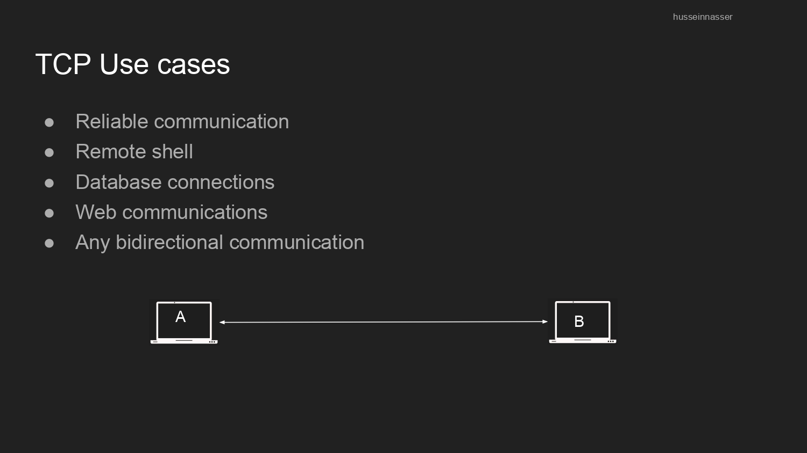
</p>

**Backend relevance:** Almost every backend protocol you'll touch — HTTP/1.1, HTTP/2, gRPC, PostgreSQL's wire protocol, SSH — is built on top of TCP specifically because they need ordering and reliability guarantees that UDP does not provide.

---

## 2. What TCP Gives Us

TCP adds control that IP and UDP do not provide by themselves.

| Feature | What it means |
|---|---|
| Connection | Both sides maintain information about the communication |
| Reliability | Lost data can be sent again |
| Ordering | Data is delivered to the application in the correct order |
| Acknowledgements | The receiver confirms what arrived |
| Ports | Data reaches the correct application on the host |
| Bidirectional communication | Both sides can send data over the same connection |

TCP is **stateful** because both endpoints must remember:

- connection state
- sequence numbers
- acknowledgement numbers
- send and receive buffers
- window information

> [!IMPORTANT]
> TCP creates reliable communication, but it does **not** prove who the other side is. Authentication and identity are handled by higher-level protocols such as TLS and application login systems. A reliable connection to an attacker is still a connection to an attacker.

---

## 3. Ports and Multiplexing

> **Analogy:** The IP address is the building's street address. The port number is the apartment number. The mail truck (IP) gets you to the right building, but you still need the apartment number (port) to know which resident (app) the package is for.

An IP address identifies a **host**, but one host can run many applications. Ports identify which application should receive the data.

```text
IP address → Which host?
Port       → Which application on that host?
```

Example:

```text
10.0.0.2:22   → SSH
10.0.0.2:443  → HTTPS
10.0.0.2:5432 → PostgreSQL
```

**Multiplexing** — the sender combines traffic from many local apps onto one IP address and sends it out.
**Demultiplexing** — the receiving OS looks at the connection information and delivers each segment to the correct application.

> 📸 *Host `10.0.0.1` runs three apps on ports 5555, 7712, and 2222. Host `10.0.0.2` runs three more on ports 53, 68, and 6978. Both machines route each incoming segment to the right process purely by looking at ports.*

<p align="center">
  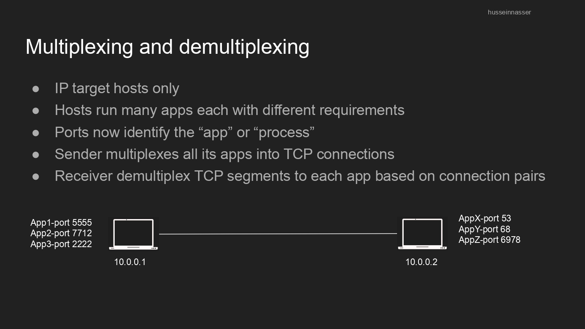
</p>

**Backend relevance:** This is exactly why you can run a web server on port 443 and a database on port 5432 on the same box without them colliding — the OS demultiplexes by port and hands each segment to the right listening socket.

---

## 4. What Is a TCP Connection?

A TCP connection is an agreement between two endpoints to communicate and maintain state. It is uniquely identified by the **four-tuple**:

```text
Source IP
Source port
Destination IP
Destination port
```

Example: `10.0.0.1:5555 → 10.0.0.2:22`

Two clients may connect to the same server IP and port at once — they're still distinguishable because their source IPs or source ports differ.

### Socket and file descriptor — just enough

Inside the OS, the connection is represented by a kernel socket object. The application accesses it through a **file descriptor** on Linux:

```text
Application file descriptor 4
             ↓
Kernel TCP socket and connection state
```

> [!WARNING]
> The file descriptor is only a small process-local number. It is **not** the connection itself and it is **not** a hash of the four-tuple — it's just an index the app uses to refer to the socket the kernel is actually tracking.

---

## 5. The Three-Way Handshake

> **Analogy:** "Can you hear me?" → "Yes, can you hear me?" → "Yes." Only after that three-step exchange do you start the real conversation.

Before normal data can be sent, TCP establishes the connection:

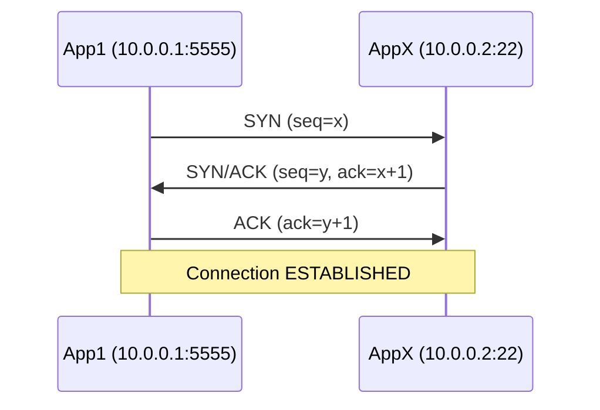
```mermaid
sequenceDiagram
    participant App1 as App1 (10.0.0.1:5555)
    participant AppX as AppX (10.0.0.2:22)
    App1->>AppX: SYN (seq=x)
    AppX->>App1: SYN/ACK (seq=y, ack=x+1)
    App1->>AppX: ACK (ack=y+1)
    Note over App1,AppX: Connection ESTABLISHED
```

- `SYN`: "I want to start a connection, and here is my initial sequence number."
- `SYN/ACK`: "I received your request, and here is my sequence number."
- `ACK`: "I received your reply. The connection is ready."

Both sides derive a **file descriptor**, keyed conceptually by the four-tuple, that they'll use for the rest of the connection.

> 📸 *App1 on `10.0.0.1:5555` wants to reach AppX on `10.0.0.2:22`. The SYN, SYN/ACK, and ACK segments each carry the source/dest IP, port, and flag, and each side ends up with a file descriptor representing the `10.0.0.1:5555 ↔ 10.0.0.2:22` connection.*

<p align="center">
  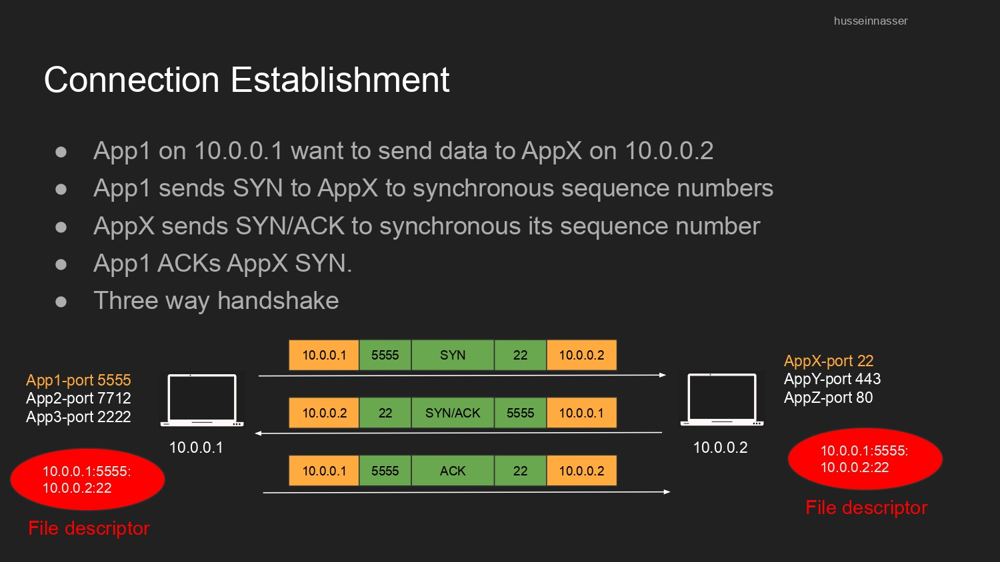
</p>

> [!NOTE]
> TCP is Layer 4. The connection gives us **session-like state**, but TCP itself remains a transport-layer protocol — it doesn't know or care what HTTP, SQL, or SSH payload is riding inside it.

**Backend relevance:** Every `connect()` call your backend makes to a database or every incoming HTTP request your web server accepts pays for this handshake — one full round trip — before a single byte of real data moves. This is part of why connection pooling and HTTP keep-alive matter for performance.

---

## 6. Sending Data Reliably

Application data is divided into TCP segments, each carrying sequence information so the receiver can reconstruct the original byte stream.

```text
Application data
      ↓
TCP divides it into ordered bytes/segments
      ↓
IP packets carry those segments through the network
```

IP packets may take different paths, arrive out of order, be delayed, or be lost. TCP handles all of this above IP.

> [!IMPORTANT]
> TCP sequence numbers count **bytes**, not "packet 1, packet 2, packet 3." The simplified `seq1`, `seq2`, `seq3` diagrams in this lecture are a teaching simplification — real sequence numbers are byte offsets into the stream.

---

## 7. Acknowledgements and Retransmission

The receiver sends acknowledgements to tell the sender how much data arrived successfully. TCP acknowledgements are normally **cumulative** — one ACK can confirm several earlier segments at once.

> 📸 *App1 sends segments 1, 2, and 3 to AppX. AppX doesn't need to ACK each one individually — a single `ACK 3` confirms all three arrived.*

<p align="center">
  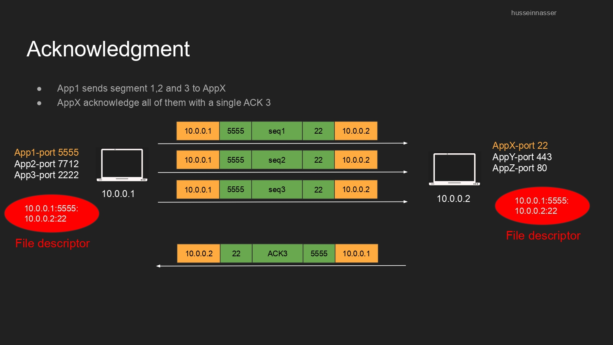
</p>

### Lost data

Suppose three segments are sent, but the third one is lost:

```text
Sender:   1 → 2 → 3
Receiver: receives 1 and 2 only
```

The receiver acknowledges what it actually received in order (`ACK 2`). The sender eventually notices segment 3 was never acknowledged and retransmits it — AppX then sends `ACK 3`.

> 📸 *Seg 3 is dropped in transit. AppX only acknowledges up through seg 2. App1 resends seg 3, and this time AppX acknowledges it with `ACK 3`.*

<p align="center">
  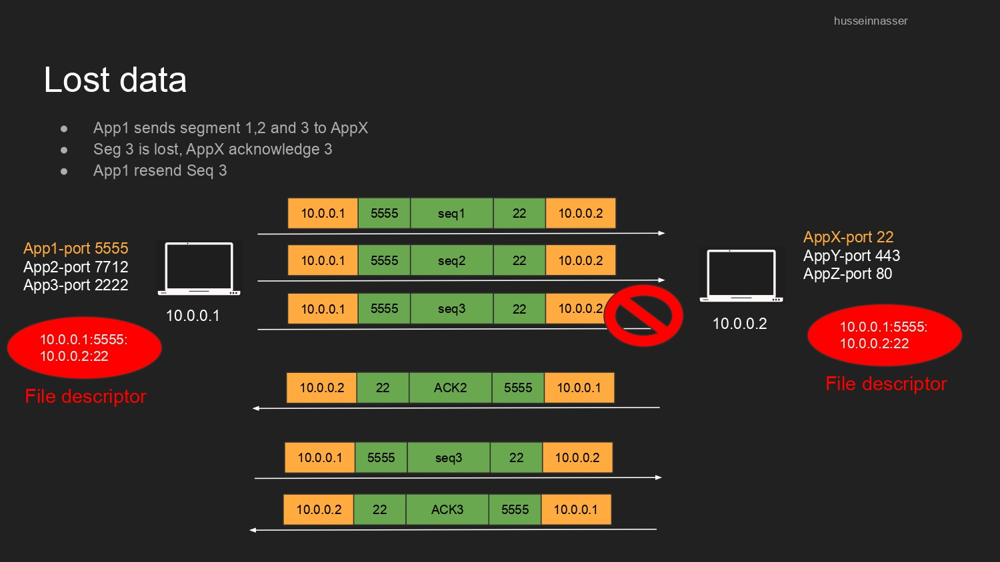
</p>

This gives TCP its reliability:

```text
Send → Track → Acknowledge → Retransmit if necessary
```

**Backend relevance:** This is why a flaky Wi-Fi connection doesn't corrupt your file download — TCP quietly detects the gap and re-sends exactly the missing bytes, invisibly to your application code.

---

## 8. Closing a TCP Connection

Because TCP is bidirectional, each direction is closed separately. The normal close is a four-step exchange:

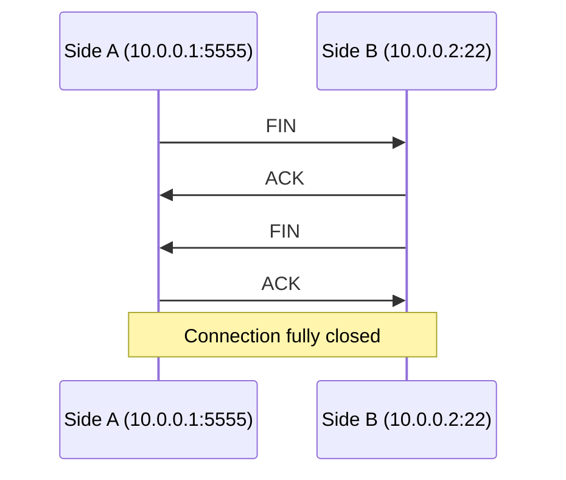
```mermaid
sequenceDiagram
    participant A as Side A (10.0.0.1:5555)
    participant B as Side B (10.0.0.2:22)
    A->>B: FIN
    B->>A: ACK
    B->>A: FIN
    A->>B: ACK
    Note over A,B: Connection fully closed
```

- `FIN` means: "I have finished sending data in this direction."
- `ACK` confirms the `FIN` arrived.

> 📸 *App1 initiates the close by sending FIN; AppX ACKs it, then sends its own FIN once it's also done sending, and App1 ACKs that. This is the classic "four-way handshake" to close.*

<p align="center">
  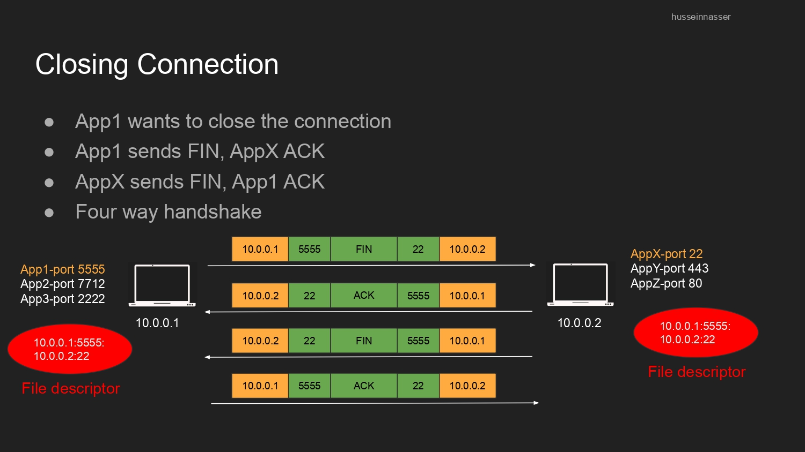
</p>

> [!NOTE]
> Closing the connection does not always remove every piece of state immediately — TCP may keep state around briefly (`TIME_WAIT`) to protect future connections from old delayed segments. This is covered in [Part 3, Section 32](#32-why-time_wait-exists).

---

## 9. The TCP Segment

A TCP segment is:

```text
TCP header + application data
```

That segment then becomes the payload of an IP packet.

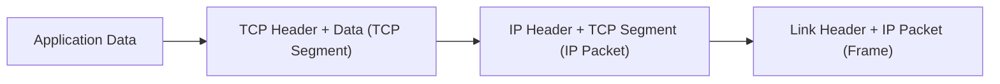
```mermaid
flowchart LR
    A[Application Data] --> B["TCP Header + Data (TCP Segment)"]
    B --> C["IP Header + TCP Segment (IP Packet)"]
    C --> D["Link Header + IP Packet (Frame)"]
```

The normal TCP header is **20 bytes**. Options can push it up to **60 bytes**.

> 📸 *The full TCP header layout — source/destination port (16 bits each), 32-bit sequence number, 32-bit acknowledgment number, data offset, the 9 flag bits, 16-bit window size, checksum, urgent pointer, and a variable options section.*

<p align="center">
  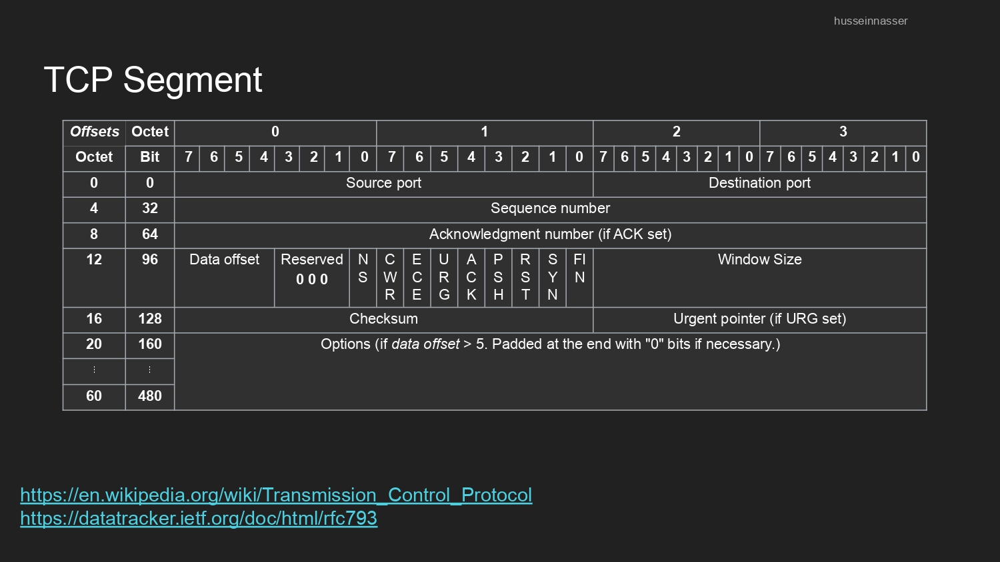
</p>

### Main fields

| Field | Purpose |
|---|---|
| Source port | Identifies the sending application |
| Destination port | Identifies the receiving application |
| Sequence number | Identifies the position of bytes in the stream |
| Acknowledgement number | Tells the sender what byte is expected next |
| Data offset | Tells where the TCP header ends and data begins |
| Flags | Control connection behavior |
| Window size | Advertises receiver capacity for flow control |
| Checksum | Detects corruption |
| Options | Extra features such as MSS and window scaling |

Source and destination ports are **16 bits** each (`0`–`65535`). Sequence and acknowledgement numbers are **32 bits** and eventually wrap around.

---

## 10. Important TCP Flags

TCP flags are small on/off control bits inside the header — 9 of them.

> 📸 *The 9 flag bits highlighted in the header: NS, CWR, ECE, URG, ACK, PSH, RST, SYN, FIN.*

<p align="center">
  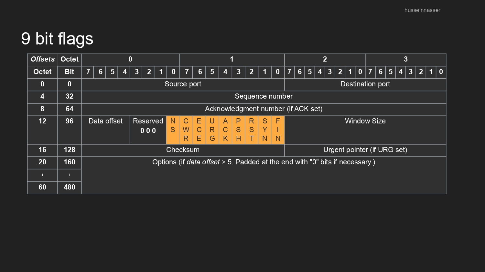
</p>

| Flag | Main meaning |
|---|---|
| `SYN` | Start a connection and synchronize sequence information |
| `ACK` | The acknowledgement field is valid |
| `FIN` | Gracefully finish one sending direction |
| `RST` | Immediately reset or reject a connection |
| `PSH` | Ask TCP to deliver queued data to the application promptly |
| `URG` | Urgent pointer is valid; rarely used today |
| `ECE` | Reports congestion notification to the sender |
| `CWR` | Sender reports that it reduced its congestion window |
| `NS` | Related to experimental congestion signaling; rarely encountered |

> [!NOTE]
> You don't need to memorize all nine right now. Start with:
> ```text
> SYN → open
> ACK → confirm
> FIN → close gracefully
> RST → stop immediately
> ```

---

## 11. MTU, MSS, and Jumbo Frames

> **Analogy:** MTU is the size of the box a delivery truck can carry. MSS is how much of your actual product fits inside that box once you subtract the packaging (headers).

These limits answer different questions.

**MTU — Maximum Transmission Unit**: the largest IP packet a link can carry without fragmentation. Common Ethernet MTU: `1500 bytes` (common, not universal).

**MSS — Maximum Segment Size**: the maximum TCP **application data** carried in one segment.

For common IPv4 over Ethernet with no extra IP/TCP options:

```text
MTU                = 1500 bytes
IPv4 header        =   20 bytes
TCP header         =   20 bytes
--------------------------------
MSS                = 1460 bytes
```

```text
MTU → maximum IP packet size on the link
MSS → maximum TCP payload inside that packet
```

**Jumbo frames**: some controlled networks support an MTU around `9000` bytes, allowing a much larger MSS — fewer packets, fewer repeated headers, less per-packet processing, potentially better throughput. But every device on the path must support the larger MTU, so jumbo frames are more common in data-center/storage networks than across the public Internet.

> 📸 *Segment size depends on the network's MTU. The usual default MTU of 1500 results in an MSS of 1460; jumbo frames (MTU 9000+) allow a correspondingly larger MSS.*

<p align="center">
  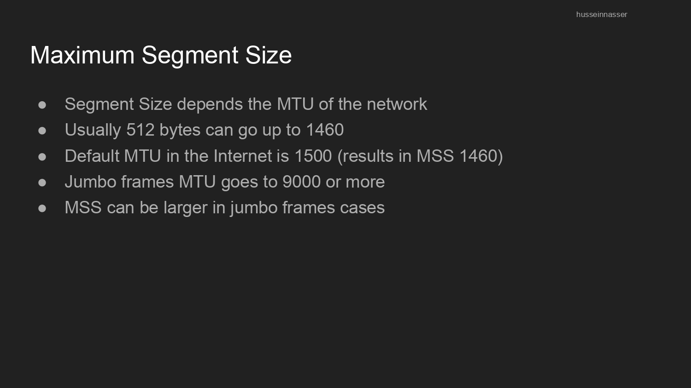
</p>

**Backend relevance:** MSS caps how much payload fits in one segment, which matters if you're tuning throughput on high-bandwidth internal networks (e.g., between microservices in a data center where jumbo frames might be enabled).

---

# Part 2 — Flow Control and Congestion Control

## 12. The Core Problem

TCP should not send only one segment and wait for one acknowledgement every time — that repeatedly pays the network's round-trip delay:

```text
Send one segment → Wait for ACK → Send the next segment → Wait again
```

TCP is faster when it can keep **multiple bytes in flight** before waiting. But this creates two questions:

```text
How much can the receiver accept?
How much can the network carry?
```

TCP answers them with two different control systems:

```text
Flow control       → protects the receiver
Congestion control → protects the network
```

---

## 13. The Three Important Limits

Do not mix these three values up:

| Limit | What it controls | Who determines it? |
|---|---|---|
| `MSS` | Maximum application data inside one TCP segment | Negotiated from path/link limits |
| `rwnd` | How much more data the receiver can currently accept | Receiver |
| `cwnd` | How much data the sender believes the network can currently carry | Sender's TCP algorithm |

> **Memory trick:**
> ```text
> MSS  → one segment
> rwnd → receiver
> cwnd → network
> ```

`MSS` is a size limit for one piece. `rwnd` and `cwnd` are limits on the **total** amount of unacknowledged data that may be in flight.

---

## 14. Why Sending One Segment at a Time Is Slow

Assume host A wants to send ten segments to host B. The slow approach:

```text
SEG 1 → ACK 1
SEG 2 → ACK 2
SEG 3 → ACK 3
```

Every segment waits for another round trip.

> 📸 *A sends SEG 1, waits for ACK 1 before sending SEG 2, waits for ACK 2 before sending SEG 3 — one full round trip burned per segment.*

<p align="center">
  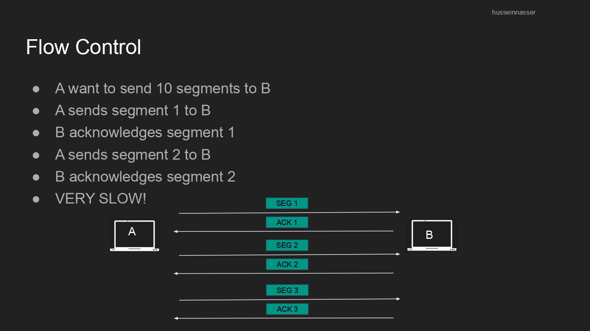
</p>

A better approach is to send several segments before waiting, then ask:

> How many bytes may the sender send safely before waiting?

---

## 15. Flow Control

> **Analogy:** Flow control is the listener saying "slow down, I can only write so fast" — it has nothing to do with how fast the phone line itself can carry your voice.

Flow control answers: **how much data can the receiver currently handle?**

Even if the network is fast, the receiver may be slow or busy. It needs time to store incoming data, hand it to the application, and let the application process it. If the sender transmits too quickly, the receiver's memory buffer may fill and segments get dropped.

> 📸 *A sends one small segment fine, but B's buffer is already full of unread segments — the new one gets dropped because there's no room.*

<p align="center">
  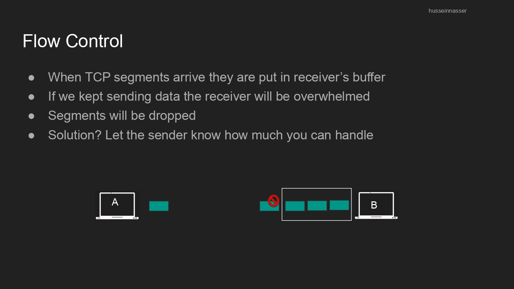
</p>

Flow control prevents the sender from overwhelming the receiver.

**Backend relevance:** This is exactly what you're hitting if your app reads slowly from a socket (e.g., a slow consumer) — the OS will shrink the advertised window until your app catches up, throttling the sender for you automatically.

---

## 16. Receiver Buffer and Receive Window

### Receiver buffer

The **receive buffer** is a real memory area maintained by the OS for one TCP connection. Incoming bytes wait there until the application reads them.

```text
Network → TCP receive buffer → Application calls read()/recv()
```

### Receive window — `rwnd`

The receive window is the amount of space the receiver currently advertises as available.

```text
Receive buffer capacity = 10,000 bytes
Currently occupied      =  7,000 bytes
Free space              =  3,000 bytes

rwnd = 3,000 bytes
```

```text
Buffer = the container
rwnd   = the available room advertised to the sender
```

> 📸 *The 16-bit Window Size field inside the TCP header — this is where `rwnd` actually travels on the wire.*

<p align="center">
  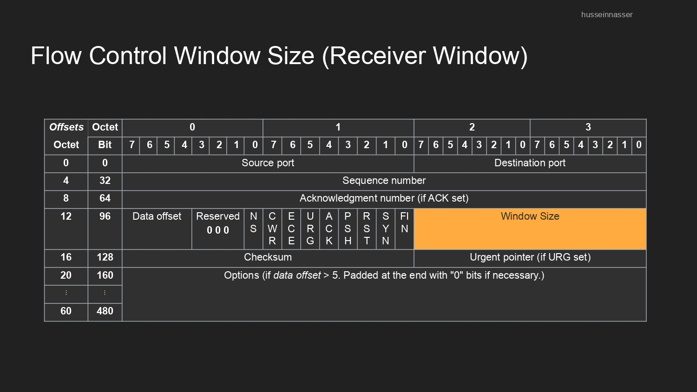
</p>

**When the window shrinks:** incoming data arrives faster than the app reads it → less free space → smaller `rwnd`.

**When the window grows:** the app calls `recv()` → buffer space frees up → receiver advertises a larger `rwnd`.

**Zero window:** if the buffer becomes full, `rwnd = 0` — the sender must pause until the receiver advertises space again.

> 📸 *B's receive buffer holds three segments already; only one more slot is free, so B advertises a small `rwnd` reflecting exactly that free space to A.*

<p align="center">
  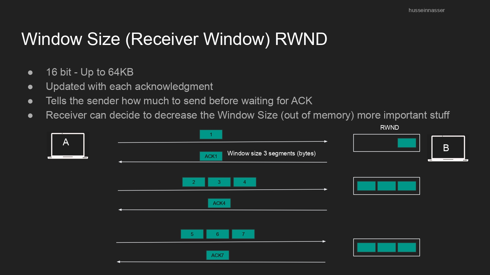
</p>

> [!NOTE]
> The receive window changes throughout the life of the connection — it doesn't reset after every message.

---

## 17. The Sliding Window

The sender tracks which bytes are: already acknowledged, sent but not yet acknowledged, allowed to be sent next, and not yet allowed to be sent. As acknowledgements arrive, the allowed range moves forward — this movement is the **sliding window**.

```text
Before ACK:
[ acknowledged ][ sent, waiting ][ allowed next ][ blocked ]

After ACK:
                [ acknowledged ][ sent, waiting ][ allowed next ]
```

> 📸 *As ACKs come back for earlier segments, the sender's allowed window slides forward, unlocking room to send newer segments without waiting on each one individually.*

<p align="center">
  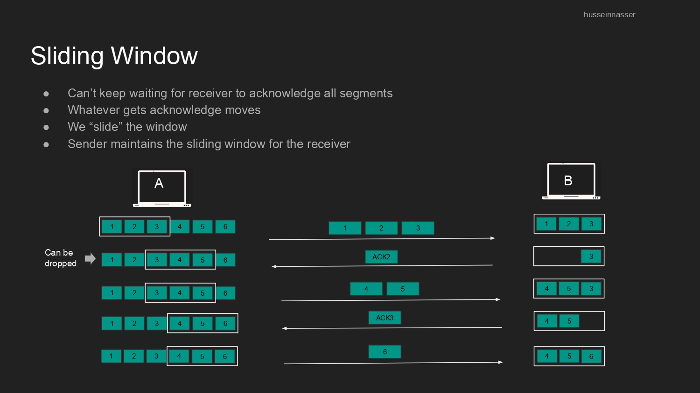
</p>

> [!IMPORTANT]
> The window doesn't mean one physical object travels through the network — it's bookkeeping the sender maintains to know which bytes it's currently allowed to transmit.

**Why it matters:** without the sliding window, the sender would repeatedly stop and wait. With it, TCP can continuously move forward as acknowledgements arrive.

---

## 18. Window Scaling

The TCP header only gives the window field `16 bits`. Without scaling, the largest advertised value is about `65,535 bytes ≈ 64 KB` — too small for modern high-speed, high-latency networks.

TCP supports a **window scale factor**. The real window is calculated approximately as:

```text
Advertised window × 2^scale
```

The scale factor (`0`–`14`) is negotiated once, during the handshake, and usually stays fixed for the connection.

> 📸 *B's window is only 16 bits wide on the wire, but with the negotiated scale factor applied, the effective window can represent far more than 64 KB.*

<p align="center">
  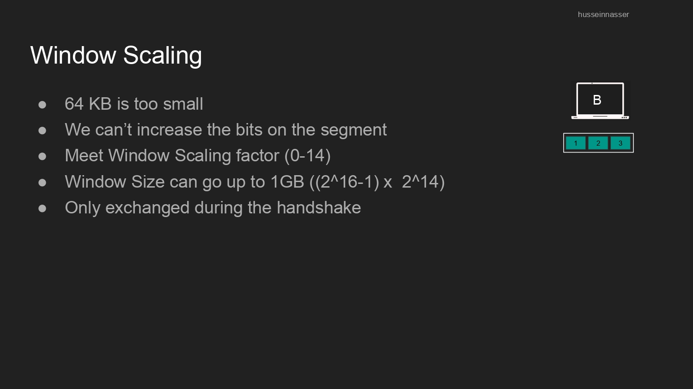
</p>

Window scaling allows TCP to advertise a window approaching `1 GB` (`(2^16 - 1) × 2^14`).

> [!NOTE]
> The scale factor is fixed during the connection, but the advertised window value itself continues to change with buffer occupancy.

**Backend relevance:** This is why long-fat-network transfers (high bandwidth × high latency, e.g., cross-continent data replication) need window scaling enabled — without it, 64 KB caps your throughput no matter how fast the pipe is.

---

## 19. Congestion Control

> **Analogy:** Flow control is about the listener's ears; congestion control is about the phone lines in between not getting overloaded by everyone talking at once.

Flow control alone is not enough — the receiver may have plenty of room while routers and links in the middle are overloaded.

```text
Sender → Router → Router → Receiver
             ↑
       queue may become full
```

When too many packets arrive at a router: queue fills → delay increases → queue becomes full → packets may be dropped.

> 📸 *A has plenty to send and B can absorb it, but the router in the middle has a small queue — two segments get dropped because the router's buffer is already full.*

<p align="center">
  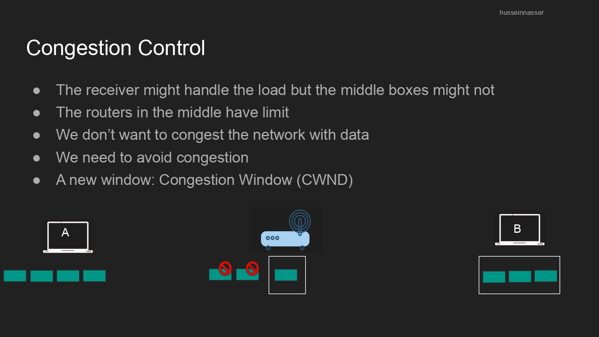
</p>

### Congestion window — `cwnd`

`cwnd` is a **sender-side** limit representing the amount of unacknowledged data TCP currently allows itself to place in the network.

> [!IMPORTANT]
> `cwnd` is not a router buffer — it's the sender's own estimate of what the path can handle.

---

## 20. The Sender's Real Sending Limit

The sender must obey both the receiver's advertised capacity and its own congestion estimate:

```text
Allowed in flight = min(rwnd, cwnd)
```

Example 1:

```text
rwnd = 200 KB
cwnd =  40 KB
Allowed = 40 KB   (network is the smaller limit)
```

Example 2:

```text
rwnd = 20 KB
cwnd = 80 KB
Allowed = 20 KB   (receiver is the smaller limit)
```

```text
Flow control:       "Can the receiver store this much?"
Congestion control:  "Can the network path carry this much?"
```

---

## 21. Slow Start

> **Analogy:** You don't floor the gas pedal on an unfamiliar icy road — you ease in, and speed up as you confirm you have grip.

TCP doesn't initially know the network path's capacity. It starts with a small congestion window and tests the network — this phase is **Slow Start**. It starts cautiously but grows quickly as ACKs arrive.

Simplified growth pattern: `1 MSS → 2 MSS → 4 MSS → 8 MSS → ...`

> 📸 *Round 1: A sends 1 segment, gets 1 ACK, so CWND becomes 2. Round 2: sends 2 segments, gets 2 ACKs, CWND becomes 4 — roughly doubling each round trip.*

<p align="center">
  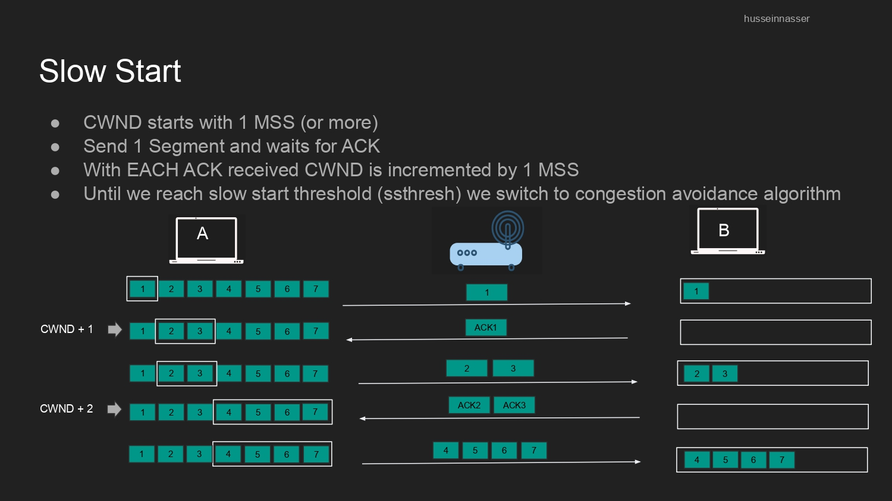
</p>

**Why it grows quickly:** during Slow Start, each ACK allows `cwnd` to increase, producing approximately exponential growth across a full round trip.

> [!NOTE]
> It's called Slow Start because it *begins* from a small sending limit, not because its growth is slow — the growth is actually the fast part.

---

## 22. Congestion Avoidance

TCP shouldn't grow exponentially forever. Once `cwnd` reaches `ssthresh` (slow start threshold), TCP becomes more conservative — this is **Congestion Avoidance**, with roughly linear growth.

```text
8 MSS → 9 MSS → 10 MSS → 11 MSS → ...
```

Instead of roughly doubling every round trip, the window grows by about one MSS per round trip.

> 📸 *Same setup as Slow Start, but now CWND only grows by 1 MSS per fully-acknowledged round, not by doubling.*

<p align="center">
  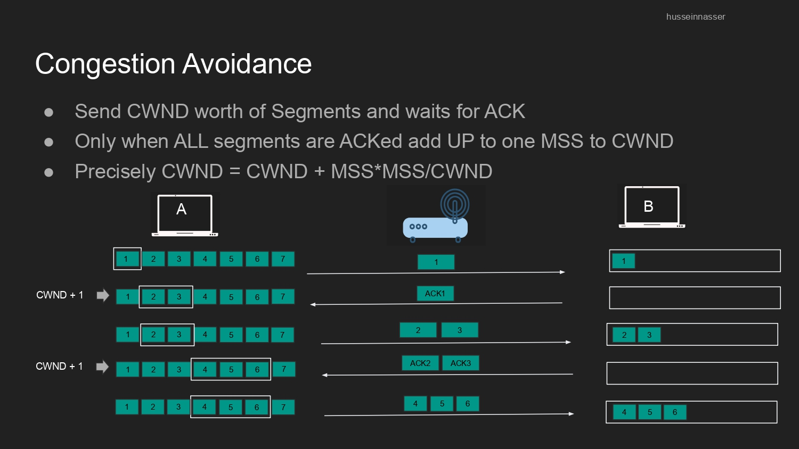
</p>

```text
Slow Start           → fast, exponential-style growth
Congestion Avoidance → careful, linear-style growth
```

---

## 23. The Slow Start Threshold

`ssthresh` = **Slow Start Threshold**. It determines which growth mode TCP uses:

```text
cwnd < ssthresh  → Slow Start
cwnd ≥ ssthresh  → Congestion Avoidance
```

It does **not** normally change after every ACK — it changes mainly after TCP detects congestion. In the classic timeout-based model:

```text
ssthresh = max(FlightSize / 2, 2 × MSS)
```

Where `FlightSize` is data already sent but not yet acknowledged, and `2 × MSS` is the minimum threshold in this model.

**Example:**

```text
MSS        = 1,460 bytes
FlightSize = 14,600 bytes

ssthresh = 14,600 / 2 = 7,300 bytes = 5 MSS
```

TCP uses Slow Start until `cwnd` reaches ~`5 MSS`, then switches to Congestion Avoidance.

**Why use FlightSize?**

```text
cwnd       = what TCP was allowed to send
FlightSize = what TCP actually sent and still has unacknowledged
```

The actual in-flight load is the more meaningful value right after congestion.

> 📸 *The sawtooth graph: CWND grows exponentially (Slow Start), hits the dotted `ssthresh` line, switches to linear growth (Congestion Avoidance), then congestion is triggered, CWND collapses back to 1 MSS, and `ssthresh` is set to roughly half of what was in flight — `ssthresh = max(FlightSize/2, 2×MSS)` per RFC 5681. Each cycle can settle at a lower ceiling than the last.*

<p align="center">
  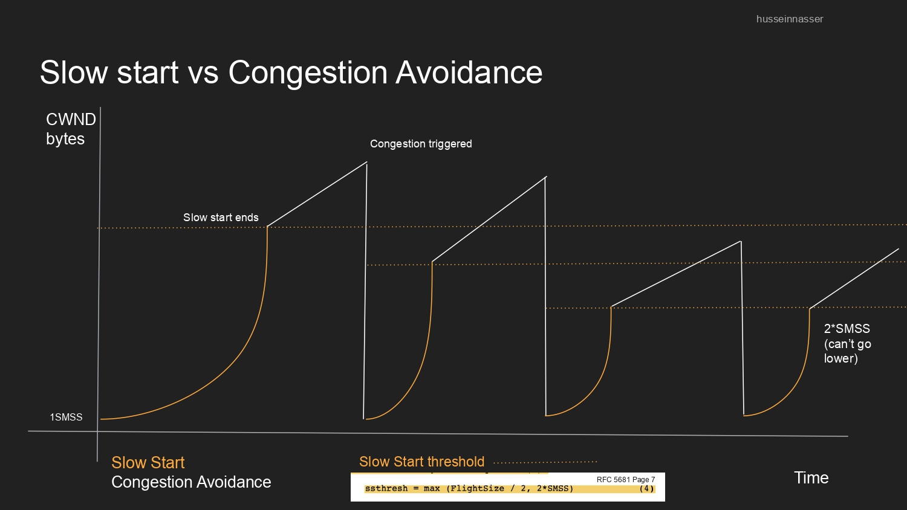
</p>

---

## 24. How TCP Detects Congestion

Congestion signals covered in this lecture:

- retransmission timeout
- duplicate acknowledgements
- packet loss
- ECN notification

A timeout is a strong signal — the sender waited and never got the expected ACK. In the simplified classic response:

1. reduce `ssthresh`
2. reset `cwnd` to a small value
3. begin Slow Start again
4. later return to Congestion Avoidance

> 📸 *A blasts 4 segments at once; all 4 are dropped by the overloaded router. B never receives them, so no ACKs come back — A eventually times out, and CWND collapses back down to 1, restarting Slow Start from scratch.*

<p align="center">
  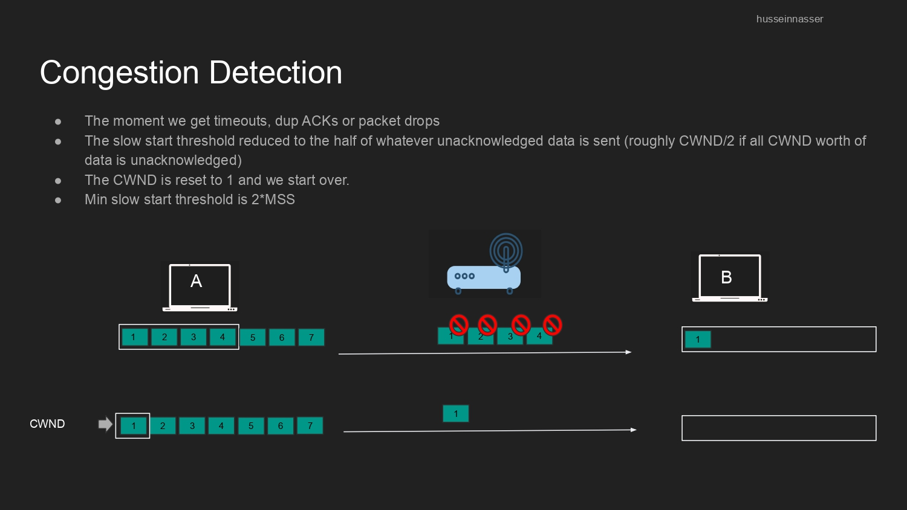
</p>

> [!WARNING]
> Real TCP implementations (Reno, CUBIC, BBR, etc.) have multiple algorithms and may react differently to timeouts vs. duplicate ACKs. This README keeps the simplified classic model taught in the lecture — don't assume every OS/kernel behaves identically.

---

## 25. ECN: Warning Before Packet Loss

Normally, congestion is only noticed *after* packets are dropped. **ECN** — **Explicit Congestion Notification** — lets supported routers mark packets when approaching congestion instead of immediately dropping them.

```text
Router approaches congestion
          ↓
Marks the IP packet
          ↓
Receiver reports the mark to the sender
          ↓
Sender reduces its sending rate
```

- the router marks congestion info in the **IP header**
- the receiver reports it via TCP's `ECE` flag
- the sender responds and signals reduction via `CWR`

> 📸 *ECN in a nutshell — routers can flag an IP packet as it nears congestion; the receiver echoes that flag back via `ECE`; the sender reduces its rate and confirms with `CWR` — no dropped packet required.*

<p align="center">
  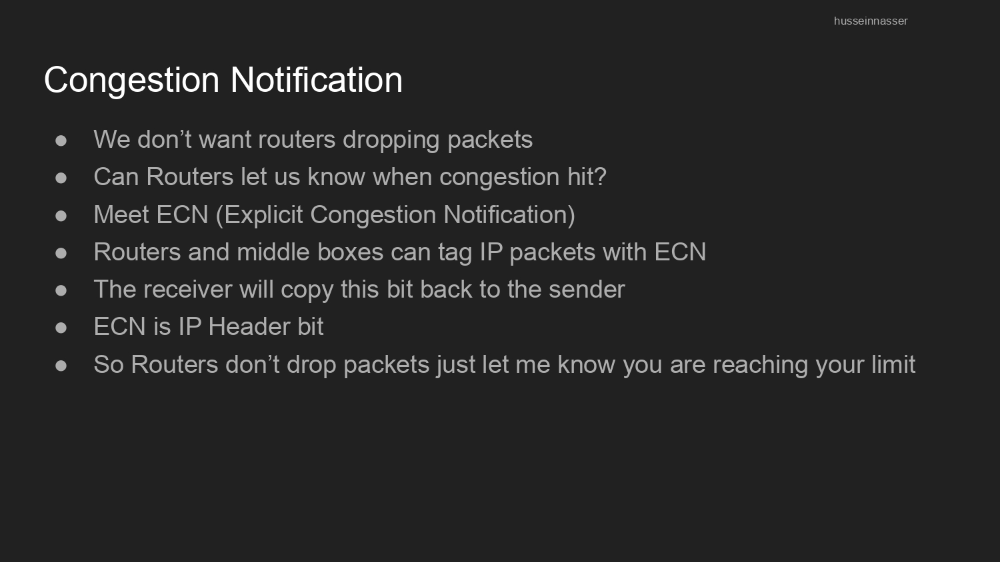
</p>

> 📸 *Same idea restated: we don't want routers dropping packets just to signal congestion — ECN lets a router say "I'm nearing my limit" by tagging the IP header bit, which the receiver copies back to the sender.*

ECN is useful because it can warn TCP *before* actual packet loss occurs.

---

## 26. The Complete Congestion-Control Cycle

```text
Start with a small cwnd
          ↓
Slow Start: grow quickly
          ↓
Reach ssthresh
          ↓
Congestion Avoidance: grow carefully
          ↓
Congestion detected
          ↓
Reduce ssthresh and cwnd
          ↓
Start growing again
```

TCP is effectively learning: *"The previous sending level was too aggressive, so next time I'll switch to cautious growth earlier."*

---

# Part 3 — TCP in Real Systems

## 27. NAT: Why Private Devices Can Reach the Internet

> **Analogy:** NAT is your building's front desk. Every resident (private IP) sends mail out under the building's one public street address; the front desk remembers which resident sent what, so replies get routed back to the right apartment.

IPv4 has a limited number of public addresses. A home or company may contain many devices (laptop, phone, TV, printer, backend server) using private IP ranges:

```text
10.0.0.0/8
172.16.0.0/12
192.168.0.0/16
```

These are not routed across the public Internet. The router has a private-side IP (faces the LAN) and a public-side IP (faces the Internet).

```text
Laptop: 192.168.1.2
Router private IP: 192.168.1.1
Router public IP: 44.11.5.17
```

**NAT** = **Network Address Translation** — it lets private devices communicate with the Internet through the router's public address.

> 📸 *A laptop at `192.168.1.2` behind a router (private side `192.168.1.1`, public side `44.11.5.17`) reaches a Node.js server at `55.11.22.33:8080` out on the Internet.*

<p align="center">
  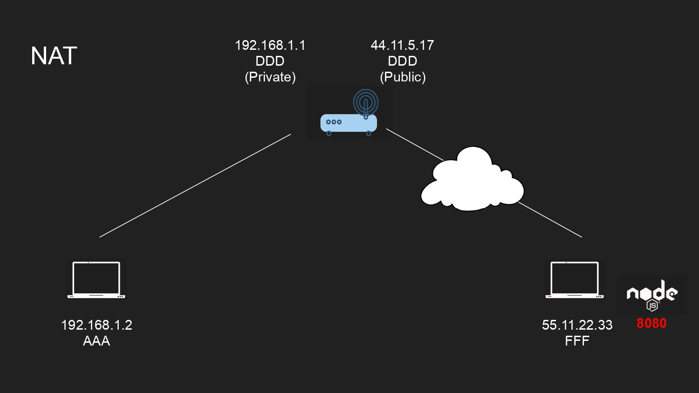
</p>

### Outgoing translation

Before the router: `192.168.1.2:8992 → 55.11.22.33:8080`
After NAT: `44.11.5.17:7777 → 55.11.22.33:8080`

The public server only ever sees the router's public address, never the laptop's private one.

> [!NOTE]
> In common home routers, NAT also translates ports, often called **PAT** or **NAPT**.

**Backend relevance:** This is why your server logs, when the client is behind a home router, show one public IP for potentially many devices — you're seeing the router's translated address, not the individual laptop or phone.

---

## 28. The NAT Table

The router must remember which private connection belongs to each translated public connection:

```text
Private side           Public translation       Destination
192.168.1.2:8992  ↔    44.11.5.17:7777    ↔    55.11.22.33:8080
```

> 📸 *The router's NAT table entry: `192.168.1.2:8992` maps to translated `44.11.5.17:7777`, which is what actually shows up on the wire talking to `55.11.22.33:8080`.*

<p align="center">
  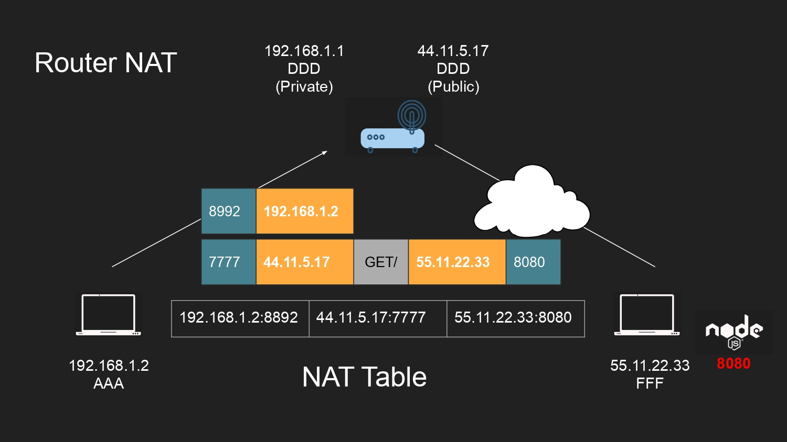
</p>

When the response arrives at `44.11.5.17:7777`, the router checks the NAT table, rewrites the destination back to `192.168.1.2:8992`, and forwards it to the right private device.

### Why ports matter

Many private devices can share one public IP because the router assigns different translated ports:

```text
192.168.1.2:5000 → 44.11.5.17:7001
192.168.1.3:5000 → 44.11.5.17:7002
192.168.1.4:5000 → 44.11.5.17:7003
```

Same public IP, different translated port identifying the correct mapping.

> [!WARNING]
> NAT has limits — the router has finite ports, memory, CPU, and NAT-table capacity. It does not create infinite connections.

---

## 29. Port Forwarding

Normal NAT usually begins with an **outgoing** connection (private device → Internet). But what if someone on the Internet needs to reach a server *inside* your LAN?

The Internet client only knows the router's public address — it can't directly reach `192.168.1.20:8080`.

Port forwarding adds a manual rule: `44.11.5.17:80 → 192.168.1.20:8080`

Meaning: *when traffic arrives at the router on public port 80, forward it to the internal server on port 8080.*

```text
Internet client
      |
      | 44.11.5.17:80
      v
NAT router
      |
      | destination rewritten
      v
192.168.1.20:8080
```

| Normal outgoing NAT | Port forwarding |
|---|---|
| Private device starts the connection | Internet client starts the connection |
| Mapping usually created automatically | Mapping configured manually |
| Used for browsing and outgoing traffic | Used to expose an internal service |

> [!WARNING]
> Port forwarding exposes a service to outside traffic. Only forward ports that are necessary, and protect the service with authentication, encryption, firewall rules, and software updates.

---

## 30. Layer 4 Load Balancing

A Layer 4 load balancer distributes TCP or UDP connections using only transport information: source IP, source port, destination IP, destination port, protocol. It doesn't need to understand HTTP paths, JSON, or cookies.

### Virtual IP

Clients connect to one service address (e.g. `10.0.0.100:443`) — the "front door." The **load balancer** is the machine/software receiving traffic for that address:

```text
Clients
   |
   v
10.0.0.100:443  ← Virtual IP
   |
   v
Layer 4 load balancer
   ├── 10.0.0.10:443
   ├── 10.0.0.11:443
   └── 10.0.0.12:443
```

### NAT-based load balancing

The load balancer picks a backend and rewrites the destination. Before: `Destination = 10.0.0.100:443`. After choosing Backend B: `Destination = 10.0.0.11:443`. The client still thinks it contacted the virtual IP.

**Who performs the balancing?** Usually not your home router — it's normally a dedicated load balancer, a proxy, a cloud LB service, a specially configured router, or software like **HAProxy** or **Linux IPVS**.

> 📸 *NAT's three big real-world applications: private-to-public translation (so we don't run out of IPv4), port forwarding (exposing an internal server without needing root to bind to port 80), and Layer 4 load balancing via HAProxy's NAT mode, where clients hit a bogus service IP and the router swaps in the real destination server.*

<p align="center">
  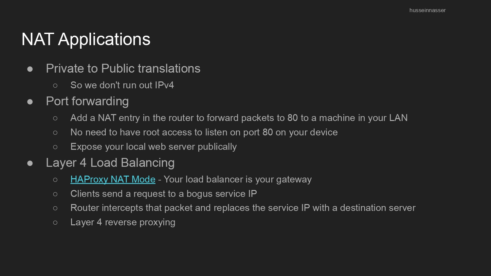
</p>

**Backend relevance:** Understanding L4 vs L7 load balancing matters when debugging — an L4 balancer can't route based on URL path or hostname, only on IP/port; that's an L7 (HTTP-aware) balancer's job.

---

## 31. TCP Connection States

TCP is stateful, so each connection moves through states.

| State | Meaning |
|---|---|
| `CLOSED` | No connection exists |
| `LISTEN` | Server is waiting for connection attempts |
| `SYN_SENT` | Client sent `SYN` and is waiting |
| `SYN_RECEIVED` | Server received `SYN` and sent `SYN-ACK` |
| `ESTABLISHED` | Both sides may exchange data |
| `FIN_WAIT_1` | Active closer sent `FIN` |
| `FIN_WAIT_2` | Its `FIN` was acknowledged; waiting for the other side's `FIN` |
| `CLOSE_WAIT` | A side received `FIN`; its application hasn't closed yet |
| `LAST_ACK` | Passive closer sent its `FIN`; waiting for the final `ACK` |
| `TIME_WAIT` | Active closer waits before fully removing the old connection |
| `CLOSING` | Both sides attempted to close at nearly the same time |

### Typical connection opening

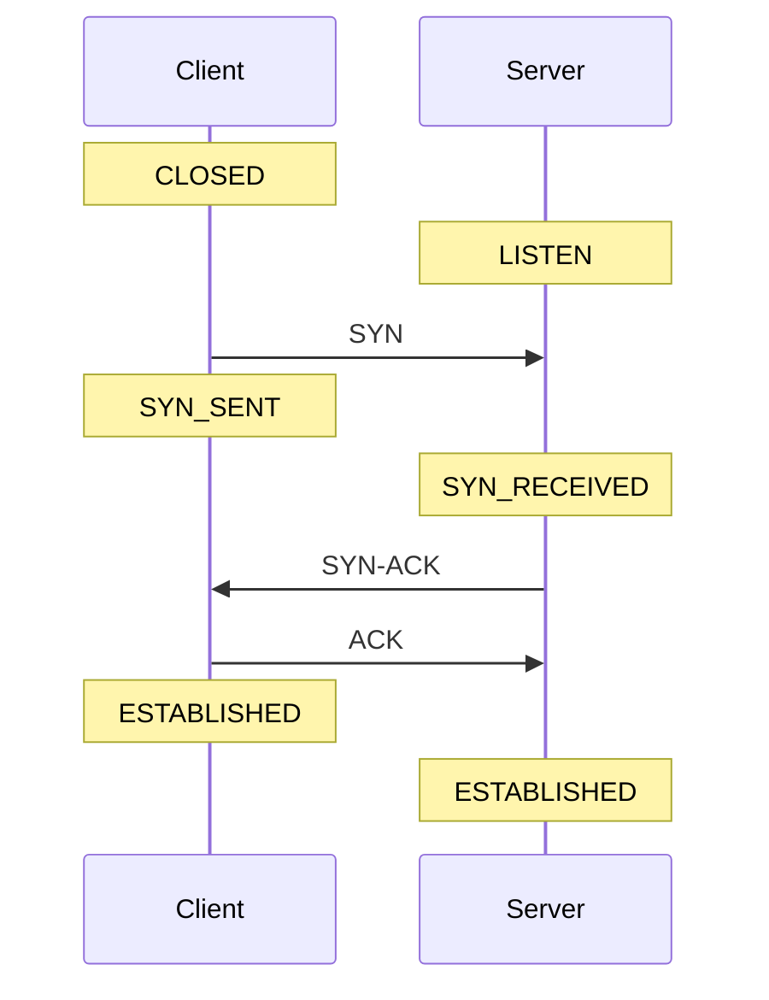
```mermaid
sequenceDiagram
    participant C as Client
    participant S as Server
    Note over C: CLOSED
    Note over S: LISTEN
    C->>S: SYN
    Note over C: SYN_SENT
    Note over S: SYN_RECEIVED
    S->>C: SYN-ACK
    C->>S: ACK
    Note over C: ESTABLISHED
    Note over S: ESTABLISHED
```

### Typical connection closing

> 📸 *The active closer moves ESTABLISHED → FIN_WAIT_1 → (ACK back) → FIN_WAIT_2 → (FIN back) → TIME_WAIT → (after ~4 minutes / 2MSL) → CLOSED. The passive closer moves ESTABLISHED → CLOSE_WAIT → LAST_ACK → CLOSED.*

<p align="center">
  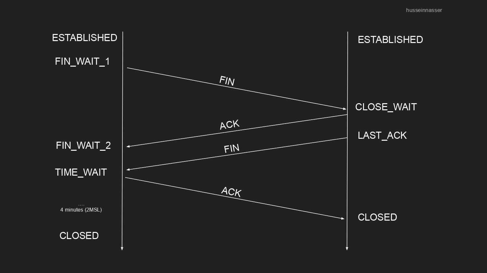
</p>

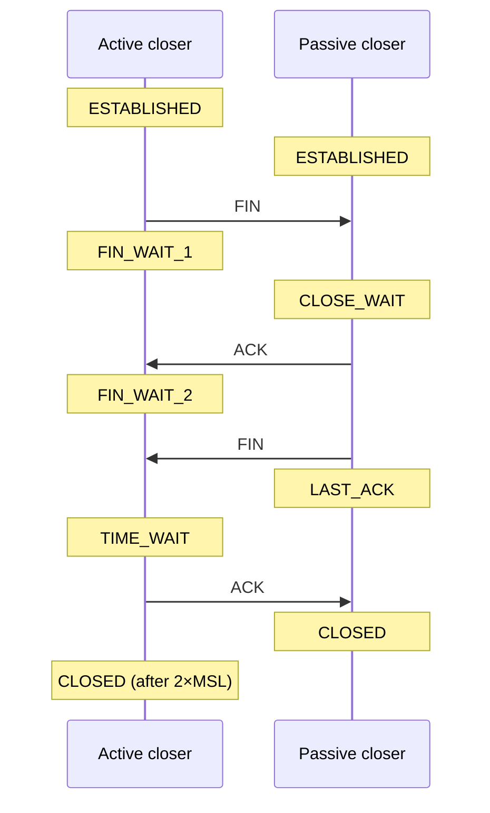
```mermaid
sequenceDiagram
    participant A as Active closer
    participant P as Passive closer
    Note over A: ESTABLISHED
    Note over P: ESTABLISHED
    A->>P: FIN
    Note over A: FIN_WAIT_1
    Note over P: CLOSE_WAIT
    P->>A: ACK
    Note over A: FIN_WAIT_2
    P->>A: FIN
    Note over P: LAST_ACK
    Note over A: TIME_WAIT
    A->>P: ACK
    Note over P: CLOSED
    Note over A: CLOSED (after 2×MSL)
```

---

## 32. Why `TIME_WAIT` Exists

The endpoint that actively starts the close normally enters `TIME_WAIT`, for two reasons:

**1. Retransmit the final ACK.** If the final ACK is lost, the other endpoint may resend its `FIN` — the endpoint in `TIME_WAIT` can answer with the ACK again.

**2. Protect a new connection from old delayed segments.** A new TCP connection might later reuse the same four-tuple. Old delayed segments from the previous connection must not be mistaken for data in the new connection.

Historically, the waiting period is described as `2 × MSL`, where `MSL` = **Maximum Segment Lifetime**. The actual duration depends on the operating system (commonly a couple of minutes in this lecture's example).

> [!NOTE]
> `TIME_WAIT` is not normally an error — it's protection for TCP correctness, not a sign something went wrong.

**Backend relevance:** If you've ever seen thousands of connections stuck in `TIME_WAIT` on a busy server and wondered why you can't reuse those ports immediately — this is why. It's also why `SO_REUSEADDR` exists.

---

## 33. TCP Advantages and Drawbacks

### Advantages

- reliable delivery
- sequencing and ordered byte delivery
- acknowledgements
- retransmission
- flow control
- congestion control
- bidirectional communication
- connection state

### Drawbacks

- at least a 20-byte TCP header
- handshake latency
- acknowledgement traffic
- kernel memory per connection
- send and receive buffers
- connection-state management
- congestion-control ramp-up
- strict ordering

> 📸 *TCP's cons in one slide: bigger header overhead than UDP, more bandwidth, statefulness costs memory on both ends, higher latency for some workloads (slow start / congestion / ACKs), it "does too much at a low level" (motivating QUIC), and TCP-over-TCP tunneling ("TCP Meltdown") makes it a poor choice for VPNs.*

<p align="center">
  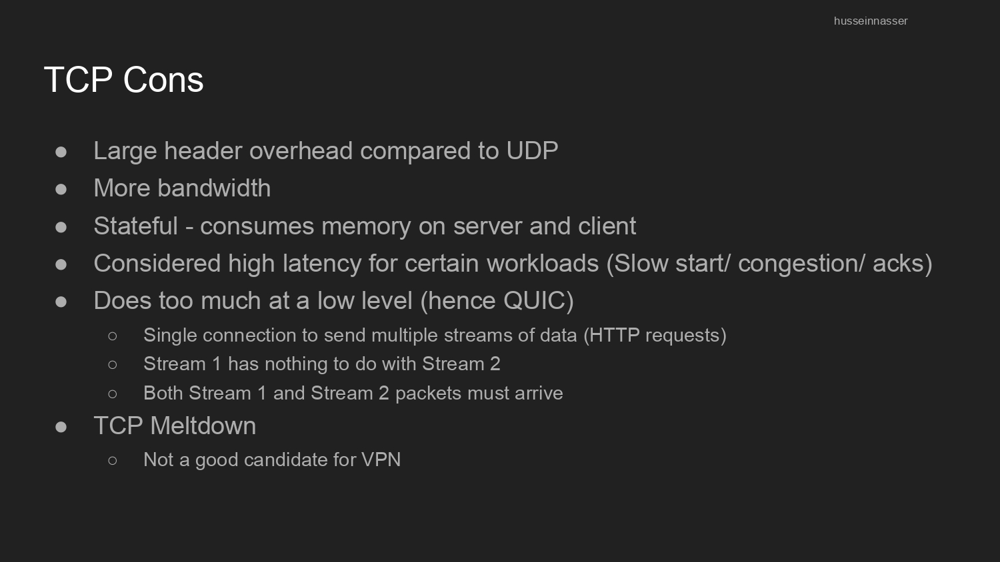
</p>

> [!IMPORTANT]
> TCP is not authentication. A TCP connection does not prove that the peer is the person or service you intended to reach — TLS certificates and application-level authentication solve that problem.

---

## 34. Head-of-Line Blocking

TCP presents one ordered byte stream. Suppose data arrives in this order:

```text
Segment 2
Segment 3
Segment 4
```

but Segment 1 is missing. TCP cannot deliver the later bytes to the application yet:

```text
Missing segment 1
       ↓
Segments 2, 3, and 4 wait
```

This is **Head-of-Line Blocking**. It becomes painful when independent application streams share one TCP connection:

```text
Request A data → missing
Request B data → arrived
Request C data → arrived
```

Even though B and C are unrelated to A, their TCP bytes may wait behind A's missing bytes.

> [!NOTE]
> This is one reason QUIC provides independent streams above UDP — loss in one stream doesn't have to block delivery in every other stream (relevant background for why HTTP/3 moved off TCP).

---

## 35. The TCP-over-TCP Problem

A TCP-based tunnel or VPN may carry another TCP connection inside it:

```text
Inner TCP connection
        ↓
Encrypted inside
        ↓
Outer TCP connection
```

Both layers perform retransmission, flow control, congestion control, and ordering — and the two control systems may interfere:

```text
Outer TCP notices loss and retransmits
Inner TCP also notices delay and retransmits
```

This can produce long stalls and poor performance ("TCP Meltdown"). That's why VPN tunnels commonly prefer UDP as the outer transport when possible.

---

## 36. NIC vs Socket

A NIC and a socket are **not** the same thing.

| NIC | Socket |
|---|---|
| Network Interface Card | Kernel networking object |
| Connects the machine to a network | Connects an application to the kernel network stack |
| Sends and receives frames | Holds endpoint/connection state and buffers |
| Has a MAC address | Uses protocol, IPs, and ports |
| Usually a small number per machine | Potentially thousands or millions |

```text
Application → Socket → Kernel TCP/IP stack → NIC → Network
```

Many sockets may use the same NIC:

```text
192.168.1.5:22   → SSH socket
192.168.1.5:80   → HTTP socket
192.168.1.5:5432 → PostgreSQL socket
```

> [!NOTE]
> Loopback communication (`127.0.0.1`) uses sockets without sending traffic through the physical NIC at all.

---

## 37. Listening Socket vs Connected Socket

A TCP server uses two types of socket roles.

**Listening socket** — waits for new connections on an address like `127.0.0.1:8800`. It's not the socket used to exchange application data with one specific client.

**Connected socket** — each accepted client gets a separate connected socket:

```text
Listening fd 3 → waits for new clients

Connected fd 4 → Client A
Connected fd 5 → Client B
Connected fd 6 → Client C
```

Each connected socket has its own four-tuple, sequence state, send buffer, receive buffer, and TCP state.

> [!IMPORTANT]
> One listening socket can produce many connected sockets.

---

## 38. The TCP Server Lifecycle

The low-level server flow is:

```text
socket() → bind() → listen() → accept() → read()/recv() and write()/send() → close()
```

- **`socket()`** — creates a kernel socket object, returns a file descriptor.
- **`bind()`** — attaches the socket to a local IP and port (e.g. `127.0.0.1:8800`). Meaning: *"deliver matching traffic for this local address to this socket."*
- **`listen()`** — turns the socket into a listening socket and enables pending-connection management.
- **`accept()`** — takes one completed connection and returns a new connected file descriptor. The original listening fd stays open.
- **`recv()`/`read()`** — copies received data from the kernel receive buffer into application memory.
- **`send()`/`write()`** — copies application data into the kernel send buffer.
- **`close()`** — releases the application's reference and begins/completes connection closing as appropriate.

---

## 39. SYN Queue, Accept Queue, and Backlog

The kernel handles TCP connection establishment before the backend application ever sees the connection. A simplified model uses two queues.

**SYN queue** — contains incomplete handshakes (client sent SYN, server sent SYN-ACK, final ACK hasn't arrived yet).

**Accept queue** — contains completed connections waiting for the application to call `accept()`.

```text
Client sends SYN
      ↓
SYN queue
      ↓
SYN-ACK / ACK
      ↓
Accept queue
      ↓
accept()
      ↓
Connected file descriptor
```

**Backlog** — a limit associated with pending connections. Its exact enforcement depends on the OS, but practically: if the application accepts too slowly and the pending queues fill, new connection attempts may be delayed, dropped, or fail.

> [!WARNING]
> **SYN flood** — an attacker may send many SYNs without ever finishing the handshake, trying to exhaust incomplete-connection resources. Modern kernels defend using SYN cookies, timeouts, queue limits, and rate limiting.

**Backend relevance:** If your server suddenly can't accept new connections under load, checking whether the accept queue is backed up (your app isn't calling `accept()` fast enough) vs. the SYN queue (possible SYN flood or extreme new-connection rate) is a real debugging step.

---

## 40. Testing a TCP Server with Netcat

`nc` means **netcat** — a small command-line tool that can create TCP connections and send raw text.

Assume the server listens on `127.0.0.1:8800`. Connect with:

> This opens a raw TCP connection to the server and lets you type text directly into it — useful for testing a server without writing a second client program.

```bash
nc 127.0.0.1 8800
# 127.0.0.1 = the host to connect to (loopback, this same machine)
# 8800      = the port the server is listening on
```

A verbose form:

```bash
nc -v 127.0.0.1 8800
# -v = verbose, prints connection status (connected/refused/etc.)
```

After connecting, anything typed into the terminal is sent over the TCP connection:

```text
Terminal input → Netcat → TCP socket → Server
```

### Create multiple connections

Open another terminal and run the same command again. Now the server has two separate TCP connections — same destination, different source ports:

```text
127.0.0.1:64409 → 127.0.0.1:8800
127.0.0.1:64428 → 127.0.0.1:8800
```

### Close the connection

`Ctrl+C` terminates netcat and closes its side of the connection.

> [!NOTE]
> Netcat is useful because it lets you test TCP without needing to build a second application.

---

## 41. Building a TCP Server in Node.js

Node.js hides most low-level socket management behind the `net` module.

> A minimal TCP server: it listens on `127.0.0.1:8800`, greets each new client, logs whatever data it receives, and logs when the client disconnects or errors out.

```js
import net from "node:net";

const server = net.createServer((socket) => {
    // socket = the connected socket for this one specific client
    console.log(
        `Connected: ${socket.remoteAddress}:${socket.remotePort}`
    );

    socket.write("Hello client\n"); // send a greeting immediately after connecting

    socket.on("data", (data) => {
        // 'data' event fires each time bytes arrive from this client
        console.log(`Received: ${data.toString()}`);
    });

    socket.on("end", () => {
        // fires when the client sends FIN (finished sending its side)
        console.log("Client closed its side of the connection");
    });

    socket.on("error", (error) => {
        // catches socket-level errors so they don't crash the process
        console.error("Socket error:", error.message);
    });
});

server.on("error", (error) => {
    // catches errors on the listening socket itself (e.g. port already in use)
    console.error("Server error:", error.message);
});

server.listen(8800, "127.0.0.1", () => {
    // start listening; callback fires once the socket is actually bound
    console.log("Listening on 127.0.0.1:8800");
});
```

### What Node.js does for us

Internally, the runtime and OS perform the equivalent of `socket()`, `bind()`, `listen()`, `accept()`, `read()`, `write()`. The callback passed to `createServer()` runs once per accepted client connection — the `socket` parameter is the connected socket for that one client.

### Why bind to `127.0.0.1`?

```text
127.0.0.1 → only this computer can connect
0.0.0.0   → listen on all IPv4 interfaces
```

Listening on all interfaces may expose the application to the LAN or public network, depending on the machine's configuration.

> [!WARNING]
> Binding to `0.0.0.0` on a machine with a public IP means anyone who can route to that IP and port can connect — don't do this for services that aren't meant to be public without a firewall in front.

---

## 42. Building a TCP Server in C

C exposes the server lifecycle more directly.

> The raw C skeleton for a TCP server — no framework hides the socket lifecycle here, so every step from the previous section is explicit.

```c
int listen_fd = socket(AF_INET, SOCK_STREAM, 0);
// AF_INET     = IPv4 address family
// SOCK_STREAM = TCP (byte-stream, reliable) rather than SOCK_DGRAM (UDP)

bind(listen_fd, ...);   // attach listen_fd to a local IP:port

listen(listen_fd, backlog);
// backlog = how many pending connections the kernel queues before refusing more

int client_fd = accept(listen_fd, ...);
// blocks until a client completes the handshake, then returns a NEW fd for that client

send(client_fd, message, message_length, 0); // write bytes to this one client

close(client_fd);   // close this client's connection
close(listen_fd);   // stop listening for new connections
```

### Important distinction

```text
listen_fd → waits for new connection attempts
client_fd → communicates with one accepted client
```

A real multi-client server must repeatedly call `accept()`:

> Looping `accept()` so the server keeps picking up new clients instead of handling just one and exiting.

```c
while (1) {
    int client_fd = accept(listen_fd, ...);
    // each iteration waits for and accepts the NEXT client

    if (client_fd < 0) {
        continue; // accept() failed (e.g. interrupted) — just try again
    }

    /* Handle this client. */
}
```

Handling many clients concurrently may use: one thread per connection, a worker pool, multiple processes, asynchronous I/O, or event loops such as `epoll`. The correct design depends on workload and scale.

**Backend relevance:** Node's `net` module and libraries like `libuv` are essentially wrapping exactly this loop with an event loop (`epoll`/`kqueue`) under the hood, so you don't manage file descriptors by hand.

---

## 43. Listing Active TCP Connections

You can inspect TCP connections directly from the OS.

**Linux: `ss`**

> Lists all TCP sockets on the machine, in every state (LISTEN, ESTABLISHED, TIME-WAIT, etc.).

```bash
ss -tan
# -t = TCP sockets only
# -a = show all sockets (not just established ones)
# -n = numeric — don't resolve hostnames/service names
```

```bash
ss -ltn
# -l = listening sockets only
```

```bash
sudo ss -tanp
# -p = show the process/PID owning each socket (needs elevated privileges)
```

**Older/common alternative: `netstat`**

```bash
netstat -an
# -a = all sockets, -n = numeric addresses/ports
```

```bash
netstat -ltn
# -l = listening only, -t = TCP, -n = numeric
```

### What you may see

```text
LISTEN
ESTABLISHED
SYN-SENT
SYN-RECV
FIN-WAIT-1
FIN-WAIT-2
CLOSE-WAIT
LAST-ACK
TIME-WAIT
```

Example mental reading:

```text
127.0.0.1:8800 LISTEN
→ server is waiting for clients

127.0.0.1:64409 → 127.0.0.1:8800 ESTABLISHED
→ one active netcat connection

... TIME-WAIT
→ recently closed active connection
```

---

## 44. Watching TCP with `tcpdump`

`tcpdump` captures packets seen by a network interface.

### Find the interface

```bash
ip addr
# lists all network interfaces and their assigned addresses (Linux)
```

or:

```bash
ifconfig
# older equivalent, still common on macOS
```

Common interface names: `eth0`, `enp0s3`, `wlan0`, `lo` (Linux); `en0`, `lo0` (macOS).

### Capture traffic for one host and port

> Filters the capture down to just traffic between this machine and one specific server on port 80, instead of drowning in every packet on the interface.

```bash
sudo tcpdump -nn -i <interface> 'host <server-ip> and port 80'
# -nn         = don't resolve hostnames or port names to numbers stay numeric
# -i          = which network interface to capture on
# host / port = BPF filter expression narrowing what gets captured
```

Example:

```bash
sudo tcpdump -nn -i en0 'host 93.184.216.34 and port 80'
```

### What appears in a basic HTTP connection

```text
1. SYN
2. SYN-ACK
3. ACK
4. HTTP request data
5. ACK
6. HTTP response data
7. FIN / ACK closing sequence
```

### Useful TCP flags in tcpdump output

```text
[S]   → SYN
[S.]  → SYN-ACK
[.]   → ACK
[P.]  → PSH + ACK, usually carrying data
[F.]  → FIN + ACK
[R]   → RST
```

### Save a packet capture

```bash
sudo tcpdump -nn -i <interface> -w tcp-capture.pcap
# -w = write raw packets to a file instead of printing them
```

Read it later:

```bash
tcpdump -nn -r tcp-capture.pcap
# -r = read from a previously saved capture file
```

The `.pcap` file can also be opened in Wireshark for visual inspection.

### What the capture proves

A packet capture connects all the theory in this lecture: IP addresses and TTL, TCP ports, SYN/ACK/FIN flags, sequence and acknowledgement numbers, window advertisement, MSS and TCP options, and the application data itself — all visible on the wire.

---

# 45. Full Flow — A Browser Request, End to End

> Tying together everything from Parts 1–3 into one concrete scenario.

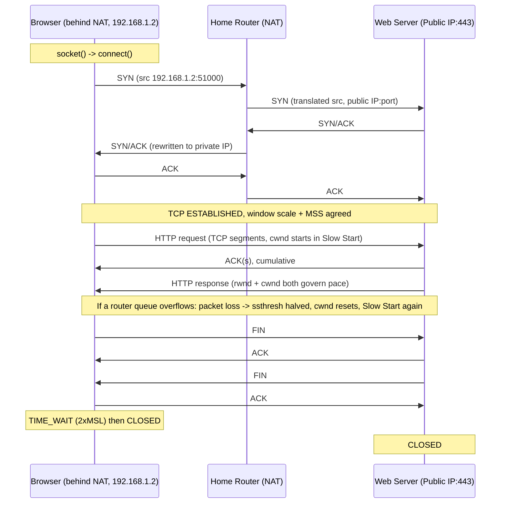
```mermaid
sequenceDiagram
    participant Browser as Browser (behind NAT, 192.168.1.2)
    participant Router as Home Router (NAT)
    participant Server as Web Server (Public IP:443)

    Note over Browser: socket() -> connect()
    Browser->>Router: SYN (src 192.168.1.2:51000)
    Router->>Server: SYN (translated src, public IP:port)
    Server->>Router: SYN/ACK
    Router->>Browser: SYN/ACK (rewritten to private IP)
    Browser->>Router: ACK
    Router->>Server: ACK
    Note over Browser,Server: TCP ESTABLISHED, window scale + MSS agreed

    Browser->>Server: HTTP request (TCP segments, cwnd starts in Slow Start)
    Server->>Browser: ACK(s), cumulative
    Server->>Browser: HTTP response (rwnd + cwnd both govern pace)

    Note over Browser,Server: If a router queue overflows: packet loss -> ssthresh halved, cwnd resets, Slow Start again

    Browser->>Server: FIN
    Server->>Browser: ACK
    Server->>Browser: FIN
    Browser->>Server: ACK
    Note over Browser: TIME_WAIT (2xMSL) then CLOSED
    Note over Server: CLOSED
```

1. The browser's OS runs `socket()` → `connect()`, which triggers the three-way handshake ([§5](#5-the-three-way-handshake)).
2. Because the browser is behind a home router, **NAT** rewrites the source IP:port on the way out and remembers the mapping in the **NAT table** ([§27–28](#27-nat-why-private-devices-can-reach-the-internet)).
3. During the handshake, both sides negotiate **MSS** and **window scaling** ([§11](#11-mtu-mss-and-jumbo-frames), [§18](#18-window-scaling)).
4. The connection is now **ESTABLISHED** on both sides ([§31](#31-tcp-connection-states)), with a listening socket on the server having produced one new connected socket for this browser ([§37](#37-listening-socket-vs-connected-socket)).
5. Data starts flowing under **Slow Start**, bounded by `min(rwnd, cwnd)` ([§20–21](#20-the-senders-real-sending-limit)).
6. If a router in the middle drops a segment, TCP detects it (timeout or duplicate ACKs), halves `ssthresh`, resets `cwnd`, and restarts Slow Start ([§23–24](#23-the-slow-start-threshold)).
7. When done, both sides run the four-way close, and the browser (the active closer) sits in **TIME_WAIT** for `2×MSL` before the four-tuple is fully free ([§8](#8-closing-a-tcp-connection), [§32](#32-why-time_wait-exists)).
8. You could watch every one of these steps happen live with `tcpdump` and see the connection's state at any moment with `ss` ([§43–44](#43-listing-active-tcp-connections)).

---

# 46. Checklist — What You Should Know After This Lecture

- [ ] Can you explain why an IP address alone isn't enough to reach an application, and what role ports play?
- [ ] Can you draw the three-way handshake and explain what each of SYN, SYN/ACK, and ACK means?
- [ ] Can you explain why TCP sequence numbers count bytes, not packets?
- [ ] Can you explain the difference between `FIN` and `RST`?
- [ ] Can you explain the difference between MTU and MSS, and compute MSS from a 1500-byte MTU?
- [ ] Can you explain the difference between flow control and congestion control in one sentence each?
- [ ] Can you explain what `rwnd` is, where it lives in the header, and why it can shrink to zero?
- [ ] Can you explain why window scaling exists and roughly how large a window it enables?
- [ ] Can you explain the difference between Slow Start and Congestion Avoidance, and what `ssthresh` does?
- [ ] Can you compute `ssthresh` from a given `FlightSize` and `MSS`?
- [ ] Can you explain what ECN is trying to prevent, and which flags (`ECE`/`CWR`) are involved?
- [ ] Can you explain how NAT translates a private connection to a public one, and why port forwarding is needed for inbound connections?
- [ ] Can you list the TCP connection states involved in opening and closing a connection, and explain why `TIME_WAIT` exists?
- [ ] Can you explain the difference between a listening socket and a connected socket, and what the SYN queue vs. accept queue hold?
- [ ] Can you trace a real-world scenario end-to-end using everything from this lecture — from `connect()` through NAT, the handshake, Slow Start, possible congestion, and the final four-way close?

---

← [Back to main README](../README.md)