# Lecture 05 — DNS, TLS & HTTPS
### From typing a URL to getting back an encrypted response

---

> [!NOTE]
> Lec 03 ended at UDP, ARP, and routing — the tools that move bytes to a *known* IP on the local segment. This lecture answers the question that comes right before that: **how does a name like `google.com` become an IP in the first place (DNS)**, and **how does the connection that follows become private and trustworthy (TLS/HTTPS)**?

---

## References

> Links and resources for this lecture:
>
> - [RFC 1035 — Domain Names, Implementation and Specification](https://datatracker.ietf.org/doc/html/rfc1035)
> - [DNS Packet source diagram — usenix.org](https://www.usenix.org/system/files/sec20-zheng.pdf)

---

## Table of Contents

**Part 1 — DNS**
1. [Why DNS Exists](#1-why-dns-exists)
2. [Anatomy of a Domain Name](#2-anatomy-of-a-domain-name)
3. [DNS vs ARP](#3-dns-vs-arp)
4. [DNS the Protocol — Port, Transport, Record Types](#4-dns-the-protocol--port-transport-record-types)
5. [The DNS Hierarchy](#5-the-dns-hierarchy)
6. [Full DNS Resolution Flow](#6-full-dns-resolution-flow)
7. [The DNS Packet](#7-the-dns-packet)
8. [Notes on DNS Security](#8-notes-on-dns-security)
9. [Practical DNS — `nslookup` and `dig`](#9-practical-dns--nslookup-and-dig)

**Part 2 — TLS Foundations**
10. [HTTP vs HTTPS](#10-http-vs-https)
11. [Why TLS — the Three Goals](#11-why-tls--the-three-goals)
12. [Symmetric vs Asymmetric Encryption](#12-symmetric-vs-asymmetric-encryption)
13. [Certificates and X.509](#13-certificates-and-x509)
14. [Self-Signed Certs, CAs, and the Trust Chain](#14-self-signed-certs-cas-and-the-trust-chain)
15. [How a Client Actually Verifies a Certificate](#15-how-a-client-actually-verifies-a-certificate)
16. [TLS 1.2 — the RSA Handshake](#16-tls-12--the-rsa-handshake)

**Part 3 — Modern TLS**
17. [Diffie–Hellman Key Exchange](#17-diffiehellman-key-exchange)
18. [The MITM Problem (Unauthenticated DH)](#18-the-mitm-problem-unauthenticated-dh)
19. [How the Certificate Fixes the MITM Problem](#19-how-the-certificate-fixes-the-mitm-problem)
20. [TLS 1.3 — What Changed](#20-tls-13--what-changed)
21. [Practical HTTPS — OpenSSL + Node.js + curl](#21-practical-https--openssl--nodejs--curl)

**Tying It Together**
- [Full Flow — Typing `https://google.com` and Hitting Enter](#full-flow--typing-httpsgooglecom-and-hitting-enter)
- [Checklist — What You Should Know After This](#checklist--what-you-should-know-after-this)

---

# Part 1 — DNS

## 1. Why DNS Exists

> **Analogy:** you don't memorize your friends' phone numbers anymore — you save a name in your contacts and let the phone resolve it. DNS is the internet's contact list.

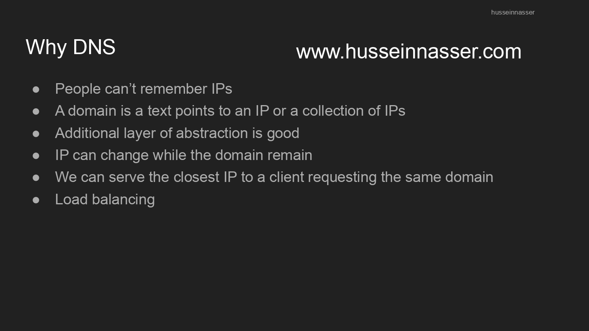

> [!NOTE]
> 📸 The slide lists the core reasons DNS exists: people can't remember IPs, a domain is text pointing to an IP (or a *collection* of IPs), it adds a useful layer of abstraction, the IP can change while the domain stays fixed, we can serve the closest IP to a client, and it enables load balancing.

IP routes packets. Humans don't route packets, so they need names:

```text
www.husseinnasser.com  →  DNS  →  some IP address
```

The domain is a stable pointer. The IP behind it can rotate, move providers, add replicas, or serve different regions — the name doesn't have to change.

**Backend relevance:** never hardcode a service's IP in your code or config. Use its hostname. That's what lets infra swap servers, fail over, or move to a new region without touching a single client.

---

## 2. Anatomy of a Domain Name

Read right to left:

```text
www     .  example      .  com
subdomain   registered name   TLD (Top-Level Domain)
```

| Part | Meaning |
|---|---|
| `.com` | Top-Level Domain (TLD) |
| `example` | Registered / second-level domain |
| `www` | Subdomain / host label |

A fully-qualified name technically ends in a root dot: `www.example.com.` — almost everyone omits the trailing dot when typing it.

---

## 3. DNS vs ARP

DNS and ARP are both "mapping" protocols, and it's easy to conflate them — don't.

| Protocol | Maps | Scope |
|---|---|---|
| **DNS** | Name → IP address | Global |
| **ARP** | Local IPv4 → MAC address | Local subnet only |

```text
google.com
   │ DNS
   ▼
142.251.40.46
   │ ARP — but only to find the MAC of the next local hop
   ▼
MAC address of your default gateway
```

> [!IMPORTANT]
> ARP never resolves the *remote* server's MAC address across the internet. Your machine ARPs its **default gateway**, and routers forward the IP packet hop by hop from there.

---

## 4. DNS the Protocol — Port, Transport, Record Types

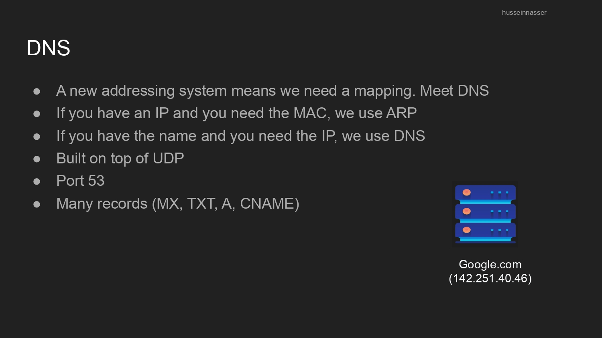

- If you have an IP and need a MAC → **ARP**
- If you have a name and need an IP → **DNS**
- Built **on top of UDP**
- Standard port: **53**
- Multiple record types: `A`, `AAAA`, `CNAME`, `MX`, `TXT`, `NS`, ...

| Record | Purpose | Example |
|---|---|---|
| `A` | Name → IPv4 | `google.com → 142.251.40.46` |
| `AAAA` | Name → IPv6 | `google.com → 2a00:1450::...` |
| `CNAME` | Alias → canonical name (never an IP directly) | `shop.example.com → stores.provider.net` |
| `MX` | Mail servers for the domain | `example.com → mail.example.com` |
| `TXT` | Free-form text — SPF, domain verification | — |
| `NS` | Authoritative name servers for the zone | `example.com → ns1.provider.net` |

> [!WARNING]
> A `CNAME` never points to an IP — it points to another **name**, which then needs its own lookup.

---

## 5. The DNS Hierarchy

> **Analogy:** finding a book in a giant library system — you don't search every shelf yourself. You ask the front desk (resolver), which asks the building directory (root), which points you to the right floor (TLD), which points you to the right shelf (authoritative server).

DNS is **not** one giant database — it's a hierarchical, distributed system.

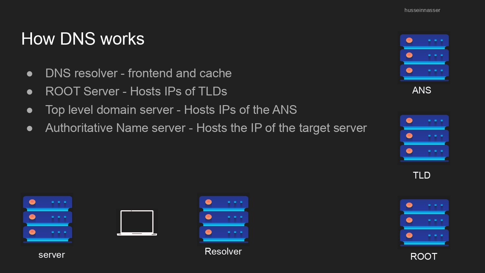

| Role | Job |
|---|---|
| **Resolver** | Frontend + cache — does the legwork for the client |
| **ROOT Server** | Hosts the IPs of the TLD servers |
| **TLD Server** | Hosts the IPs of the Authoritative Name Servers |
| **Authoritative Name Server (ANS)** | Hosts the actual IP of the target server |

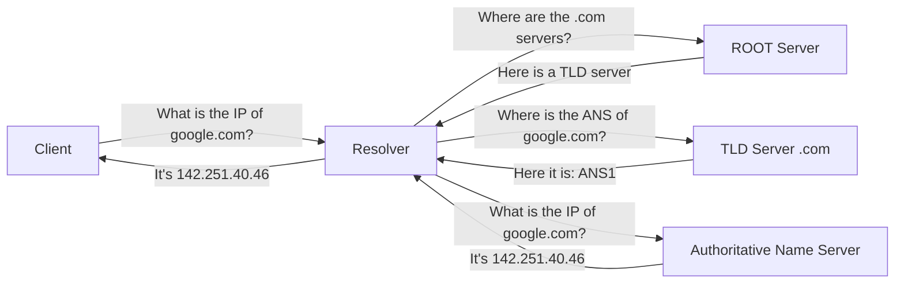

**Backend relevance:** this is why a cold DNS cache miss adds real latency before your app even opens a socket — every one of those arrows is a round trip.

---

## 6. Full DNS Resolution Flow

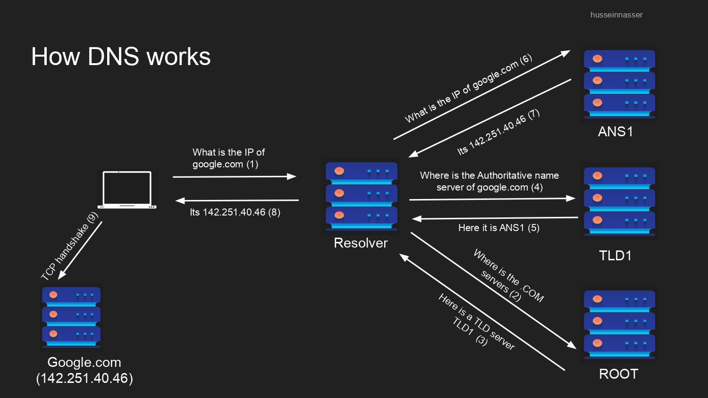

> [!NOTE]
> 📸 The numbered slide walks through resolving `google.com`, step by step, ending in a TCP handshake to the resolved IP:

```text
1. Client  → Resolver : "What is the IP of google.com?"
2. Resolver → ROOT    : "Where is the .COM server?"
3. ROOT     → Resolver: "Here is a TLD server: TLD1"
4. Resolver → TLD1    : "Where is the authoritative name server of google.com?"
5. TLD1     → Resolver: "Here it is: ANS1"
6. Resolver → ANS1    : "What is the IP of google.com?"
7. ANS1     → Resolver: "It's 142.251.40.46"
8. Resolver → Client  : "It's 142.251.40.46"
9. Client   → Google.com : TCP handshake begins
```

Notice steps 1↔8 are **one recursive request** from the client's point of view ("just give me the answer"). Steps 2–7 are the resolver doing **iterative** queries on the client's behalf, following referrals down the hierarchy.

### Caching and TTL

Every DNS record carries a **TTL (Time To Live)**:

```text
google.com.  300  IN  A  142.251.40.46
             ↑
        TTL = 300 seconds
```

While the TTL hasn't expired, the resolver can answer from cache — no root/TLD/ANS round trip needed.

| TTL | Trade-off |
|---|---|
| Long | Fewer lookups, but DNS changes take longer to propagate |
| Short | Changes propagate fast, but more repeated queries |

---

## 7. The DNS Packet

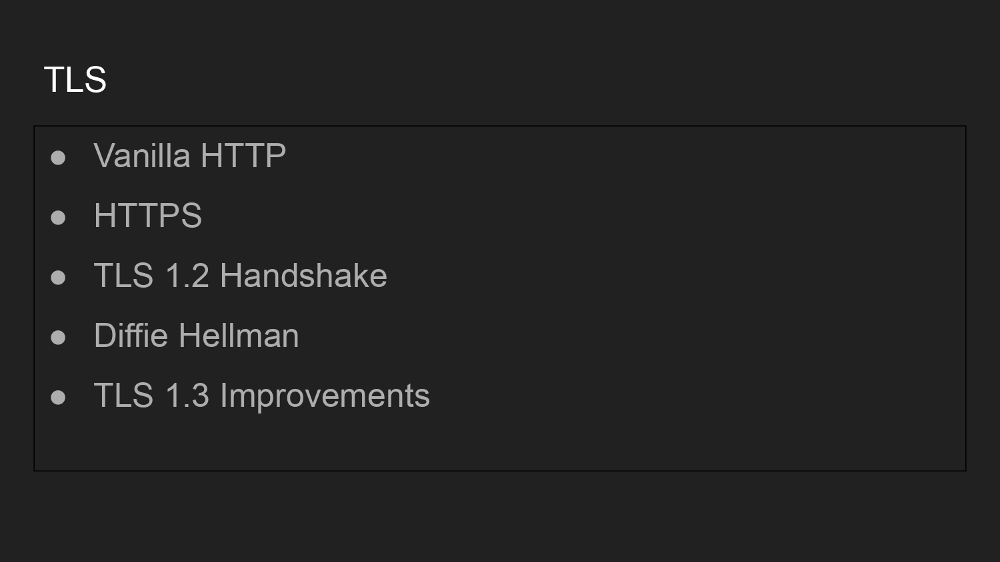

DNS rides inside UDP, which rides inside IP:

```text
IP header
 └─ UDP header (Source Port, Destination Port = 53, Length, Checksum)
     └─ DNS header (Transaction ID, Flags, QDCOUNT, ANCOUNT, NSCOUNT, ARCOUNT)
```

| Field | Meaning |
|---|---|
| `Transaction ID` | Matches a response to its request |
| `QR` | Query (0) or Response (1) |
| `Opcode` | Type of query |
| `RCODE` | Result status (0 = success, 3 = NXDOMAIN) |
| `QDCOUNT` | Number of questions |
| `ANCOUNT` | Number of answer records |

`NXDOMAIN` means the requested name simply does not exist — resolvers can cache this negative result too.

---

## 8. Notes on DNS Security

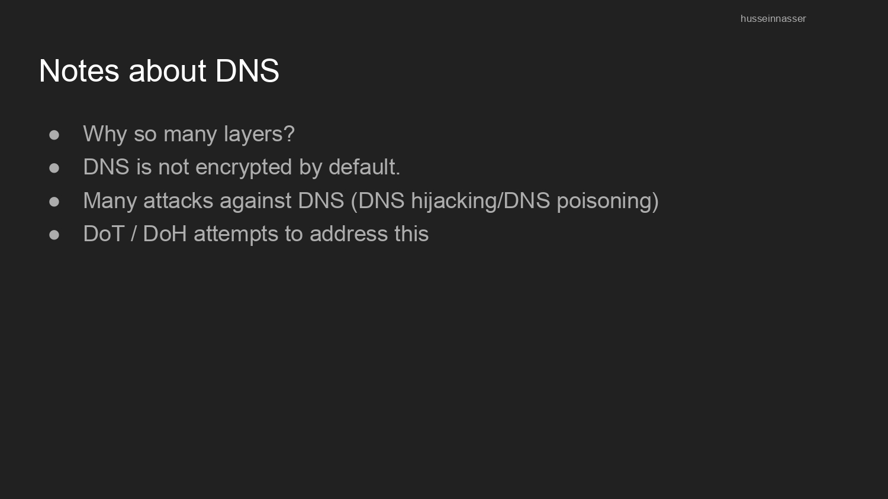

> [!WARNING]
> **DNS is not encrypted by default.** Plain DNS over UDP port 53 is readable and spoofable by anyone on the path — this is what enables **DNS hijacking** and **DNS poisoning** (an attacker feeding a resolver a fake answer).

Two protocols try to fix this:

| Protocol | Meaning | Transport |
|---|---|---|
| **DoT** | DNS over TLS | TCP 853 |
| **DoH** | DNS over HTTPS | TCP 443 |

Neither DoT nor DoH is the same as **DNSSEC**, which is a different mechanism — DNSSEC *authenticates* DNS data with signatures, it does not encrypt the traffic itself.

---

## 9. Practical DNS — `nslookup` and `dig`

> This looks up the IP address behind a domain — the exact query your OS/browser silently performs before opening any connection.

```bash
nslookup google.com
# nslookup    = "name server lookup", a DNS query CLI tool
# google.com  = the name we want resolved
```

```text
# output:
Server:         192.168.1.1        # the resolver YOUR machine asked (your router/ISP, not Google)
Address:        192.168.1.1#53     # that resolver's IP and port 53 — matches §4

Non-authoritative answer:          # this resolver isn't the ANS for google.com, it's relaying a cached answer
Name:   google.com
Address: 142.251.40.46             # the A record — this is the IP your machine will now connect to
```

> [!NOTE]
> "Non-authoritative answer" doesn't mean untrusted — it just means the resolver that replied is a step 8 in the §6 flow, not the authoritative server itself (step 6-7). If it *had* skipped its cache and asked the ANS directly, it would say "authoritative" instead.

You can target a specific record type or a specific resolver:

```bash
nslookup -type=MX google.com        # ask specifically for mail server records
```

```text
# output:
google.com      mail exchanger = 10 smtp.google.com.
# "10" is the priority (lower = tried first) — mail servers for google.com
```

```bash
nslookup -type=NS google.com        # ask which name servers are authoritative
```

```text
# output:
google.com      nameserver = ns1.google.com.
google.com      nameserver = ns2.google.com.
# these are the Authoritative Name Servers (ANS) from §5 — the ones that
# actually hold the real records, not just a cache of them
```

```bash
nslookup google.com 1.1.1.1         # force the query through Cloudflare's resolver
nslookup google.com 8.8.8.8         # force the query through Google's resolver
```

```text
# output (top line changes, answer usually stays the same):
Server:         1.1.1.1
Address:        1.1.1.1#53
...
Address: 142.251.40.46
# same final IP, different resolver replied — proves the resolver is just
# a middleman/cache (§5), not the source of truth
```

`dig` (Domain Information Groper) gives more detail and is the standard tool on Linux/macOS:

```bash
dig google.com A
# google.com = the domain to query
# A          = record type requested (defaults to A if omitted)
```

```text
# output:
;; QUESTION SECTION:
;google.com.                   IN      A          # what we asked

;; ANSWER SECTION:
google.com.             243    IN      A       142.251.40.46
#            ↑ TTL in seconds (§6) — cache this answer for 243 more seconds

;; Query time: 24 msec           # how long the round trip took
;; SERVER: 192.168.1.1#53(192.168.1.1)   # which resolver answered
```

The `ANSWER SECTION` line maps directly to the record format from §4:  `name  TTL  class  type  value`.

```bash
dig +trace google.com
# +trace = manually walks the hierarchy: ROOT -> TLD -> Authoritative -> answer
# this is the single best command to *see* the DNS hierarchy from Part 1 in action
```

```text
# output (trimmed):
.                       518400  IN      NS      a.root-servers.net.   # step 2-3 in §6: the ROOT
com.                    172800  IN      NS      a.gtld-servers.net.   # step 4-5: the .com TLD
google.com.             172800  IN      NS      ns1.google.com.       # step 6-7: the ANS
google.com.             300     IN      A       142.251.40.46         # final answer, from the ANS
```

Each block above is one hop of the exact mermaid diagram in §5 — `dig +trace` makes the abstract hierarchy concrete.

```bash
dig +short google.com
# +short = strip all the metadata, print only the resolved IP(s)
# useful inside scripts: MY_IP=$(dig +short google.com)
```

```text
# output:
142.251.40.46
# nothing else — just the bare answer, good for piping into other commands
```

---

# Part 2 — TLS Foundations

## 10. HTTP vs HTTPS

Once DNS hands back an IP, the client opens a connection. Plain HTTP looks like this:

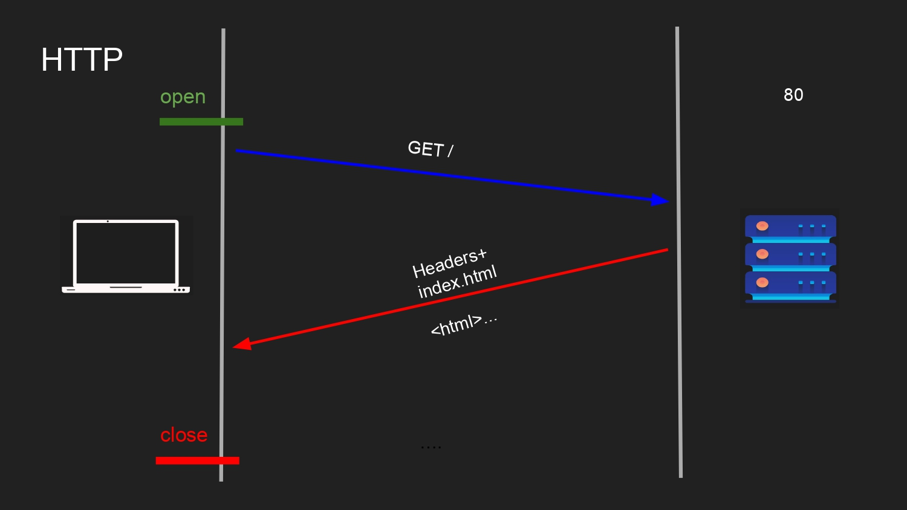

```text
open (port 80)
 → GET /
 ← Headers + index.html
close
```

Nothing here is protected — every byte is readable by anything sitting on the path.

HTTPS is not a separate application protocol — it's the same HTTP conversation wrapped in TLS:

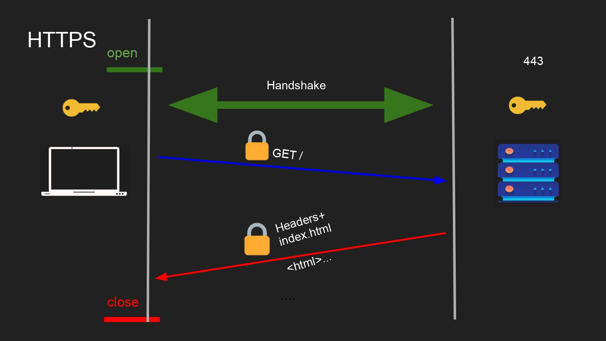

```text
open (port 443)
 → Handshake  (establishes trust + shared keys)
 → 🔒 GET /
 ← 🔒 Headers + index.html
close
```

> HTTP describes the conversation. TLS protects it. TCP carries it. IP routes it.

---

## 11. Why TLS — the Three Goals

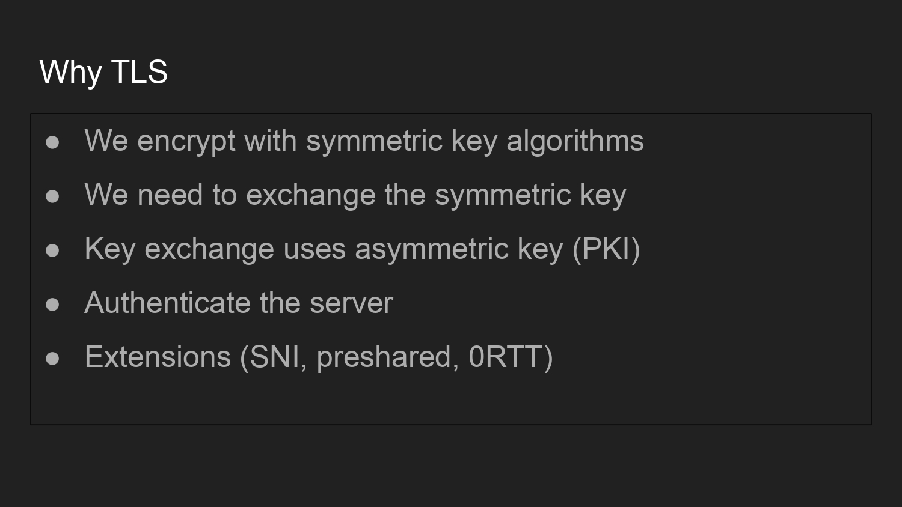

TLS exists to solve one core chain of problems:

```text
We encrypt with symmetric key algorithms
        ↓
We need to exchange that symmetric key safely
        ↓
Key exchange uses asymmetric key cryptography (PKI)
        ↓
We must also authenticate the server
        ↓
Extensions add extra behavior (SNI, preshared keys, 0-RTT)
```

| Goal | Meaning |
|---|---|
| **Confidentiality** | Outsiders can't read the data |
| **Integrity** | Outsiders can't silently modify the data |
| **Authentication** | The client knows *who* it's actually talking to |

The high-level agenda for the rest of TLS follows this exact order:


```text
Vanilla HTTP → HTTPS → TLS 1.2 Handshake → Diffie-Hellman → TLS 1.3 Improvements
```

---

## 12. Symmetric vs Asymmetric Encryption

| | Symmetric | Asymmetric |
|---|---|---|
| Keys | One shared secret key | A public/private key **pair** |
| Speed | Fast — used for bulk application data | Slow — used only for the handshake |
| Problem it solves | Encrypting lots of data cheaply | Safely exchanging/authenticating a key |
| Examples | AES-GCM, ChaCha20-Poly1305 | RSA, DH, ECDHE |

The core tension TLS has to resolve:

```text
Both sides need the SAME symmetric key to talk fast and cheap.
But sending that key in plaintext defeats the whole point.
```

This is exactly the problem key exchange (RSA in TLS 1.2, Diffie–Hellman in TLS 1.3) is built to solve — covered in Part 3.

**Backend relevance:** symmetric ciphers do the actual heavy lifting for every request/response byte on your server. Asymmetric crypto (RSA, ECDHE) is only paid for once, during the handshake.

---

## 13. Certificates and X.509

> **Analogy:** a certificate is a notarized ID card. It doesn't just claim "I am google.com" — a trusted third party (the notary/CA) has verified and signed that claim.

The process:

```text
1. Generate a public/private key pair
2. Put the public key in a certificate
3. Put the website's name in the certificate
4. Sign the certificate with a private key (the issuer's)
5. Package it all as an X.509 certificate
```


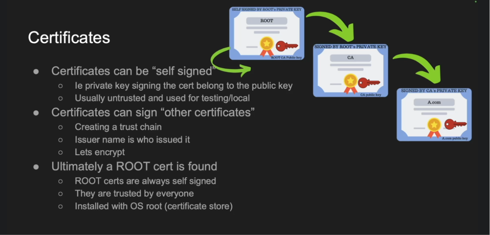

> [!NOTE]
> 📸 The X.509 structure shown includes a **Certificate Header** (Version, Serial Number, Signature Algorithm, **Issuer Name** — who issued it, Validity Period, **Subject Name** — who owns it), a **Public Key** block, **Optional Extensions** (most importantly the **Subject Alternative Name**, which lists every hostname the cert is valid for), and a final **Digital Signature** signed by the issuer's private key.

| Field | Meaning |
|---|---|
| Issuer Name | Who issued/signed this certificate |
| Subject Name | Who this certificate belongs to |
| Validity Period | Start/end dates |
| Public Key | The subject's public key |
| Subject Alternative Name (SAN) | All hostnames this cert covers |
| Signature | Proof the issuer actually signed this exact content |

> [!WARNING]
> A certificate **never** contains the private key. It contains the *public* key plus metadata plus a signature. Leaking a certificate is fine; leaking the matching private key is a full compromise.

---

## 14. Self-Signed Certs, CAs, and the Trust Chain

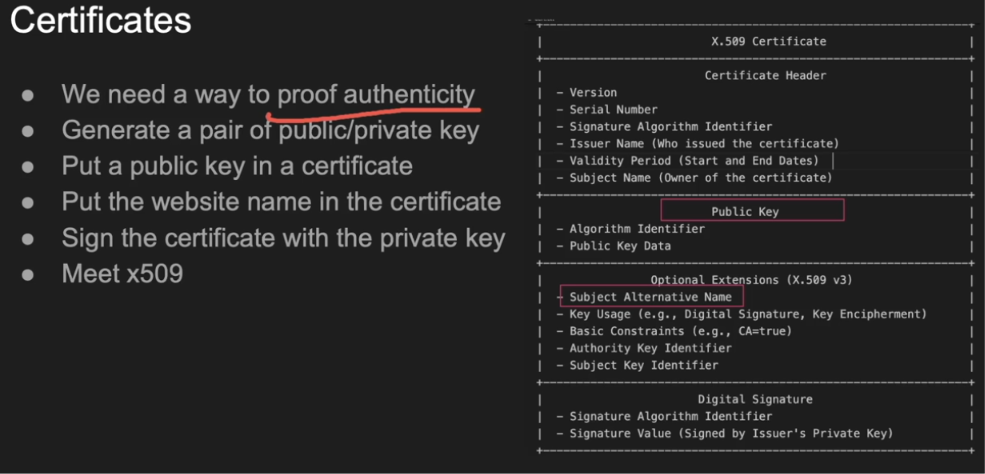

> [!NOTE]
> 📸 The diagram shows a **ROOT** certificate that is self-signed (its own private key signs itself), which then signs a **CA** certificate, which then signs the leaf certificate for **A.com**. Each arrow represents "signed using the private key of the certificate on the left."

- Certificates **can be self-signed** — the private key that signs it belongs to the same public key inside it. Usually untrusted, mainly used for local/testing.
- Certificates **can sign other certificates**, creating a **trust chain**.
- Every chain eventually bottoms out at a **ROOT** certificate:
  - ROOT certs are always self-signed
  - They are trusted by everyone *because* they are pre-installed
  - They live in the OS/browser's **certificate store**

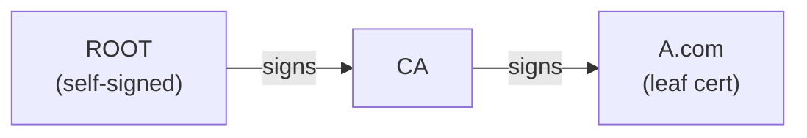

---

## 15. How a Client Actually Verifies a Certificate

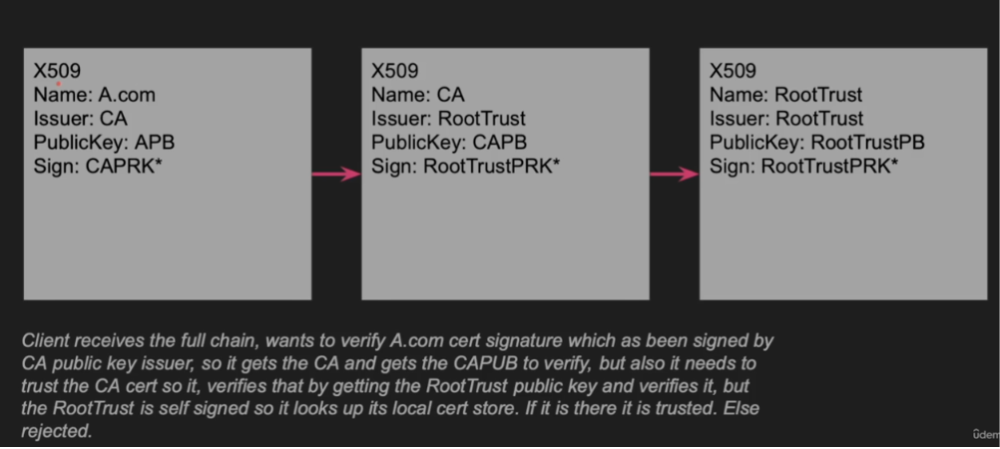

> [!NOTE]
> 📸 Walking the chain shown: the client receives the **full chain** and wants to verify `A.com`'s signature. That signature was made with the **CA**'s private key, so the client fetches the CA's public key to check it. But it also needs to trust the CA cert itself — so it goes one level up to **RootTrust**, checks that signature using RootTrust's public key. RootTrust is self-signed, so the client looks it up in its **local certificate store**. If it's there → trusted. If not → rejected.

```text
X.509 chain: A.com  →  issued by CA  →  issued by RootTrust (self-signed)
```

Verification, step by step:

```text
1. Check the hostname is covered by the certificate (SAN match)
2. Check the validity period (not expired, not "not yet valid")
3. Verify A.com's signature using the CA's public key
4. Verify the CA's signature using RootTrust's public key
5. RootTrust is self-signed — look it up in the local trust store
6. Found and trusted?  → accept the whole chain
   Not found?          → reject the certificate
```

**Backend relevance:** this is exactly why "certificate chain incomplete" errors happen in production — a server sending only its leaf cert without the intermediate CA cert breaks step 3 for clients that don't already have that intermediate cached.

---

## 16. TLS 1.2 — the RSA Handshake

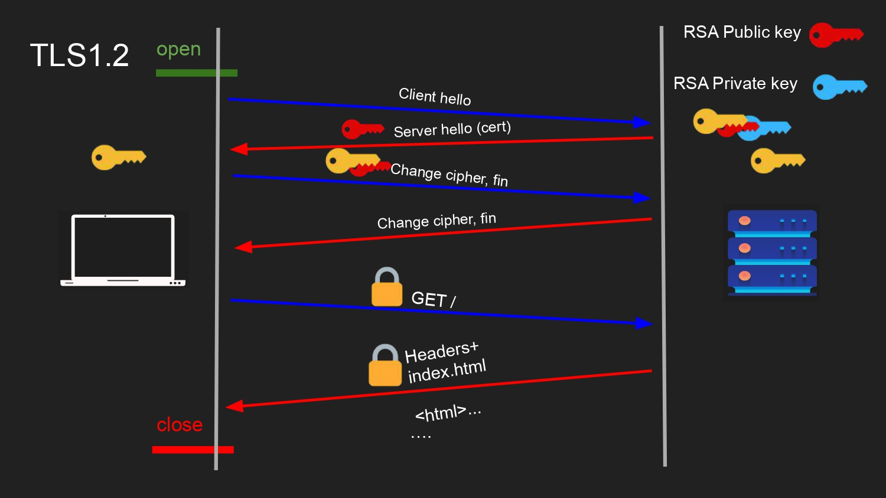

```text
open (port 443)
 → Client Hello
 ← Server Hello (cert, with RSA public key)
 → Change Cipher, Fin      🔑 encrypted using server's RSA public key
 ← Change Cipher, Fin
 → 🔒 GET /
 ← 🔒 Headers + index.html
close
```

The client generates a random "premaster secret," encrypts it with the server's RSA **public** key from the certificate, and sends it over. Only the server's RSA **private** key can decrypt it — so both sides now share a secret nobody else could read off the wire.

> [!WARNING]
> This flow has a serious long-term weakness: it ties every session's secrecy to one long-lived RSA private key. If that private key is ever stolen — even years later — an attacker holding old recorded traffic can decrypt it retroactively. This is exactly the **forward-secrecy problem** that Part 3 exists to fix.

---

# Part 3 — Modern TLS

## 17. Diffie–Hellman Key Exchange

> **Analogy:** two people mix colors of paint in public where anyone can see, but each keeps one private color secret. Both end up with the exact same final mixed color — but an observer who only saw the public colors can't reverse-engineer either private one.

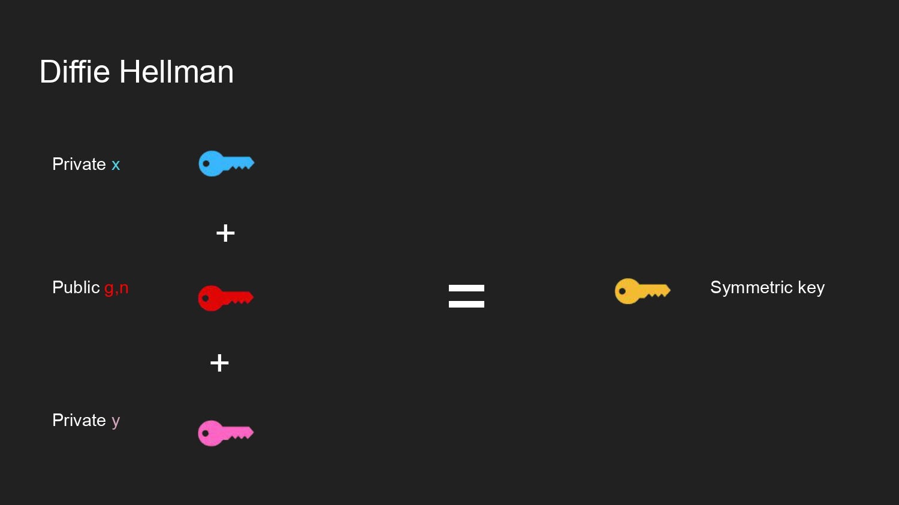

```text
Private x  (client, secret)
Public g,n (shared, safe to broadcast)
Private y  (server, secret)
        ↓
   Symmetric key
```

The trick: both sides derive the **same** shared secret **without ever transmitting that secret itself**.

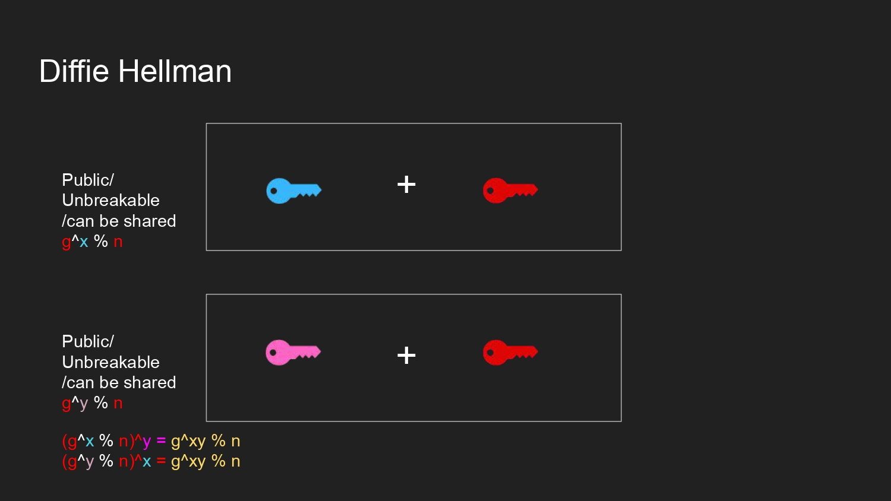

```text
Client computes:  A = g^x mod n     (public, shareable)
Server computes:  B = g^y mod n     (public, shareable)

Client then computes: (B)^x mod n = g^(xy) mod n
Server then computes: (A)^y mod n = g^(xy) mod n

Both land on the exact same value: the shared secret g^(xy) mod n
```

### Tiny numeric example

```text
g = 5, n = 23
Client picks x = 6  →  A = 5^6 mod 23 = 8
Server picks y = 15 →  B = 5^15 mod 23 = 19

Client:  19^6  mod 23 = 2
Server:  8^15  mod 23 = 2   ← same result, independently derived
```

What went over the wire: `g`, `n`, `A`, `B`. What never did: `x`, `y`, or the final secret itself. Recovering `x` or `y` from `A` or `B` is the **discrete logarithm problem** — computationally infeasible at real-world key sizes.

**Backend relevance:** this is why the exact same shared secret is never reused across sessions — new random `x`/`y` per handshake means a compromise of today's secret tells an attacker nothing about yesterday's traffic. That property is **forward secrecy**.

---

## 18. The MITM Problem (Unauthenticated DH)

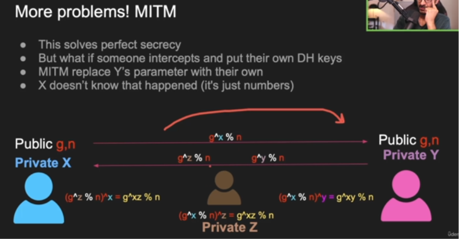

> [!NOTE]
> 📸 The slide shows the flaw plainly: Diffie–Hellman on its own **solves perfect secrecy against a passive listener, but not identity.** If someone actively intercepts the exchange and swaps in their own DH parameters, X (the client) has no way to know it happened — "it's just numbers."

```text
Client (private X) ←→ Attacker (private Z) ←→ Server (private Y)

Client thinks it shares a secret with the Server.
Server thinks it shares a secret with the Client.
In reality, the attacker holds two separate shared secrets —
one with each side — and can read/relay/modify everything.
```

```text
(g^Z % n)^X = g^XZ % n     ← client ↔ attacker's shared secret
(g^X % n)^Z = g^XZ % n
(g^Z % n)^Y = g^YZ % n     ← attacker ↔ server's shared secret
(g^Y % n)^Z = g^YZ % n
```

> [!IMPORTANT]
> Key exchange without authentication is vulnerable to MITM. Diffie–Hellman alone is never enough for HTTPS — it must be paired with certificates.

---

## 19. How the Certificate Fixes the MITM Problem

The server **signs** its ephemeral DH value with the private key tied to its certificate:

```text
Server's ephemeral DH value
        ↓ signed with the certificate's private key
Digital signature
        ↓ sent alongside the DH value
Client verifies the signature using the certificate's (authenticated) public key
```

Since only the real server holds that private key, an attacker who swaps in a fake DH value cannot produce a valid signature over it — the client detects the tampering and aborts the handshake.

This is the missing piece from Part 2's certificate chain (§13–15): **certificates don't create the symmetric key — they authenticate the key exchange so a MITM can't quietly hijack it.**

---

## 20. TLS 1.3 — What Changed

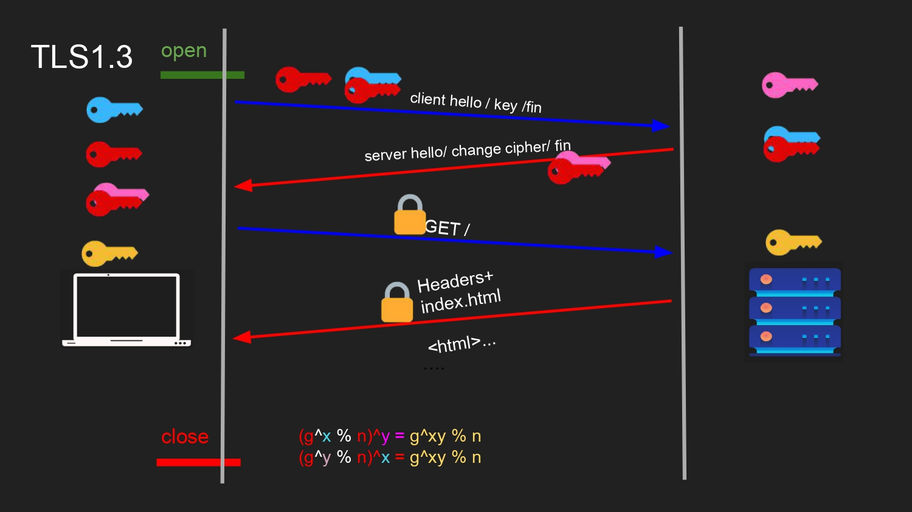

```text
open (port 443)
 → Client Hello + Key share + Fin
 ← Server Hello + Change Cipher + Fin  (signed, authenticated)
 → 🔒 GET /
 ← 🔒 Headers + index.html
close
```

Compare that to the TLS 1.2 flow in §16 — TLS 1.3 collapses the handshake into essentially **one round trip** instead of two, because the client sends its key share immediately in the first message instead of waiting to see the server's certificate first.

| | TLS 1.2 | TLS 1.3 |
|---|---|---|
| Key exchange | Static RSA **or** DH | Ephemeral DH/ECDHE **only** |
| Forward secrecy | Not guaranteed (RSA mode) | Always guaranteed |
| Round trips (new connection) | 2 | 1 |
| Resumption | Session IDs/tickets | Faster PSK-based resumption |
| 0-RTT | Not supported | Supported (with caveats below) |

### Session resumption & 0-RTT

Once a client and server have talked before, TLS 1.3 can skip most of the handshake on the next connection using a pre-shared key (PSK) derived from the earlier session. Taken further, **0-RTT** lets the client send encrypted application data (like an HTTP request) in its very first flight — before the handshake even finishes.

> [!WARNING]
> 0-RTT data can be **replayed** by an attacker who captures it — there's no handshake yet to guarantee freshness. Never use 0-RTT for non-idempotent operations (payments, state-changing POSTs) unless the server has explicit replay protection.

---

## 21. Practical HTTPS — OpenSSL + Node.js + curl

> This generates a private key and a self-signed certificate — the minimum needed to stand up a local HTTPS server for testing.

```bash
openssl req -x509 -newkey rsa:2048 \
  -keyout key.pem \
  -out cert.pem \
  -days 365 \
  -nodes
# req -x509     = generate a self-signed X.509 certificate directly (skip a CSR)
# -newkey rsa:2048 = create a new 2048-bit RSA key pair alongside it
# -keyout key.pem  = where to save the PRIVATE key — never commit this file
# -out cert.pem    = where to save the certificate (contains the PUBLIC key)
# -days 365        = validity period
# -nodes           = "no DES" — don't encrypt the private key with a passphrase
```

```text
# output:
Generating a RSA private key                        # the private key from §12/§13
....................+++++
writing new private key to 'key.pem'                 # goes in key.pem — keep this secret
-----
You are about to be asked to enter information that will be incorporated
into your certificate request.
Country Name (2 letter code) []:EG                    # anything you type here becomes
State or Province Name []:Cairo                        # part of the certificate's Subject
Organization Name []:Hikawi                             # from §13 — safe to leave blank (press Enter)
Common Name (e.g. server FQDN) []:localhost             # IMPORTANT: must match the hostname you'll test
```

```bash
ls -la key.pem cert.pem
```

```text
# output:
-rw------- 1 you you 1704 Jul 19 10:00 key.pem    # private key — 600 perms, no one else should read it
-rw-r--r-- 1 you you 1188 Jul 19 10:00 cert.pem    # certificate — fine to share, it's the public half
```

> Inspecting the certificate you just generated — confirming it actually has the fields from §13.

```bash
openssl x509 -in cert.pem -text -noout
# -in cert.pem = the certificate file to read
# -text        = print it in human-readable form instead of raw base64
# -noout       = don't also dump the base64 block, just the parsed text
```

```text
# output (trimmed to the fields we care about):
Certificate:
    Data:
        Serial Number: 7e:3a:...                          # Serial Number field from §13
        Issuer: CN=localhost                                # self-signed → Issuer == Subject
        Validity
            Not Before: Jul 19 10:00:00 2026 GMT             # Validity Period from §13
            Not After : Jul 19 10:00:00 2027 GMT             # matches our -days 365
        Subject: CN=localhost                                # who this cert claims to be
        Subject Public Key Info:
            Public-Key: (2048 bit)                            # the public key, from §13
        X509v3 extensions:
            X509v3 Subject Alternative Name:
                DNS:localhost                                  # SAN from §13 — must match the URL you curl
    Signature Algorithm: sha256WithRSAEncryption               # signed with our own key.pem — "self-signed"
```

> [!IMPORTANT]
> If `Subject: CN=` or the SAN doesn't say `localhost`, `curl` and browsers will reject the cert with a **hostname mismatch** even though the signature itself is valid — the identity check from §15 fails independently of the signature check.

> A minimal HTTPS server in Node.js, using the key/cert pair generated above.

```js
const https = require('https')   // Node's built-in HTTPS module
const fs = require('fs')         // to read the key/cert files from disk

const options = {
  key: fs.readFileSync('key.pem'),   // server's private key — decrypts/signs
  cert: fs.readFileSync('cert.pem')  // server's certificate — sent to clients
}

https.createServer(options, (req, res) => {
  // req/res look identical to plain http — TLS is already handled below this
  res.writeHead(200)
  res.end('hello over TLS\n')
}).listen(8443, () => {
  console.log('HTTPS server listening on port 8443')
})
```

```bash
node server.js
```

```text
# output:
HTTPS server listening on port 8443
# the process just hangs here, waiting for connections — that's expected,
# it means the handshake in §16/§20 is ready to happen on the next request
```

> A minimal HTTPS client request, pointed at the self-signed server above.

```js
const https = require('https')

https.get('https://localhost:8443/', {
  rejectUnauthorized: false
  // rejectUnauthorized: false = accept the self-signed cert for local testing
  // NEVER set this in production — it disables hostname/chain verification entirely
}, (res) => {
  res.on('data', (chunk) => process.stdout.write(chunk))
})
```

```text
# output (in the client terminal):
hello over TLS
# output (in the server terminal, no code needed to see this — Node logs nothing
# extra by default, but the request DID complete a full TLS 1.3 handshake first)
```

> Testing the server with `curl` — first the way that fails, then the two safe ways to fix it.

```bash
curl https://localhost:8443/
# fails: "self-signed certificate" — curl doesn't trust our own root by default
```

```text
# output:
curl: (60) SSL certificate problem: self signed certificate
More details here: https://curl.se/docs/sslcerts.html
curl failed to verify the legitimacy of the server and therefore could not
establish a secure connection to it.
# this is §15's chain-of-trust check failing on purpose: cert.pem isn't in
# curl's trust store, so step 5-6 of the verification flow rejects it
```

```bash
curl --cacert cert.pem https://localhost:8443/
# --cacert cert.pem = explicitly trust THIS certificate for THIS command only
# this is the correct, scoped way to test a self-signed server
```

```text
# output:
hello over TLS
# succeeds — we manually supplied the trust anchor that curl's default
# store doesn't have, satisfying §15 without touching global trust settings
```

```bash
curl -k https://localhost:8443/
# -k / --insecure = disable certificate verification entirely
# fine for a five-second local sanity check, never acceptable in production code
```

```text
# output:
hello over TLS
# same result as --cacert, but for the wrong reason: verification never
# ran at all, rather than running and passing — see the warning below
```

> [!WARNING]
> `curl --insecure` or `rejectUnauthorized: false` don't "fix" HTTPS — they turn off the authentication half of TLS from §11. You keep encryption but lose any guarantee about *who* you're actually talking to.

---

# Full Flow — Typing `https://google.com` and Hitting Enter

This ties Part 1, Part 2, and Part 3 — plus lec 03's ARP/routing — into one continuous trace:

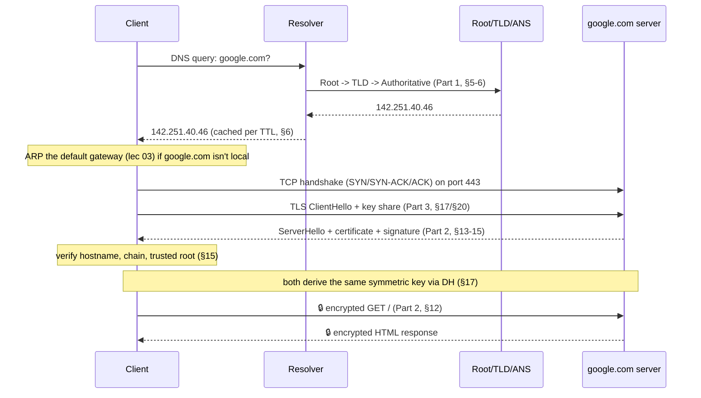

```text
1. Client asks resolver for google.com's IP           → DNS (Part 1)
2. Resolver walks Root → TLD → Authoritative           → DNS hierarchy
3. Client gets an IP, ARPs its gateway if needed        → lec 03
4. TCP handshake opens a connection to that IP          → lec 03/04
5. TLS ClientHello kicks off the handshake              → TLS (Part 2/3)
6. Server proves identity via certificate chain          → §13-15
7. Both sides derive a shared symmetric key (DH)          → §17
8. HTTP request/response travel encrypted end to end      → §12
```

---

# Checklist — What You Should Know After This

- [ ] Why does DNS exist, and what problem does it actually solve?
- [ ] Can you explain the difference between DNS and ARP without conflating them?
- [ ] What port and transport protocol does plain DNS use?
- [ ] Can you name the four roles in the DNS hierarchy (resolver, root, TLD, authoritative) and what each one returns?
- [ ] What is a TTL, and what's the trade-off between a long one and a short one?
- [ ] Why is plain DNS considered insecure, and what do DoT/DoH change?
- [ ] Can you run `nslookup`/`dig` and read the ANSWER section of the output?
- [ ] What's the actual relationship between HTTP and HTTPS?
- [ ] What are the three goals TLS provides (confidentiality, integrity, authentication)?
- [ ] Why can't TLS just use symmetric encryption from the start?
- [ ] What fields live inside an X.509 certificate, and what does the Subject Alternative Name do?
- [ ] Can you trace a certificate chain from a leaf cert down to a trusted root?
- [ ] Why is TLS 1.2's static RSA key exchange considered a forward-secrecy weakness?
- [ ] Can you explain Diffie–Hellman well enough to compute a tiny numeric example by hand?
- [ ] Why is unauthenticated Diffie–Hellman vulnerable to MITM, and how does the certificate fix it?
- [ ] What changed between TLS 1.2 and TLS 1.3, and what does 0-RTT trade away?
- [ ] Can you generate a self-signed cert with OpenSSL and stand up an HTTPS server with it?
- [ ] Can you trace a real-world scenario end-to-end using everything from this lecture — from typing a URL to receiving an encrypted HTTP response?

---

← [Back to main README](../README.md)