# Routing and Docker Networking — From Zero

> How a machine decides **where a packet goes next**, how routers move it between networks, and how Docker rebuilds those same ideas *virtually*, inside one computer.

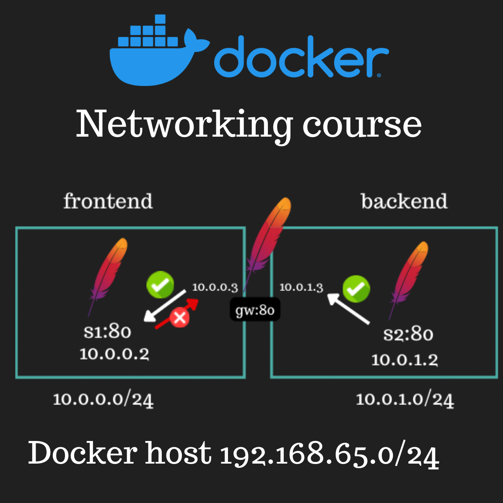

> [!NOTE]
> This chapter has two halves that build on each other:
>
> ```text
> Part I  — Routing from Zero     (how real networks pick a path)
> Part II — Docker Networking     (the same ideas, virtualized on one host)
> ```
>
> Part II will keep referring back to Part I — Docker isn't a new set of rules, it's the same routing/ARP/gateway story running inside software instead of physical wires.

## What you will understand

By the end of this chapter, you should be able to explain:

- why switches use MAC addresses but routers use IP addresses;
- why ARP works only inside the current subnet;
- why a packet for a remote machine is placed inside a frame addressed to a router;
- what the kernel does when an application sends data;
- what a routing table contains, where it lives, and who updates it;
- why a route is needed in both directions;
- what Docker, images, containers, Apache, and `curl` are — from zero;
- how Docker gives containers virtual IP addresses, gateways, routes, and DNS;
- why two containers in separate Docker networks cannot communicate automatically.

---

## Table of Contents

- [The big picture](#the-big-picture-the-network-is-mostly-an-os-feature)
- **Part I — Routing from Zero**
  - [1. Local communication: MAC addresses and switches](#1-local-communication-mac-addresses-and-switches)
  - [2. Why MAC addresses are not enough](#2-why-mac-addresses-are-not-enough)
  - [3. How the kernel checks whether an IP is local](#3-how-the-kernel-checks-whether-an-ip-is-local)
  - [4. ARP: IP address to local MAC address](#4-arp-ip-address-to-local-mac-address)
  - [5. Gateway, next hop, and router](#5-gateway-next-hop-and-router)
  - [6. Final destination vs. next hop](#6-the-most-important-routing-idea-final-destination-vs-next-hop)
  - [7. What a router does with the frame](#7-what-a-router-does-with-the-frame)
  - [8. IP forwarding](#8-ip-forwarding)
  - [9. The routing table](#9-the-routing-table)
  - [10. Why one default gateway may be wrong](#10-why-one-default-gateway-may-be-wrong)
  - [11. Routing must work in both directions](#11-routing-must-work-in-both-directions)
  - [12. Where is the routing table stored?](#12-where-is-the-routing-table-stored)
  - [13. Who writes routes?](#13-who-writes-routes)
  - [14. The kernel's complete sending algorithm](#14-the-kernels-complete-sending-algorithm)
- **Part II — Docker Networking from Zero**
  - [15. What Docker actually is](#15-what-docker-actually-is)
  - [16. Apache and curl, from zero](#16-apache-and-curl-from-zero)
  - [17. Running your first container](#17-running-your-first-container)
  - [18. A Docker network is a virtual LAN](#18-a-docker-network-is-a-virtual-lan)
  - [19. The default `bridge` network](#19-the-default-bridge-network)
  - [20. Reading Docker's network inspection output](#20-reading-dockers-network-inspection-output)
  - [21. Why `curl http://172.17.0.2` may fail from your Mac](#21-why-curl-httpxxxxx-may-fail-from-your-mac)
  - [22. Building a debugging image](#22-building-a-debugging-image)
  - [23. Two containers on the same network](#23-two-containers-on-the-same-network)
  - [24. The default bridge's DNS limitation](#24-the-default-bridges-dns-limitation)
  - [25. Creating a custom Docker network](#25-creating-a-custom-docker-network)
  - [26. Docker DNS on user-defined networks](#26-docker-dns-on-user-defined-networks)
  - [27. Why split frontend, backend, and database networks?](#27-why-split-frontend-backend-and-database-networks)
  - [28. Internal networks](#28-internal-networks)
  - [29. Two Docker networks do not automatically talk to each other](#29-two-docker-networks-do-not-automatically-talk-to-each-other)
  - [30. Building a gateway container between two networks](#30-building-a-gateway-container-between-two-networks)
  - [31. Adding routes on both endpoints](#31-adding-routes-on-both-endpoints)
  - [32. Packet journey from S1 to S2](#32-packet-journey-from-s1-to-s2)
  - [33. Why routing by IP may work while names still fail](#33-why-routing-by-ip-may-work-while-names-still-fail)
  - [34. Routes inside containers are ephemeral](#34-routes-inside-containers-are-ephemeral)
  - [35. `traceroute` and TTL](#35-traceroute-and-ttl)
- [Command Cheat Sheet](#command-cheat-sheet)
- [Common Confusions](#common-confusions)
- [Final Mental Model](#final-mental-model)

---

## The big picture: the network is mostly an OS feature

Your application does not manually build Ethernet frames or decide which router should receive every packet — the **operating system** does that for you.

A backend application just says something like:

```text
Send these bytes to 172.16.6.2 on port 80.
```

The kernel takes it from there:

```text
Application
    ↓ socket system call
Kernel networking stack
    ↓ chooses a route
    ↓ resolves the next-hop MAC address
NIC / Wi-Fi adapter
    ↓ sends bits
Network
```

The kernel owns the TCP/IP implementation, routing table, interface configuration, and neighbor/ARP cache. The NIC just does the physical transmission — the kernel decides *what* gets transmitted and *where* it goes first.

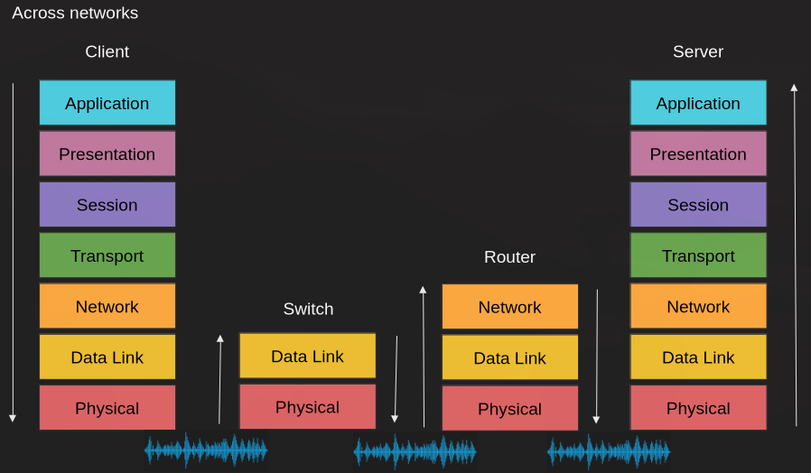

> [!NOTE]
> 📸 Notice the switch only climbs to Data Link, and the router only climbs to Network — neither needs Transport or Application. Only the client and server run the full stack. This is the exact same "climb only as high as you need" rule from the OSI layer table in the previous chapter — it's why a switch can't route between subnets, and a router can't read an HTTP header.

| Device | Highest networking layer it normally needs |
|---|---|
| Switch | Layer 2 — Data Link |
| Router | Layer 3 — Network/IP |
| Client or server | All required layers up to the application |

---

# Part I — Routing from Zero

## 1. Local communication: MAC addresses and switches

> **Analogy:** a MAC address is like an apartment number *within one specific building* — it only means something to people inside that same building. Someone in a different building can't use it to find you.

Every network interface has a link-layer address, usually called a **MAC address**:

```text
00:00:5e:00:53:af
```

A MAC address delivers an Ethernet frame across the **current local link only**.

Suppose three devices are connected to a switch:

```text
A ── port 1
B ── port 2
C ── port 3
```

The switch learns which source MAC address appears on each port:

```text
MAC-A → port 1
MAC-B → port 2
MAC-C → port 3
```

When A sends a frame to MAC-B, the switch forwards it only through port 2 — not to every port.

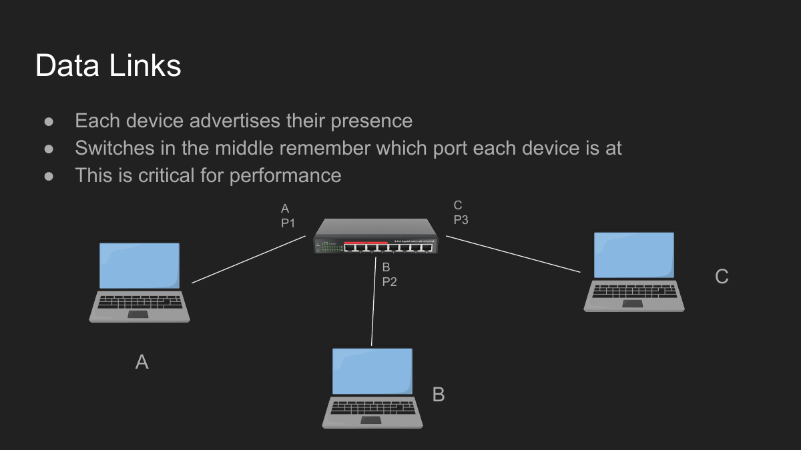

### Do you have a switch at home?

Probably. A home Wi-Fi router is commonly several devices combined into one box:

```text
Home router box
├── Router
├── Small Ethernet switch — the LAN ports
├── Wi-Fi access point
├── DHCP server
├── NAT
└── Firewall
```

The ports labelled `LAN 1`, `LAN 2`, and so on are the visible part of its built-in switch.

---

## 2. Why MAC addresses are not enough

MAC addresses work locally, but they aren't organized by *location* — a switch can learn a few thousand local devices, but it would be hopeless for every switch on Earth to learn every device on Earth.

> **Analogy:** an apartment number alone can't route a letter across the country — you also need the city, street, and building number. IP is that outer, hierarchical address; MAC is just the apartment number once you've arrived at the right building.

We need a hierarchical, *routable* addressing system: **IP**.

An IPv4 address is 32 bits, containing:

```text
network portion + host portion
```

Example:

```text
192.168.1.3/24
```

`/24` means the first 24 bits identify the network:

```text
Network: 192.168.1.0/24
Host:    .3
Mask:    255.255.255.0
```

```text
IP answers:  Which network contains the final destination?
MAC answers: Which device should receive this frame on the current local link?
```

---

## 3. How the kernel checks whether an IP is local

Before sending, the kernel compares the destination IP against the subnet of the outgoing interface, using a bitwise AND with the subnet mask.

For a `/24` network:

```text
192.168.1.5 AND 255.255.255.0 = 192.168.1.0
192.168.1.4 AND 255.255.255.0 = 192.168.1.0
```

Both results match `192.168.1.0` — same subnet.

```text
10.0.0.6 AND 255.255.255.0 = 10.0.0.0
```

That doesn't match `192.168.1.0` — different subnet.

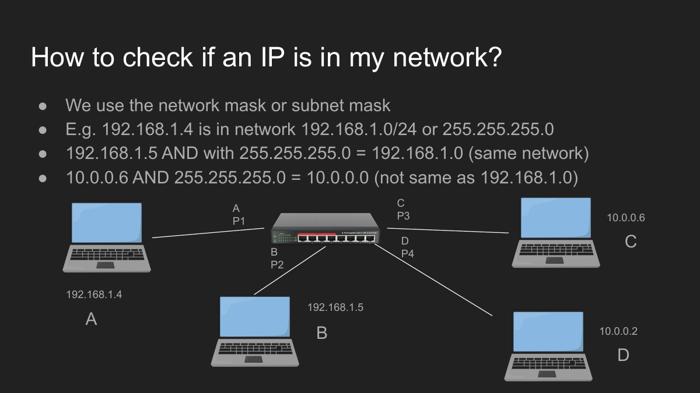

```text
Destination is local    → send directly to that machine
Destination is remote   → send to a gateway/next hop
```

> [!IMPORTANT]
> This single AND-and-compare check is the fork in the road for *everything* that follows: it decides whether the next step is "ARP for the real destination" (§4) or "ARP for the gateway instead" (§6).

---

## 4. ARP: IP address to local MAC address

ARP answers a purely local question:

> I know the IPv4 address of a device on my current subnet. What is its MAC address?

Suppose:

```text
A: IP 192.168.1.4, MAC A
B: IP 192.168.1.5, MAC B
```

A wants to send to B:

```text
1. A confirms B is in the same /24 network.
2. A broadcasts: "Who has 192.168.1.5?"
3. The switch floods the broadcast through the local LAN.
4. Every machine receives it, but only B owns that IP.
5. B replies: "192.168.1.5 is at MAC B."
6. A caches the answer and sends the frame directly to B.
```

```text
Ethernet frame
├── Source MAC:      A
├── Destination MAC: B
└── IP packet
    ├── Source IP:      192.168.1.4
    └── Destination IP: 192.168.1.5
```

View the Linux neighbor/ARP cache with:

```bash
ip neigh show
```

> [!IMPORTANT]
> **The critical ARP rule:** ARP never crosses a router and never searches the internet. It resolves an IPv4 address only on the current local link. Any local device — laptop, server, or router — can issue ARP; the requester changes, ARP itself doesn't.

---

## 5. Gateway, next hop, and router

When the final destination is outside the local subnet, the sender cannot ARP for the final machine directly — ARP only works locally (§4). It instead hands the packet to a **next hop**, commonly its default gateway.

> **Analogy:** mailing a letter abroad. You don't personally deliver it — you drop it at your local post office, which knows the next step. The post office is the "gateway" out of your local system.

A router connects networks, so it has at least one interface *in each* connected network — each with its own IP and MAC address.

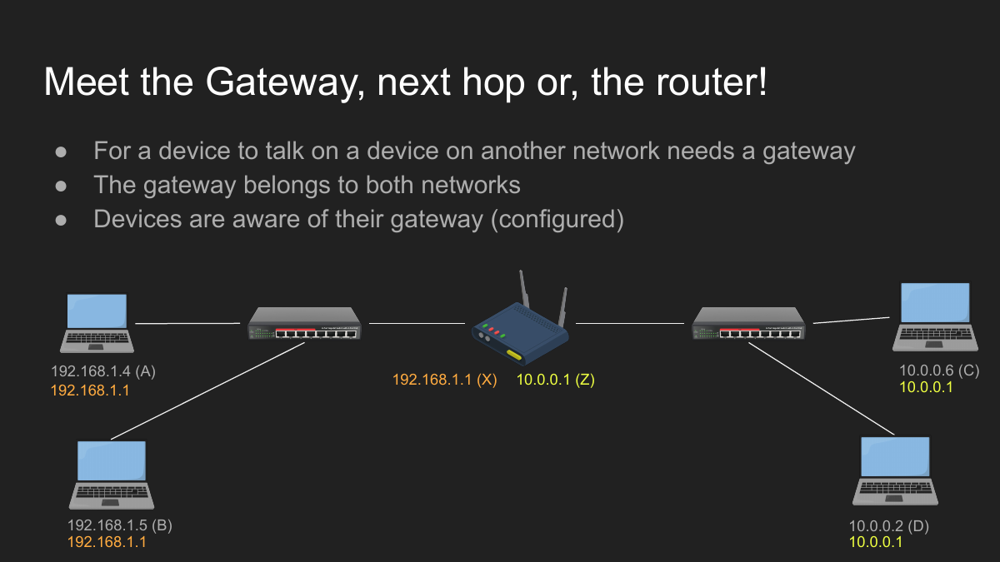

```text
Interface facing 192.168.1.0/24
IP:  192.168.1.1
MAC: X

Interface facing 10.0.0.0/24
IP:  10.0.0.1
MAC: Z
```

So **X and Z are MAC addresses**, not IP addresses — the same physical router simply looks different (different IP, different MAC) depending on which network you ask it from.

---

## 6. The most important routing idea: final destination vs. next hop

Suppose:

```text
A: 192.168.1.4, MAC A
D: 10.0.0.2,    MAC D
Router interface near A: 192.168.1.1, MAC X
Router interface near D: 10.0.0.1,    MAC Z
```

A wants to talk to D. D is not local to A (§3), so A ARPs for the gateway `192.168.1.1` — not for D.

A creates:

```text
Ethernet frame — delivery for this hop
├── Source MAC:      A
├── Destination MAC: X       ← the router
└── IP packet — end-to-end destination
    ├── Source IP:      192.168.1.4
    └── Destination IP: 10.0.0.2  ← the final machine
```

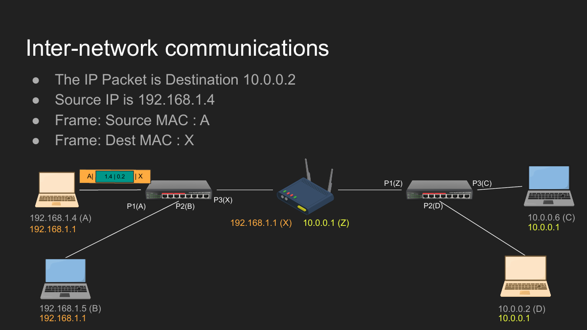

> [!IMPORTANT]
> **Memorize this one line — everything else in routing follows from it:**
> The destination **IP** identifies the final machine. The destination **MAC** identifies only the next device on the current local link.
>
> This is why D might be talking to a distant machine M, yet the frame it sends first may carry a completely different router's MAC address.

---

## 7. What a router does with the frame

The router receives the frame because the destination MAC matches its local interface. Then it:

```text
1. removes the old Layer 2 frame;
2. examines the destination IP in the packet;
3. checks its own routing table;
4. selects an outgoing interface and next hop;
5. uses ARP on that outgoing network when necessary;
6. creates a NEW frame for the next link.
```

For the final link toward D:

```text
New Ethernet frame
├── Source MAC:      Z
├── Destination MAC: D
└── Original IP packet
    ├── Source IP:      192.168.1.4
    └── Destination IP: 10.0.0.2
```

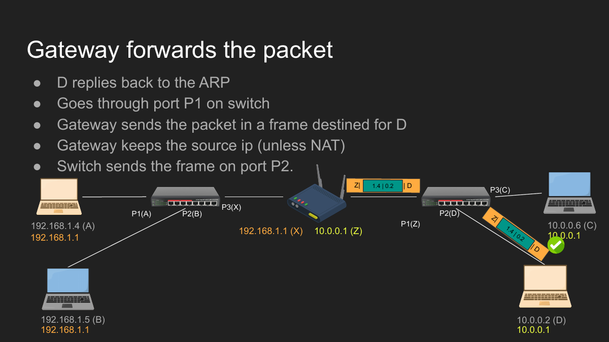

The MAC addresses changed because the local link changed. Source/destination **IP** addresses normally stay the same, unless something like NAT modifies them.

```text
Hop 1 frame: A → X
Hop 2 frame: Z → D

IP packet (unchanged across both hops): 192.168.1.4 → 10.0.0.2
```

---

## 8. IP forwarding

A normal host usually consumes packets addressed to itself and drops unrelated traffic. A router has to do something extra:

> Receive a frame addressed to one of its MAC addresses, discover the enclosed IP packet actually targets *another* machine, and forward that packet out a different interface.

That kernel behavior is called **IP forwarding**. Without it, merely connecting a computer to two networks does not automatically turn it into a working router — the OS also has to be told to actually forward traffic between them.

---

## 9. The routing table

A routing table is the kernel's map for answering:

```text
For this destination IP, what should I do next?
```

| Field | Meaning |
|---|---|
| Destination/prefix | The destination network matched by the rule |
| Next hop/gateway | The router that should receive the packet next |
| Interface | The NIC or virtual interface used to send it |
| Direct/on-link | Whether the destination can be reached without another router |
| Metric | Preference when competing routes are otherwise comparable |

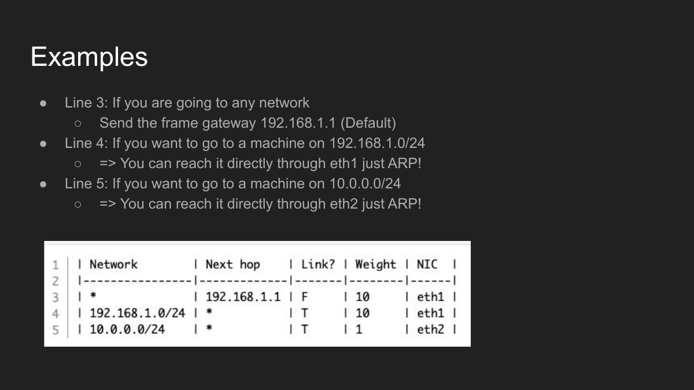

A simple table might mean:

```text
10.0.0.0/24       dev eth0
172.16.6.0/24     via 10.0.0.6 dev eth0
default           via 10.0.0.1 dev eth0
```

In English:

```text
For 10.0.0.x:     directly connected; ARP for the destination itself.
For 172.16.6.x:   give the packet to router 10.0.0.6.
For everything else: use the default gateway 10.0.0.1.
```

### Route selection: longest-prefix match

The kernel always prefers the **most specific** matching prefix. Given:

```text
172.16.0.0/16   via router A
172.16.6.0/24   via router B
default         via router C
```

For `172.16.6.2`, all three technically match — but `/24` is more specific than `/16`, so router B wins. Metrics break ties between routes of equal specificity.

---

## 10. Why one default gateway may be wrong

Consider three networks:

```text
10.0.0.0/24
172.16.6.0/24
192.168.1.0/24
```

Machine D is `10.0.0.2`. Its default gateway is `10.0.0.1`, but the router that actually knows about `172.16.6.0/24` is `10.0.0.6`.

Without a specific route, D sends the packet to the wrong router — and it gets dropped.

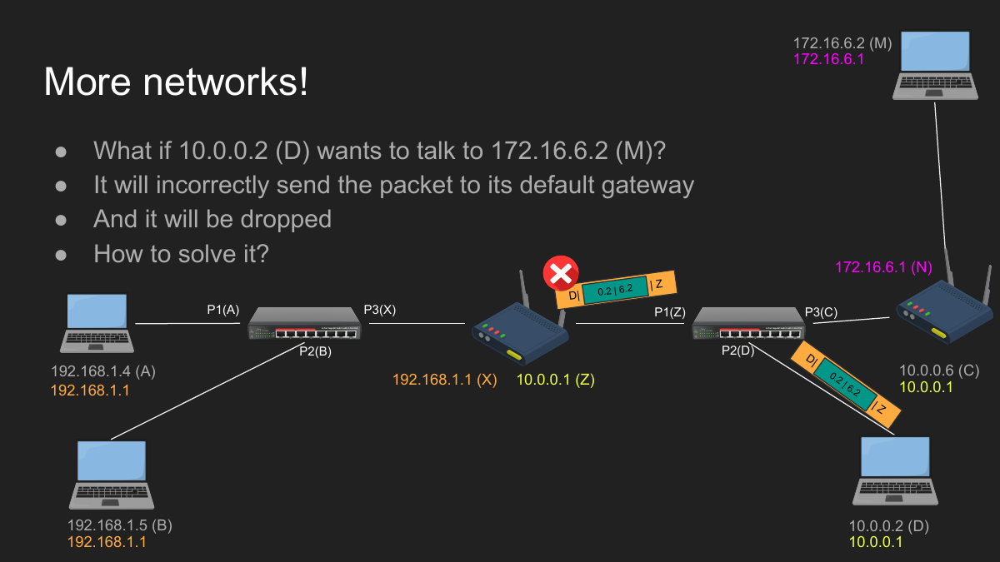

Add a specific route:

```text
172.16.6.0/24 via 10.0.0.6
```

Now the kernel knows: *for this particular destination network, skip the normal default gateway — use `10.0.0.6` instead.*

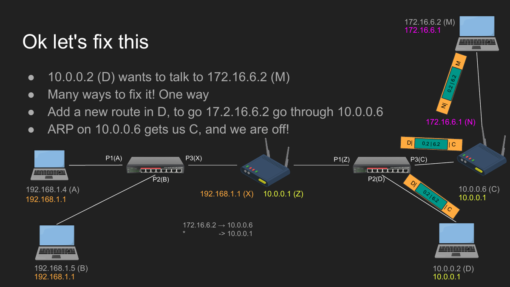

```bash
sudo ip route add 172.16.6.0/24 via 10.0.0.6
sudo ip route del 172.16.6.0/24
```

---

## 11. Routing must work in both directions

Getting a request *to* the destination is only half the job.

```text
Forward path works  ≠  complete communication works
```

If D can reach M, but M has no valid route back to D, the request arrives and simply vanishes — no response ever makes it back.

```text
D → M   (must work)
M → D   (must ALSO work)
```

The return route doesn't have to be identical, but it must exist.

---

## 12. Where is the routing table stored?

The active routing table lives in **kernel memory** — it's runtime OS state, not a text file you `cat` directly. Commands ask the kernel to *show* its current routes.

```bash
# Linux
ip route show
netstat -rn      # older view

# Windows
route print

# macOS
netstat -rn
```

Persistent network configuration may live on disk or inside an OS network manager — that config is used to *rebuild* the active kernel table during startup or connection setup.

---

## 13. Who writes routes?

- **Kernel** — adds routes for directly connected interfaces automatically.
- **DHCP** — supplies an IP address, subnet mask, and default gateway.
- **Administrator** — adds static routes manually.
- **OSPF** — learns paths inside one organization.
- **BGP** — exchanges reachability information between large networks and ISPs.

No matter how sophisticated the source, its useful output eventually becomes the same thing: routing information the packet-forwarding system can use.

---

## 14. The kernel's complete sending algorithm

When an application sends data to a destination IP, the kernel roughly does:

```text
1. Read the destination IP.
2. Search the routing table.
3. Select the most specific matching route.
4. Select the outgoing interface.
5. Decide whether the next hop is:
      a. the final destination itself, or
      b. a router/gateway.
6. Search the neighbor/ARP cache for that next-hop IP.
7. If missing, perform ARP on the selected local interface.
8. Create a frame addressed to the next-hop MAC.
9. Give the frame to the NIC.
```

The application only ever knows the final socket destination — the kernel figures out every local networking detail underneath it.

> [!IMPORTANT]
> **Routing chooses the next-hop IP and interface. ARP finds the MAC needed to actually reach that next hop.** Keep those two jobs separate in your head — Part II will lean on this constantly.

---

# Part II — Docker Networking from Zero

> [!NOTE]
> **Running analogy for this whole Part:** think of your computer (the **host**) as a plot of land you can build apartment buildings on. Docker is the construction company. An **image** is a blueprint. A **container** is an actual built apartment made from that blueprint — you can build many identical apartments from one blueprint. A **Docker network** is a hallway connecting apartments so residents can knock on each other's doors. Keep this picture running — every section below maps onto it.

## 15. What Docker actually is

Docker runs applications inside isolated environments called **containers**. A container is *not* a full virtual machine with its own kernel — it's mainly an isolated **process** with tightly controlled access to resources.

```text
Host operating system
└── Docker
    ├── Container A
    ├── Container B
    └── Container C
```

Docker achieves this isolation using operating-system features you don't need to master yet — **namespaces** (each container gets its own private view of processes, network, filesystem) and **control groups / cgroups** (limits on how much CPU/memory a container may use). You don't need to configure these directly; Docker sets them up for you every time you run a container.

### Host

The **host** is the actual machine (or VM) where Docker itself is running — the "land" in our analogy.

### Image vs. container — the one distinction that unlocks everything else

```text
Image      = a reusable blueprint/template. It never runs by itself.
Container  = a running instance created FROM an image.
```

Programming analogy, if that clicks better for you:

```text
Image      ≈ a class
Container  ≈ an object/instance of that class
```

> [!IMPORTANT]
> You can create **many** containers from the same image, just like a blueprint can build many identical apartments. Deleting a container doesn't touch the image — you can always build another apartment from the same blueprint.

---

## 16. Apache and `curl`, from zero

Two tools show up constantly in this lab — neither one is Docker itself, they're just the test app and the test client used to *prove* networking is working.

### Apache — the test web server

The image used in the lecture is `httpd`, Docker's official image for **Apache HTTP Server**. Apache is a web server: it listens for HTTP requests and returns HTTP responses, usually on port `80`.

```text
HTTP client → Apache → HTML response
```

If `curl`ing a container returns Apache's default page, you've just proved the network path to that container works. That's Apache's *entire* job in this lab.

### `curl` — the test client

`curl` is a command-line tool that sends requests to a server and prints the response.

```bash
curl http://example.com
```

```text
curl sends an HTTP request
        ↓
server receives it
        ↓
server returns an HTTP response
        ↓
curl prints the response
```

A browser does the same underlying thing, but renders HTML/CSS/JS visually instead of printing raw text — which is exactly why `curl` is more useful for debugging: you see exactly what came back, unprocessed.

```bash
curl http://localhost:8080
curl http://172.17.0.3
curl http://s2
curl -v http://localhost:8080   # -v: verbose, shows headers and connection details
```

---

## 17. Running your first container

```bash
docker run -d --name web httpd
```

```text
-d          detached mode — keep it running in the background
--name web  give the container a readable name (otherwise Docker picks a random one)
httpd       the image to build this container from
```

At this point Apache is listening on port `80` **inside the container** — but nothing outside the container can reach it yet.

> **Analogy:** the apartment has a working front door, but it only opens into the building's internal hallway — there's no street entrance yet.

### Publishing a port — building a street entrance

```bash
docker run -d --name web -p 8080:80 httpd
```

Read the mapping left-to-right:

```text
host port 8080 → container port 80
```

Now the host itself can reach it:

```bash
curl http://localhost:8080
```

> [!NOTE]
> `-p` doesn't change anything *inside* the container — Apache still only knows about port 80. It creates a forwarding rule on the host that says "traffic hitting my port 8080 should be handed to this container's port 80." That's the entire trick behind port publishing.

---

## 18. A Docker network is a virtual LAN

Docker builds *virtual* versions of everything from Part I — interfaces, bridges, subnets, gateways, routing entries, and DNS — entirely in software, on one host.

A container can have:

```text
virtual IP address
virtual MAC address
virtual NIC
subnet mask
routing table
default gateway
DNS resolver
```

> [!IMPORTANT]
> This is the single most important idea in Part II: **Docker isn't inventing new networking rules.** Everything from Part I — subnets, ARP, gateways, routing tables — still applies exactly as described. Docker just builds *virtual* copies of those pieces (virtual switches, virtual routers, virtual cables) instead of using physical hardware.

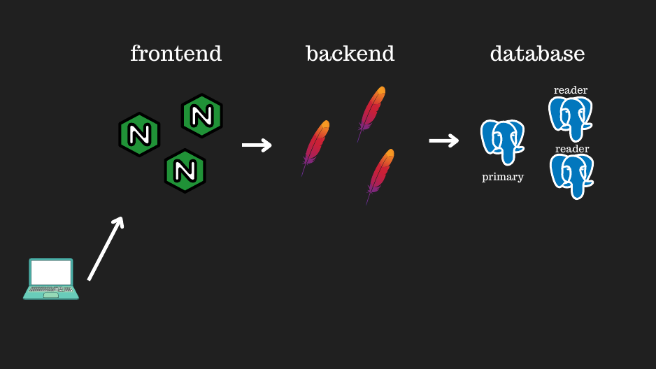

---

## 19. The default `bridge` network

If you don't choose a network, Docker attaches a new container to a network named `bridge` automatically — think of it as *the building's original, pre-installed hallway* that every apartment connects to unless told otherwise.

Example:

```text
Bridge network: 172.17.0.0/16
Gateway:        172.17.0.1
S1:             172.17.0.2
S2:             172.17.0.3
```

The bridge behaves like a virtual Layer 2 switch connected to a virtual gateway:

```text
S1 ─┐
    ├── Docker bridge ── Docker host ── outside networks
S2 ─┘
```

Useful inspection commands:

```bash
docker ps                        # list running containers
docker inspect s1                # full details of one container
docker network inspect bridge    # full details of the bridge network
docker network ls                # list all Docker networks on this host
```

---

## 20. Reading Docker's network inspection output

`docker inspect s1` will show a block like this:

```json
"Gateway": "172.17.0.1",
"IPAddress": "172.17.0.2",
"IPPrefixLen": 16,
"MacAddress": "02:42:ac:11:00:02"
```

```text
Gateway      172.17.0.1          where remote traffic is sent
IPAddress    172.17.0.2          this container's virtual IPv4 address
IPPrefixLen  16                  subnet is 172.17.0.0/16
MacAddress   02:42:...           virtual NIC's Layer 2 address
```

Other fields you may see:

```text
NetworkID   identifies the Docker network
EndpointID  identifies this container's attachment/virtual port
Aliases     extra DNS names on that network
IPAMConfig  manually requested IP configuration, if any
```

The rules are identical to a physical machine: the kernel (inside the container's network namespace) uses the subnet and routing table to decide whether to send directly, or through the gateway — exactly the §3 AND-check from Part I.

---

## 21. Why `curl http://172.17.0.2` may fail from your Mac

This confuses almost everyone the first time. On **Docker Desktop for macOS**, containers don't actually run directly on macOS — Docker quietly runs a hidden **Linux virtual machine**, and your containers live inside *that* VM.

```text
macOS host
└── Docker Linux VM
    └── 172.17.0.0/16 bridge
        └── container 172.17.0.2
```

The container network exists *inside that hidden VM*. Your Mac's own networking stack has no direct route into it — so this fails from a Mac terminal:

```bash
curl http://172.17.0.2
```

But all of these work fine:

```text
- another container on the same bridge curling 172.17.0.2
- a process running inside the Docker VM itself
- a native Linux Docker host reaching its own local bridge (no hidden VM there)
- your Mac reaching it through a published port (§17)
```

```bash
docker run -d -p 8080:80 httpd
curl http://localhost:8080
```

> [!NOTE]
> Failure from the host doesn't mean *nobody* can reach the container — it means your Mac's terminal is outside that private virtual network and has no path in, exactly like a random laptop outside a company's private LAN.

---

## 22. Building a debugging image

Minimal production images strip out diagnostic tools to stay small. For learning, the lecture builds a custom Apache image that *keeps* tools like `ping`, `traceroute`, `ip`, `curl`, `telnet`, and `nslookup` — so you can actually poke at the network from inside a container.

```dockerfile
FROM httpd:latest

RUN apt-get update && apt-get install -y \
    iputils-ping \
    traceroute \
    iproute2 \
    curl \
    telnet \
    dnsutils \
    vim \
    && rm -rf /var/lib/apt/lists/*
```

```bash
docker build -t nhttpd .
```

> [!NOTE]
> `RUN` executes **while the image is being built** — it bakes these tools permanently into the blueprint. A different instruction, `CMD`, describes what runs each time a *container starts* from that image. Don't confuse the two: `RUN` = build-time, `CMD` = run-time.

---

## 23. Two containers on the same network

```bash
docker run -d --name s1 nhttpd
docker run -d --name s2 nhttpd
```

Both land on the default bridge unless told otherwise:

```text
s1: 172.17.0.2
s2: 172.17.0.3
```

Open a shell inside one:

```bash
docker exec -it s1 bash
```

And explore, from the inside, using the exact same commands you'd use on a physical Linux box:

```bash
hostname -I
ip route
ip neigh show
ping 172.17.0.3
curl http://172.17.0.3
traceroute 172.17.0.3
nslookup google.com
```

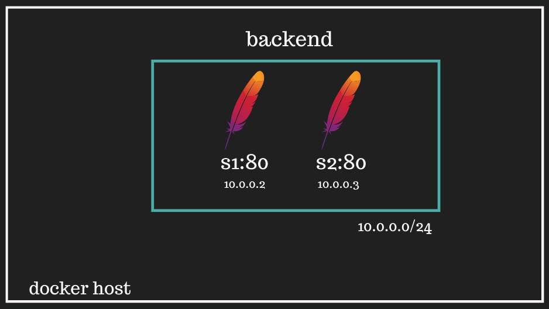

Since S1 and S2 share the same subnet, they're directly reachable — no gateway/router hop is needed between them (same as any two devices on one physical LAN, §3).

---

## 24. The default bridge's DNS limitation

Here's a gotcha specific to the *default* `bridge` network: containers can talk to each other **by IP**, but not reliably **by name**.

This works:

```bash
curl http://172.17.0.3
```

This may fail:

```bash
curl http://s2
```

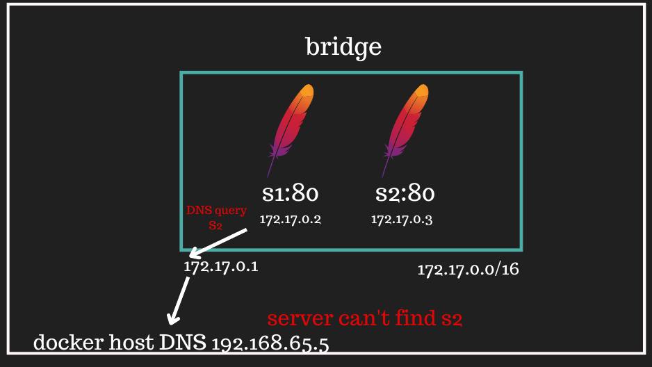

> [!NOTE]
> 📸 S2's container tries to resolve the name `S2` by asking the Docker host's DNS server (`192.168.65.5`) — but that's the host's general-purpose DNS resolver, and it has never heard of a container literally named `S2`. It knows public domain names, not private container names on the legacy bridge.

This is exactly why the next section exists — a **user-defined** (custom) network fixes this by giving Docker's own internal DNS server a real directory of the containers attached to it.

---

## 25. Creating a custom Docker network

> **Analogy:** instead of using the building's old shared hallway (default bridge, no working directory board), you build your own private wing with a proper lobby directory that lists every resident by name.

```bash
docker network create \
  --subnet 10.0.0.0/24 \
  backend
```

A `/24` gives addresses in the `10.0.0.x` range. Docker commonly reserves `.1` for the network's own gateway.

Attach existing containers to it:

```bash
docker network connect backend s1
docker network connect backend s2
```

> [!NOTE]
> A container can belong to **more than one** network at once. Connecting `s1` to `backend` does not automatically remove it from `bridge` — you'd disconnect it explicitly if you wanted that:
>
> ```bash
> docker network disconnect bridge s1
> docker network disconnect bridge s2
> ```

Inspect what you built:

```bash
docker inspect s1
docker network inspect backend
```

---

## 26. Docker DNS on user-defined networks

On a **user-defined** network (unlike the default bridge), Docker runs an internal DNS server that actually knows every container's name:

```text
s1 → 10.0.0.2
s2 → 10.0.0.3
```

From inside S1, this now works:

```bash
nslookup s2
curl http://s2
```

**Why this matters for real backend systems:** an API can address a dependency by a stable *name* instead of a changeable *IP*:

```text
http://api:3000
postgres://database:5432
```

Container IPs can change every time a container is recreated (a redeploy, a restart) — the service name stays the same, so nothing downstream needs updating.

---

## 27. Why split frontend, backend, and database networks?

A production-style system often looks like:

```text
Client
  ↓
Frontend/reverse proxy
  ↓
Backend API
  ↓
Database
```

Putting everything on one shared network is simple, but it means a single compromised container can potentially reach *everything* — including your database.

A stronger design separates tiers into their own networks, and only connects a container to the networks it actually needs:

```text
frontend network
    reverse proxy

backend network
    reverse proxy + backend API      ← proxy is in BOTH networks, API is only in this one

database network
    backend API + database           ← API is in BOTH networks, database is only in this one
```

The public-facing proxy never needs *direct* access to the database — it can only reach the backend API, which is the only thing that can reach the database. Network segmentation is a second line of defense, in addition to application-level auth.

> [!NOTE]
> A container joining multiple networks gets multiple virtual interfaces and multiple IPs — just like a physical router having multiple NICs (§5). This is the *exact* mechanism §30's gateway container will use.

---

## 28. Internal networks

```bash
docker network create \
  --internal \
  --subnet 10.0.0.0/24 \
  private-backend
```

`--internal` builds a network with **no path out** through Docker's normal bridge route to the internet or host — containers on it can only talk to each other. Useful when a tier (like an internal database network) should never need external connectivity at all.

> [!NOTE]
> This isolation is fairly all-or-nothing — handy for a genuinely internal-only tier, but not something you'd casually reach for if you also need controlled, partial access out.

---

## 29. Two Docker networks do not automatically talk to each other

```bash
docker network create --subnet 10.0.0.0/24 frontend
docker network create --subnet 10.0.1.0/24 backend
```

Place one container in each:

```bash
docker run -d --name s1 --network frontend --cap-add=NET_ADMIN nhttpd
docker run -d --name s2 --network backend  --cap-add=NET_ADMIN nhttpd
```

```text
S1: 10.0.0.2/24
S2: 10.0.1.2/24
```

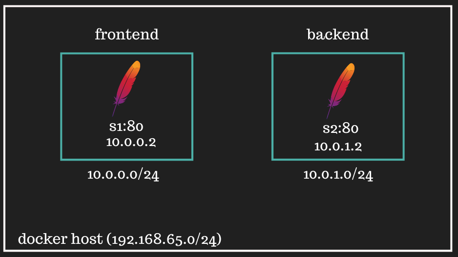

S1 correctly recognizes `10.0.1.2` as remote (§3's AND-check) — but its default gateway has no route into a completely separate Docker network, so the packet has nowhere valid to go.

> **Analogy:** two separate apartment buildings on the same street, each with its own hallway — there's no walkway connecting them yet. Being close by address doesn't mean there's an actual path between them.

---

## 30. Building a gateway container between two networks

> **Analogy:** now we build a skybridge connecting the two separate buildings from §29 — but a skybridge that nobody knows exists is useless. Residents also need to be *told*: "to reach the other building, walk to the skybridge first."

A gateway container must be connected to **both** networks:

```text
Frontend side: 10.0.0.3
Backend side:  10.0.1.3
```

Create it on the first network, then attach it to the second:

```bash
docker run -d \
  --name gw \
  --network frontend \
  --cap-add=NET_ADMIN \
  --sysctl net.ipv4.ip_forward=1 \
  nhttpd

docker network connect backend gw
```

```text
--cap-add=NET_ADMIN            grants permission to change routing/network config (§31 needs this too)
--sysctl net.ipv4.ip_forward=1 turns on IP forwarding (§8) inside this container's kernel namespace
```

The gateway can now physically reach both S1 and S2, because it has an interface on each network — but S1 and S2 still don't automatically know `gw` should be used to reach the *other* subnet.

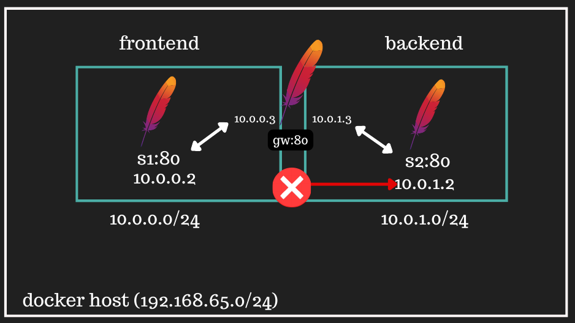

### `gw:80` doesn't make it a "gateway"

The diagram labels the container `gw:80` only because the custom image also happens to run Apache on port 80 — that's coincidental, not what makes it a router.

Its actual routing role comes from three separate things together:

```text
being connected to both networks
+ having IP forwarding enabled          (§8)
+ having correct routes on the endpoints (§31, next)
```

Port 80 has nothing to do with Layer 3 forwarding.

---

## 31. Adding routes on both endpoints

S1 needs a route telling it: *to reach the backend subnet, go through the gateway's frontend-side address.*

```bash
docker exec -it s1 \
  ip route add 10.0.1.0/24 via 10.0.0.3
```

S2 needs the **return** route, or replies will never make it back (§11):

```bash
docker exec -it s2 \
  ip route add 10.0.0.0/24 via 10.0.1.3
```

> [!NOTE]
> **Why `--cap-add=NET_ADMIN` was needed back in §29/§30:** changing a routing table is an administrative networking operation. A default container isn't given that permission — you have to explicitly grant it.

Test:

```bash
# From S1
ping 10.0.1.2
curl http://10.0.1.2
traceroute 10.0.1.2

# From S2
ping 10.0.0.2
curl http://10.0.0.2
```

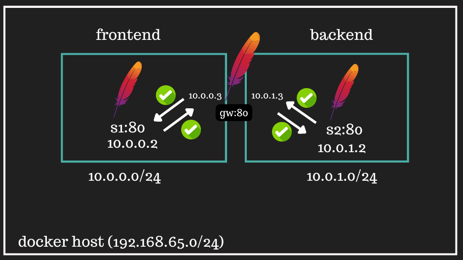

---

## 32. Packet journey from S1 to S2

Given:

```text
S1:          10.0.0.2
GW near S1:  10.0.0.3
GW near S2:  10.0.1.3
S2:          10.0.1.2
```

S1 sends to S2 — walk through this slowly, it's every idea from Part I applied at once:

```text
1. S1 checks its routing table.
2. Route says 10.0.1.0/24 is reachable via 10.0.0.3.
3. S1 performs ARP for 10.0.0.3.
4. First frame targets the gateway's frontend-side MAC.
5. The enclosed IP packet still targets 10.0.1.2 (§6's rule, virtualized).
6. Gateway removes the first frame and checks its own routes.
7. 10.0.1.0/24 is directly attached to its other interface.
8. Gateway ARPs for 10.0.1.2.
9. Gateway creates a NEW frame addressed to S2's MAC (§7, virtualized).
10. S2 receives the packet, and Apache replies.
11. S2's reply follows its own reverse route, back through 10.0.1.3.
```

```text
MAC addresses change per local hop — same as physical routing.
IP source and destination identify the end hosts — same as physical routing.
```

---

## 33. Why routing by IP may work while names still fail

After the manual routes are in place, this may work:

```bash
curl http://10.0.1.2
```

But this may still fail:

```bash
curl http://s2
```

> [!IMPORTANT]
> **Routing and DNS solve two completely different problems** — fixing one never automatically fixes the other:
>
> ```text
> Routing: How do I reach this IP network?
> DNS:     Which IP address belongs to this name?
> ```

S1 and S2 no longer share one Docker network (they're in `frontend` and `backend` separately), so Docker's per-network name directory (§26) isn't automatically merged just because a gateway now forwards *packets* between the subnets. A real architecture needing cross-network name resolution has to add its own DNS/service-discovery layer on top.

---

## 34. Routes inside containers are ephemeral

The `ip route add` commands from §31 only exist as long as that specific container keeps running.

> [!WARNING]
> Those routes live in the running container's network namespace. If the container is removed or recreated (a redeploy, a crash-restart), the routes disappear — you'd need to add them again by hand.

For anything you actually want to persist, automate it instead:

```text
- a startup script
- an entrypoint script
- container-orchestration configuration
- Docker Compose, where appropriate
```

The point of doing it manually first is understanding exactly *what* that automation is configuring under the hood — not that you should keep doing it by hand in production.

---

## 35. `traceroute` and TTL

`traceroute` reveals the sequence of routers between you and a destination, using the IP **TTL (Time To Live)** field.

```text
Every IP packet carries a TTL.
Each router that forwards it decrements the TTL by 1.
If TTL hits zero, that router drops the packet and replies with an ICMP "Time Exceeded" message.
```

`traceroute` deliberately sends probes with increasing TTL values to force each hop, one at a time, to reveal itself:

```text
TTL 1 → first router responds (its TTL hit zero)
TTL 2 → second router responds
TTL 3 → third router responds
...
```

For two containers in the *same* subnet, the destination is directly connected — no routing hop is needed, so `traceroute` shows nothing in between. Across the §30-§31 gateway lab, the gateway itself shows up as one visible intermediate hop.

---

# Command Cheat Sheet

## Routing and neighbors

```bash
# Linux routing table
ip route show

# Linux ARP/neighbor cache
ip neigh show

# Add/delete a static route
sudo ip route add 172.16.6.0/24 via 10.0.0.6
sudo ip route del 172.16.6.0/24

# Windows routing table
route print

# macOS routing table
netstat -rn
```

## Network debugging

```bash
ping 10.0.0.2
traceroute 10.0.0.2
nslookup example.com
curl -v http://10.0.0.2
```

## Docker basics

```bash
docker ps
docker network ls
docker inspect s1
docker network inspect bridge
docker exec -it s1 bash
docker stop s1
docker rm s1
```

## Docker networks

```bash
docker network create --subnet 10.0.0.0/24 backend
docker network connect backend s1
docker network disconnect bridge s1
docker network inspect backend
```

## Run and publish Apache

```bash
docker run -d --name web -p 8080:80 httpd
curl http://localhost:8080
```

---

# Common Confusions

**"Does the router always send ARP?"**
No. Any device can send ARP when it needs the MAC address of an IPv4 next hop on its own local subnet.

**"Why does D send to MAC Z when D wants to reach M?"**
Because Z is the next *local* router interface. M remains the destination IP inside the packet the whole time (§6).

**"Does a router have one MAC address?"**
No — a router has a separate network interface on each connected link, and each interface normally has its own MAC address and IP address (§5).

**"Is the routing table a file?"**
No. The active table is kernel state in memory (§12). Persistent configuration may be stored elsewhere and used to *rebuild* it.

**"Does adding a gateway container connect two Docker networks?"**
Not by itself (§30). The gateway needs interfaces in both networks, forwarding enabled, **and** endpoint routes on both sides (§31).

**"Why can containers access the internet?"**
Their kernel uses a default route toward the Docker gateway. Docker then provides a path through the host toward external networks.

**"Why can `curl` by IP work while `curl` by name fails?"**
The route may be perfectly correct, but DNS may not know that private name in this particular network context (§33).

---

# Final Mental Model

```text
Application chooses:
    final IP + port

Kernel routing table chooses:
    next-hop IP + outgoing interface

ARP chooses:
    next-hop MAC on that local link

Switch chooses:
    output Layer 2 port

Router:
    removes the old frame
    keeps/forwards the IP packet
    creates a new frame for the next link
```

And Docker applies the exact same model, virtually:

```text
Container process
    ↓
container network namespace
    ↓ routing table + ARP + virtual NIC
    ↓
Docker bridge / gateway
    ↓
other container, host, or internet
```

> **One sentence to remember:** IP tells the network the final destination; the routing table selects the next step; ARP finds the local MAC required to perform that step. Everything Docker does is the same three steps, running in software.

---

## Source material used

- *Routing Explained From Zero* lecture transcript and slide deck.
- Docker networking tutorial transcript and visual slide deck.
- Discussion clarifications about switches, ARP, gateways, kernel routing, Apache, `curl`, Docker Desktop, and routing between Docker networks.